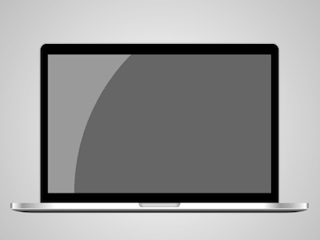

+++
title = 'MacBook Pro'
date = 2018-07-09T17:13:31+08:00
image = '/fe/img/thumbs/074.png'
summary = '#74'
+++



## 效果预览

点击链接可以在 Codepen 预览。

[https://codepen.io/comehope/pen/MXNNyR](https://codepen.io/comehope/pen/MXNNyR)

## 可交互视频

此视频是可以交互的，你可以随时暂停视频，编辑视频中的代码。

[https://scrimba.com/p/pEgDAM/cyEPrue](https://scrimba.com/p/pEgDAM/cyEPrue)

## 源代码下载

每日前端实战系列的全部源代码请从 github 下载：

[https://github.com/comehope/front-end-daily-challenges](https://github.com/comehope/front-end-daily-challenges)

## 代码解读

定义 dom，容器中包含 2 个元素，分别代表屏幕和底座：
```html
<div class="macbook">
    <span class="screen"></span>
    <span class="base"></span>
</div>
```

居中显示：
```css
body {
    margin: 0;
    height: 100vh;
    display: flex;
    align-items: center;
    justify-content: center;
    background: radial-gradient(circle at center, white, gray);
}
```

定义容器尺寸：
```css
.macbook {
    width: 50em;
    font-size: 10px;
    display: flex;
    flex-direction: column;
    align-items: center;
}
```

画出屏幕的轮廓：
```css
.screen {
    width: 40em;
    height: calc(40em * 0.667);
    background-color: black;
    border-radius: 3% 3% 0 0 / 5%;
    border: 0.2em solid silver;
    border-bottom: none;
    position: relative;
}
```

画出屏幕上的光影：
```css
.screen {
    position: relative;
}

.screen::before {
    content: '';
    position: absolute;
    top: 0;
    right: 0;
    bottom: 0;
    left: 0;
    background: radial-gradient(
        circle at right bottom,
        rgba(255, 255, 255, 0.4) 75%,
        rgba(255, 255, 255, 0.6) 75%
    );
    margin: 4.3% 3.2%;
}
```

画出底座的轮廓：
```css
.base {
    position: relative;
}

.base {
    width: inherit;
    height: 1.65em;
    background: linear-gradient(
        white,
        white 55%,
        #999 60%,
        #222 90%,
        rgba(0, 0, 0, 0.1) 100%
    );
    border-radius: 0 0 10% 10% / 0 0 50% 50%;
}
```

为底座增加光照效果：
```css
.base::before {
    content: '';
    position: absolute;
    width: inherit;
    height: 55%;
    background: linear-gradient(
        to right,
        rgba(0, 0, 0, 0.5) 0%,
        rgba(255, 255, 255, 0.8) 1%,
        rgba(0, 0, 0, 0.4) 4%,
        transparent 15%,
        rgba(255, 255, 255, 0.8) 50%,
        transparent calc(100% - 15%),
        rgba(0, 0, 0, 0.4), calc(100% - 4%),
        rgba(255, 255, 255, 0.8) calc(100% - 1%),
        rgba(0, 0, 0, 0.5) 100%
    );
}
```

画出底座上用于掀开屏幕的缺口：
```css
.base::after {
    content: '';
    position: absolute;
    width: 7em;
    height: 0.7em;
    background-color: #ddd;
    left: calc(50% - 7em / 2);
    box-shadow: 
        inset -0.5em -0.1em 0.3em rgba(0, 0, 0, 0.2),
        inset 0.5em 0.1em 0.3em rgba(0, 0, 0, 0.2);
    border-radius: 0 0 7% 7% / 0 0 95% 95%;
}
```

大功告成！
