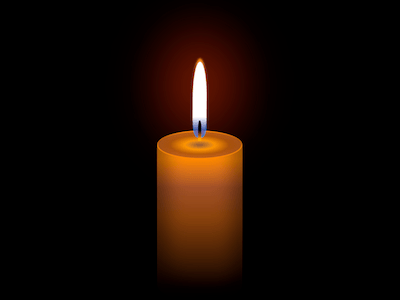

+++
title = '蜡烛'
date = 2018-07-10T17:13:46+08:00
image = '/test-hugo-deploy/img/thumbs/075.png'
summary = '#75'
+++



## 效果预览

点击链接可以在 Codepen 预览。

[https://codepen.io/comehope/pen/LBPvON](https://codepen.io/comehope/pen/LBPvON)

## 可交互视频

此视频是可以交互的，你可以随时暂停视频，编辑视频中的代码。

[https://scrimba.com/p/pEgDAM/cBEvpTL](https://scrimba.com/p/pEgDAM/cBEvpTL)

## 源代码下载

每日前端实战系列的全部源代码请从 github 下载：

[https://github.com/comehope/front-end-daily-challenges](https://github.com/comehope/front-end-daily-challenges)

## 代码解读

定义 dom，容器中包含 4 个元素，分别代表光晕、火焰和灯芯：
```html
<div class="candle">
    <span class="glow"></span>
    <span class="flames"></span>
    <span class="thread"></span>
</div>
```

居中显示：
```css
body {
    margin: 0;
    height: 100vh;
    display: flex;
    align-items: center;
    justify-content: center;
    background: black;
}
```

画出蜡烛的轮廓：
```css
.candle {
    width: 15em;
    height: 30em;
    font-size: 10px;
    background: linear-gradient(
        orange,
        darkorange,
        sienna,
        saddlebrown 50%,
        rgba(0, 0, 0, 0.6)
    );
    box-shadow: 
        inset 2em -3em 5em rgba(0, 0, 0, 0.4),
        inset -2em 0 5em rgba(0, 0, 0, 0.4);
    border-radius: 10em / 4em;
}
```

用伪元素画出蜡烛的顶面：
```css
.candle {
    position: relative;
}

.candle::before {
    content: '';
    position: absolute;
    width: inherit;
    height: 5em;
    border: 0.2em solid darkorange;
    border-radius: 50%;
    box-sizing: border-box;
    background: radial-gradient(
        #444,
        orange,
        saddlebrown,
        sienna,
        darkorange
    );
    filter: opacity(0.7);
}
```

画出蜡烛的灯芯：
```css
.candle {
    display: flex;
    justify-content: center;
}

.thread {
    position: absolute;
    width: 0.6em;
    height: 3.6em;
    top: -1.8em;
    background: linear-gradient(
        #111,
        black,
        orange 90%
    );
    border-radius: 40% 40% 0 0;
}
```

画出蜡烛的内焰：
```css
.flames {
    position: absolute;
    width: 2.4em;
}

.flames::before {
    content: '';
    position: absolute;
    width: inherit;
    height: 6em;
    background-color: royalblue;
    top: -4.8em;
    border-radius: 50% 50% 35% 35%;
    border: 0.2em solid dodgerblue;
    box-sizing: border-box;
    filter: opacity(0.7);
}
```

画出蜡烛的外焰：
```css
.flames::after {
    content: '';
    position: absolute;
    width: inherit;
    height: 12em;
    top: -12em;
    background: linear-gradient(white 80%, transparent);
    border-radius: 50% 50% 20% 20%;
    box-shadow: 0 -0.6em 0.4em darkorange;
}
```

画出光晕：
```css
.glow {
    position: absolute;
    width: 10em;
    height: 18em;
    background-color: orangered;
    border-radius: 50%;
    top: -16.5em;
    filter: blur(6em);
}
```

为外焰增加摇曳的效果：
```css
.outer-flame {
    animation: 
        enlarge 5s linear infinite,
        move 6s linear infinite;
}

@keyframes move {
    0%, 100% {
        transform: rotate(-2deg);
    }

    50% {
        transform: rotate(2deg);
    }
}

@keyframes enlarge {
    0%, 100% {
        height: 12em;
        top: -12em;
    }

    50% {
        height: 14em;
        top: -13em;
    }
}
```

为光晕增加闪烁效果：
```css
.glow {
    animation: blink 100ms infinite;
}

@keyframes blink {
    to {
        filter: blur(6em) opacity(0.8);
    }
}
```

最后，使蜡烛垂直居中：
```css
.candle {
    top: 10em;
}
```

大功告成！
