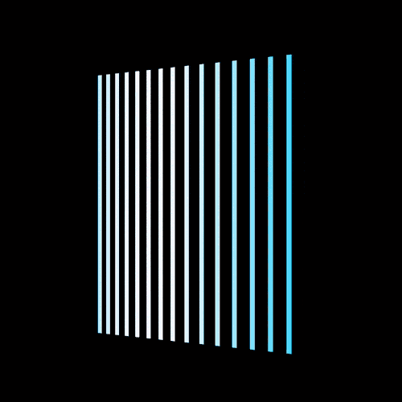

+++
title = '飘扬的旗帜'
date = 2018-07-13T17:14:21+08:00
image = '/test-hugo-deploy/img/thumbs/077.png'
summary = '#77'
+++



## 效果预览

点击链接可以在 Codepen 预览。

[https://codepen.io/comehope/pen/qydvBm](https://codepen.io/comehope/pen/qydvBm)

## 可交互视频

此视频是可以交互的，你可以随时暂停视频，编辑视频中的代码。

[https://scrimba.com/p/pEgDAM/cD9pLTW](https://scrimba.com/p/pEgDAM/cD9pLTW)

## 源代码下载

每日前端实战系列的全部源代码请从 github 下载：

[https://github.com/comehope/front-end-daily-challenges](https://github.com/comehope/front-end-daily-challenges)

## 代码解读

定义 dom，容器中包含 15 个元素：
```html
<div class="flag">
    <span></span>
    <span></span>
    <span></span>
    <span></span>
    <span></span>
    <span></span>
    <span></span>
    <span></span>
    <span></span>
    <span></span>
    <span></span>
    <span></span>
    <span></span>
    <span></span>
    <span></span>
</div>
```

居中显示：
```css
body {
    margin: 0;
    height: 100vh;
    display: flex;
    align-items: center;
    justify-content: center;
    background-color: black;
}
```

定义容器尺寸：
```css
.flag {
    width: 10em;
    height: 15em;
    font-size: 20px;
}
```

设置线条样式：
```css
.flag span {
    width: 0.25em;
    height: inherit;
    background-color: deepskyblue;
}
```

让线条平铺：
```css
.flag {
    display: flex;
    justify-content: space-between;
}
```

增加 3d 透视效果：
```css
.flag {
    transform: perspective(500px) rotateY(-20deg);
}
```

定义左右移动的动画效果：
```css
.flag span {
    animation: wave 1.5s ease-in-out infinite alternate;
}

@keyframes wave {
    to {
        transform: translateX(2em);
    }
}
```

设置元素变量值：
```css
.flag span:nth-child(1) {
    --n: 1;
}

.flag span:nth-child(2) {
    --n: 2;
}

/* 共 15 个元素，每元素的 --n 变量值等于它的序号。 */
/* 中间代码略 …… */

.flag span:nth-child(14) {
    --n: 14;
}

.flag span:nth-child(15) {
    --n: 15;
}
```

让各线条分别延时启动动画，形成旗帜飘扬的效果：
```css
.flag span {
    animation-delay: calc(var(--n) * -0.1s);
}
```

最后，增加光影效果：
```css
.flag span {
    background-color: ghostwhite;
}

@keyframes wave {
    to {
        transform: translateX(2em);
        background-color: deepskyblue;
    }
}
```

大功告成！
