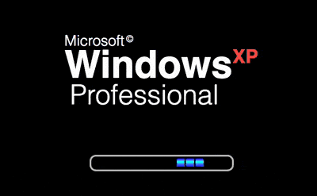

+++
title = 'Windows启动界面'
date = 2018-07-14T17:14:38+08:00
image = '/test-hugo-deploy/img/thumbs/078.png'
summary = '#78'
+++



## 效果预览

点击链接可以在 Codepen 预览。

[https://codepen.io/comehope/pen/WKQdpx](https://codepen.io/comehope/pen/WKQdpx)

## 可交互视频

此视频是可以交互的，你可以随时暂停视频，编辑视频中的代码。

[https://scrimba.com/p/pEgDAM/cgzaEH9](https://scrimba.com/p/pEgDAM/cgzaEH9)

## 源代码下载

每日前端实战系列的全部源代码请从 github 下载：

[https://github.com/comehope/front-end-daily-challenges](https://github.com/comehope/front-end-daily-challenges)

## 代码解读

定义 dom，容器中包含 2 个元素，分别代表 logo 和进度条，logo 又包含 3 段文字：
```html
<div class="windows-xp-loader">
    <div class="logo">
        <p class="ms">Microsoft</p>
        <p class="win">Windows</p>
        <p class="pro">Professional</p>
    </div>
    <div class="bar"></div>
</div>
```

居中显示：
```css
body {
    margin: 0;
    height: 100vh;
    display: flex;
    align-items: center;
    justify-content: center;
    background-color: black;
}
```

定义容器尺寸：
```css
.windows-xp-loader {
    width: 21.5em;
    height: 15em;
}
```

设置段落样式：
```css
.logo p {
    color: white;
    font-family: sans-serif;
    margin: 0;
    padding: 0;
}
```

设置字号：
```css
.logo .ms {
    font-size: 1.6em;
}

.logo .win {
    font-size: 4.2em;
}

.logo .pro {
    font-size: 3em;
}
```

设置字体粗细：
```css
.logo .ms {
    font-weight: lighter;
}

.logo .win {
    font-weight: bold;
}

.logo .pro {
    font-weight: lighter;
}
```

设置行高：
```css
.logo .ms {
    line-height: 1em;
}

.logo .win {
    line-height: 86%;
}

.logo .pro {
    line-height: 1em;
    padding-left: 0.2em;
}
```

在 "Microsoft" 后面增加商标版权符号：
```css
.logo .ms::after {
    content: '\00a9';
    font-size: 0.625em;
    vertical-align: top;
    position: relative;
    top: -0.3em;
    left: 0.2em;
}
```

在 "Windows" 后面增加 "xp"：
```css
.logo .win::after {
    content: 'XP';
    font-size: 0.5em;
    vertical-align: top;
    position: relative;
    top: -0.4em;
    color: tomato;
}
```

定义进度条尺寸：
```css
.bar {
    width: 15em;
    height: 1em;
    border: 0.2em solid silver;
}
```

增加 logo 和进度条的间距：
```css
.windows-xp-loader {
    display: flex;
    flex-direction: column;
    justify-content: space-between;
    align-items: center;
}
```

设置进度条的样式：
```css
.bar {
    border-radius: 0.7em;
    position: relative;
    padding: 0.2em;
}

.bar::before {
    content: '';
    position: absolute;
    width: 3em;
    height: 70%;
    background-color: dodgerblue;
    border-radius: 0.2em;
}
```

用线性渐变设置进度条中蓝色色块的样式：
```css
.bar::before {
    background: 
        linear-gradient(
            to right,
            transparent 30%,
            black 30%, black 35%,
            transparent 35%, transparent 65%,
            black 65%, black 70%,
            transparent 70%
        ),
        linear-gradient(
            blue 0%,
            royalblue 17%,
            deepskyblue 32%, deepskyblue 45%,
            royalblue 60%,
            blue 100%
        );
    filter: brightness(1.2);
}
```

增加动画效果：
```css
.bar::before {
    animation: run 2s linear infinite;
}

@keyframes run {
    from {
        transform: translateX(-3em);
    }

    to {
        transform: translateX(15em);
    }
}
```

最后，隐藏进度条之外的内容：
```css
.bar {
    overflow: hidden;
}
```

大功告成！
