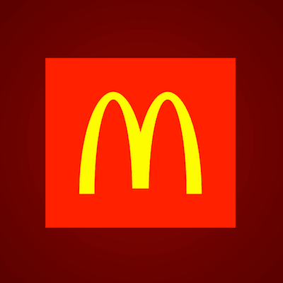

+++
title = '麦当劳 Logo'
date = 2018-07-15T17:14:55+08:00
image = '/test-hugo-deploy/img/thumbs/079.png'
summary = '#79'
+++



## 效果预览

点击链接可以在 Codepen 预览。

[https://codepen.io/comehope/pen/mjVVmY](https://codepen.io/comehope/pen/mjVVmY)

## 可交互视频

此视频是可以交互的，你可以随时暂停视频，编辑视频中的代码。

[https://scrimba.com/p/pEgDAM/cewvyhq](https://scrimba.com/p/pEgDAM/cewvyhq)

## 源代码下载

每日前端实战系列的全部源代码请从 github 下载：

[https://github.com/comehope/front-end-daily-challenges](https://github.com/comehope/front-end-daily-challenges)

## 代码解读

定义 dom，只有 1 个元素：
```css
<div class="mcdonalds"></div>
```

居中显示：
```css
body {
    margin: 0;
    height: 100vh;
    display: flex;
    align-items: center;
    justify-content: center;
    background: radial-gradient(circle at center, darkred, black);
}
```

定义容器尺寸：
```css
.mcdonalds {
    width: 36em;
    height: 30em;
    font-size: 5px;
    color: red;
    background-color: currentColor;
}
```

用伪元素画出字母 m 的左半边 n 的形状：
```css
.mcdonalds {
    position: relative;
    overflow: hidden;
}

.mcdonalds::before {
    content: '';
    position: absolute;
    width: 20em;
    height: 60em;
    box-sizing: border-box;
    border: solid yellow;
    border-width: 2.2em 4.4em;
    border-radius: 50%;
}
```

把左半边复制一份，即是右半边 n 的形状，和左边一起组成了字母 m：
```css
.mcdonalds::before {
    filter: drop-shadow(16em 0 0 yellow);
}
```

用伪元素遮住字母 m 中间竖线底部一点点，使两边的竖显得长一些：
```css
.mcdonalds::after {
    content: '';
    position: absolute;
    width: 5em;
    height: 1.5em;
    background-color: currentColor;
    left: calc((36em - 5em) / 2);
    bottom: 0;
}
```

最后，将红色背景向外延伸一些：
```css
.mcdonalds {
    box-shadow: 0 0 0 10em;
}
```

大功告成！
