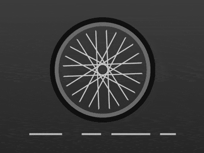

+++
title = '自行车车轮'
date = 2018-07-16T17:15:11+08:00
image = '/fe/img/thumbs/080.png'
summary = '#80'
+++



## 效果预览

点击链接可以在 Codepen 预览。
[https://codepen.io/comehope/pen/XBXEPK](https://codepen.io/comehope/pen/XBXEPK)


## 可交互视频

此视频是可以交互的，你可以随时暂停视频，编辑视频中的代码。

[https://scrimba.com/p/pEgDAM/cgkqnAz](https://scrimba.com/p/pEgDAM/cgkqnAz)

## 源代码下载

每日前端实战系列的全部源代码请从 github 下载：

[https://github.com/comehope/front-end-daily-challenges](https://github.com/comehope/front-end-daily-challenges)

## 代码解读

定义 dom，容器中包含 6 个元素：
```html
<div class="wheel">
    <span></span>
    <span></span>
    <span></span>
    <span></span>
    <span></span>
    <span></span>
</div>
```

居中显示：
```css
body {
    margin: 0;
    height: 100vh;
    display: flex;
    align-items: center;
    justify-content: center;
    background-image: linear-gradient(#555, #222);
}
```

画出轮圈：
```css
.wheel {
    width: 9em;
    height: 9em;
    font-size: 25px;
    border: 0.4em solid #777;
    border-radius: 50%;
    box-shadow: 0 0 0 0.5em #111;
}
```

定义辐条的样式：
```css
.wheel {
    display: flex;
    align-items: center;
    justify-content: center;
}

.wheel span {
    position: absolute;
    width: 8em;
    height: 1em;
    border: 0.1em solid;
    border-color: #ccc transparent;
}
```

定义变量，画出多根幅条：
```css
.wheel span {
    transform: rotate(calc((var(--n) - 1) * 30deg));
}

.wheel span:nth-child(1) {
    --n: 1;
}

.wheel span:nth-child(2) {
    --n: 2;
}

.wheel span:nth-child(3) {
    --n: 3;
}

.wheel span:nth-child(4) {
    --n: 4;
}

.wheel span:nth-child(5) {
    --n: 5;
}

.wheel span:nth-child(6) {
    --n: 6;
}
```

让车轮转动起来：
```css
.wheel span {
    animation: run 4s linear infinite;
}

@keyframes run {
    to {
        transform: rotate(calc((var(--n) - 1) * 30deg + 360deg));
    }
}
```

用伪元素画出地面上的线条：
```css
.wheel {
    position: relative;
}

.wheel::before {
    content: '';
    position: absolute;
    width: 15em;
    height: 0.2em;
    top: 11em;
    background-image: linear-gradient(
            to right,
            silver 0, silver 4em,
            transparent 4em, transparent 5em,
            silver 5em, silver 10em,
            transparent 10em, transparent 12em,
            silver 12em, silver 14em,
            transparent 14em, transparent 15em
        );
}
```

最后，让地面上的线条动起来，形成车轮向前走的效果：
```css
.wheel::before {
    background-position: 15em;
    animation: run2 6s linear infinite;
}

@keyframes run2 {
    to {
        background-position: -15em;
    }
}
```

大功告成！
