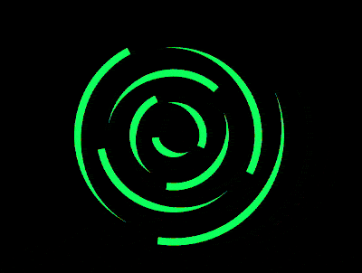

+++
title = '变色旋转动画'
date = 2018-07-17T17:15:27+08:00
image = '/test-hugo-deploy/img/thumbs/081.png'
summary = '#81'
+++



## 效果预览

点击链接可以在 Codepen 预览。

[https://codepen.io/comehope/pen/ejZWKL](https://codepen.io/comehope/pen/ejZWKL)

## 可交互视频

此视频是可以交互的，你可以随时暂停视频，编辑视频中的代码。

[https://scrimba.com/p/pEgDAM/cawq6cB](https://scrimba.com/p/pEgDAM/cawq6cB)

## 源代码下载

每日前端实战系列的全部源代码请从 github 下载：

[https://github.com/comehope/front-end-daily-challenges](https://github.com/comehope/front-end-daily-challenges)

## 代码解读

定义 dom，容器中包含 9 个元素：
```html
<div class="container">
    <span></span>
    <span></span>
    <span></span>
    <span></span>
    <span></span>
    <span></span>
    <span></span>
    <span></span>
    <span></span>
</div>
```

居中显示：
```css
body {
    margin: 0;
    height: 100vh;
    display: flex;
    align-items: center;
    justify-content: center;
    background-color: black;
}
```

定义容器尺寸：
```css
.container {
    width: 30em;
    height: 30em;
    font-size: 12px;
}
```

设置容器中线条的样式：
```css
.container {
    color: lime;
}

.container span {
    position: absolute;
    width: 5em;
    height: 5em;
    border-style: solid;
    border-width: 1em 1em 0 0;
    border-color: currentColor transparent;
    border-radius: 50%;
}
```

让线条在容器中居中显示：
```css
.container {
    display: flex;
    align-items: center;
    justify-content: center;
}
```

定义变量，使线条从中心向外侧逐渐延伸：
```css
.container span {
    --diameter: calc(5em + (var(--n) - 1) * 3em);
    width: var(--diameter);
    height: var(--diameter);
}

.container span:nth-child(1) {
    --n: 1;
}

.container span:nth-child(2) {
    --n: 2;
}

.container span:nth-child(3) {
    --n: 3;
}

.container span:nth-child(4) {
    --n: 4;
}

.container span:nth-child(5) {
    --n: 5;
}

.container span:nth-child(6) {
    --n: 6;
}

.container span:nth-child(7) {
    --n: 7;
}

.container span:nth-child(8) {
    --n: 8;
}

.container span:nth-child(9) {
    --n: 9;
}
```

设置让线条旋转的动画效果：
```css
.container span {
    animation: rotating linear infinite;
    animation-duration: calc(5s / (9 - var(--n) + 1));
}

@keyframes rotating {
    to {
        transform: rotate(1turn);
    }
}
```

定义改变颜色的动画效果，以色相环一周 360 度为 100%，--percent 变量是指位于这个 100% 的哪个位置：
```css
@keyframes change-color {
    0%, 100% {
        --percent: 0;
    }

    10% {
        --percent: 10;
    }

    20% {
        --percent: 20;
    }

    30% {
        --percent: 30;
    }

    40% {
        --percent: 40;
    }

    50% {
        --percent: 50;
    }

    60% {
        --percent: 60;
    }

    70% {
        --percent: 70;
    }

    80% {
        --percent: 80;
    }

    90% {
        --percent: 90;
    }
}
```

最后，把改变颜色的动画效果应用到容器上：
```css
.container {
    --deg: calc(var(--percent) / 100 * 360deg);
    color: hsl(var(--deg), 100%, 50%);
    animation: change-color 5s linear infinite;
}
```

大功告成！
