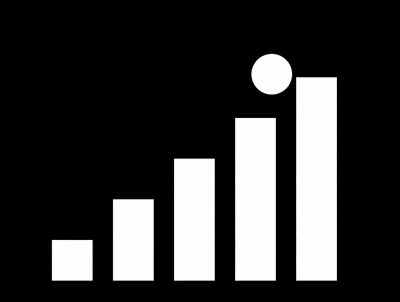

+++
title = '上台阶的小球'
date = 2018-07-19T17:16:04+08:00
image = '/test-hugo-deploy/img/thumbs/083.png'
summary = '#83'
+++



## 效果预览

点击链接可以在 Codepen 预览。

[https://codepen.io/comehope/pen/PBGJwL](https://codepen.io/comehope/pen/PBGJwL)

## 可交互视频

此视频是可以交互的，你可以随时暂停视频，编辑视频中的代码。

[https://scrimba.com/p/pEgDAM/cDMyyHv](https://scrimba.com/p/pEgDAM/cDMyyHv)

## 源代码下载

每日前端实战系列的全部源代码请从 github 下载：

[https://github.com/comehope/front-end-daily-challenges](https://github.com/comehope/front-end-daily-challenges)


## 代码解读

定义 dom，容器中包含 5 个元素，代表 5 个台阶：
```html
<div class="loader">
    <span></span>
    <span></span>
    <span></span>
    <span></span>
    <span></span>
</div>
```

居中显示：
```css
body {
    margin: 0;
    height: 100vh;
    display: flex;
    align-items: center;
    justify-content: center;
    background-color: black;
}
```

定义容器尺寸：
```css
.loader {
    width: 7em;
    height: 5em;
    font-size: 40px;
}
```

画出 5 个台阶：
```css
.loader {
    display: flex;
    justify-content: space-between;
    align-items: flex-end;
}

.loader span {
    width: 1em;
    height: 1em;
    background-color: white;
    animation: up-down 5s infinite;
}
```

用变量让 5 个台阶从低到高排序：
```css
.loader span {
    height: calc(var(--n) * 1em);
}

.loader span:nth-child(1) {
    --n: 1;
}

.loader span:nth-child(2) {
    --n: 2;
}

.loader span:nth-child(3) {
    --n: 3;
}

.loader span:nth-child(4) {
    --n: 4;
}

.loader span:nth-child(5) {
    --n: 5;
}
```

为台阶增加转换排序方向的动画效果：
```css
.loader span {
    animation: up-down 5s infinite;
}

@keyframes up-down {
    0%, 40%, 100% {
        height: calc(var(--n) * 1em);
    }

    50%, 90% {
        height: calc(5em - (var(--n) - 1) * 1em);
    }
}
```

下面做小球的动画，用了障眼法，使 2 个同色小球的交替运动看起来就像 1 个小球在做往复运动。

用伪元素画出 2 个小球：
```css
.loader::before,
.loader::after {
    content: '';
    position: absolute;
    width: 1em;
    height: 1em;
    background-color: white;
    border-radius: 50%;
    bottom: 1em;
}

.loader::before {
    left: 0;
}

.loader::after {
    left: 6em;
}
```

增加让小球向上运动的动画效果：
```css
.loader::before,
.loader::after {
    animation: move 5s infinite;
    visibility: hidden;
}

.loader::after {
    animation-delay: 2.5s;
}

@keyframes move {
    0% {
        bottom: 1em;
        visibility: visible;
    }

    10% {
        bottom: 2em;
    }

    20% {
        bottom: 3em;
    }

    30% {
        bottom: 4em;
    }

    40% {
        bottom: 5em;
    }

    50% {
        bottom: 1em;
    }

    50%, 100% {
        visibility: hidden;
    }
}
```

在向上运动的同时向两侧运动，形成上台阶的动画效果：
```css
.loader::before {
    --direction: 1;
}

.loader::after {
    --direction: -1;
}

@keyframes move {
    0% {
        bottom: 1em;
        left: calc(3em - 2 * 1.5em * var(--direction));
        visibility: visible;
    }

    10% {
        bottom: 2em;
        left: calc(3em - 1 * 1.5em * var(--direction));
    }

    20% {
        bottom: 3em;
        left: calc(3em - 0 * 1.5em * var(--direction));
    }

    30% {
        bottom: 4em;
        left: calc(3em + 1 * 1.5em * var(--direction));
    }

    40% {
        bottom: 5em;
        left: calc(3em + 2 * 1.5em * var(--direction));
    }

    50% {
        bottom: 1em;
        left: calc(3em + 2 * 1.5em * var(--direction));
    }

    50%, 100% {
        visibility: hidden;
    }
}
```

最后，为上台阶的动作增加拟人效果：
```css
@keyframes move {
    0% {
        bottom: 1em;
        left: calc(3em - 2 * 1.5em * var(--direction));
        visibility: visible;
    }

    7% {
        bottom: calc(2em + 0.3em);
    }

    10% {
        bottom: 2em;
        left: calc(3em - 1 * 1.5em * var(--direction));
    }

    17% {
        bottom: calc(3em + 0.3em);
    }

    20% {
        bottom: 3em;
        left: calc(3em - 0 * 1.5em * var(--direction));
    }

    27% {
        bottom: calc(4em + 0.3em);
    }

    30% {
        bottom: 4em;
        left: calc(3em + 1 * 1.5em * var(--direction));
    }

    37% {
        bottom: calc(5em + 0.3em);
    }

    40% {
        bottom: 5em;
        left: calc(3em + 2 * 1.5em * var(--direction));
    }

    50% {
        bottom: 1em;
        left: calc(3em + 2 * 1.5em * var(--direction));
    }

    50%, 100% {
        visibility: hidden;
    }
}
```

大功告成！
