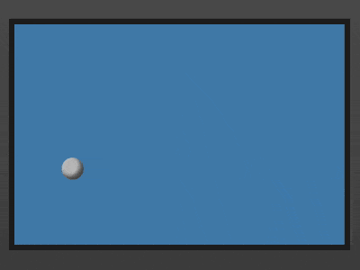

+++
title = '反弹的小球'
date = 2018-07-21T17:16:33+08:00
image = '/test-hugo-deploy/img/thumbs/085.png'
summary = '#85'
+++



## 效果预览

点击链接可以在 Codepen 预览。

[https://codepen.io/comehope/pen/OwWROO](https://codepen.io/comehope/pen/OwWROO)

## 可交互视频

此视频是可以交互的，你可以随时暂停视频，编辑视频中的代码。

[https://scrimba.com/p/pEgDAM/cnKwKA3](https://scrimba.com/p/pEgDAM/cnKwKA3)

## 源代码下载

每日前端实战系列的全部源代码请从 github 下载：

[https://github.com/comehope/front-end-daily-challenges](https://github.com/comehope/front-end-daily-challenges)

## 代码解读

定义 dom，只有 1 个元素：
```html
<div class="box"></div>
```

居中显示：
```css
body {
    margin: 0;
    height: 100vh;
    display: flex;
    align-items: center;
    justify-content: center;
    background: linear-gradient(#666, #333);
}
```

定义容器尺寸：
```css
.box {
    width: 30em;
    height: 20em;
    font-size: 10px;
    background-color: steelblue;
    border: 0.5em solid #222;
}
```

用伪元素画出小球：
```css
.box {
    position: relative;
}

.box::before {
    content: '';
    position: absolute;
    width: 2em;
    height: 2em;
    background-color: silver;
    border-radius: 50%;
    box-shadow: inset -0.3em -0.3em 0.5em rgba(0, 0, 0, 0.6);
}
```

定义沿 x 轴即横向移动的动画效果：
```css
@keyframes moveX {
    from {
        left: 0;
    }

    to {
        left: calc(30em - 2em);
    }
}
```

定义沿 y 轴即纵向移动的动画效果：
```css
@keyframes moveY {
    from {
        top: 0;
    }

    to {
        top: calc(20em - 2em);
    }
}
```

最后，把动画效果应用到小球上：
```css
.box::before {
    animation: 
        moveX 2s linear infinite alternate,
        moveY 2.5s linear infinite alternate;
}
```

大功告成！
