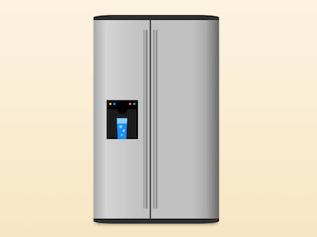

+++
title = '对开门冰箱'
date = 2018-07-23T17:17:03+08:00
image = '/test-hugo-deploy/img/thumbs/087.png'
summary = '#87'
+++



## 效果预览

点击链接可以在 Codepen 预览。

[https://codepen.io/comehope/pen/EpWagM](https://codepen.io/comehope/pen/EpWagM)

## 可交互视频

此视频是可以交互的，你可以随时暂停视频，编辑视频中的代码。

[https://scrimba.com/p/pEgDAM/cZwGRTL](https://scrimba.com/p/pEgDAM/cZwGRTL)

## 源代码下载

每日前端实战系列的全部源代码请从 github 下载：

[https://github.com/comehope/front-end-daily-challenges](https://github.com/comehope/front-end-daily-challenges)

## 代码解读

定义 dom，只有 1 个元素：
```html
<div class="fridge"></div>
```

居中显示：
```css
body {
    margin: 0;
    height: 100vh;
    display: flex;
    align-items: center;
    justify-content: center;
    background: linear-gradient(floralwhite, wheat);
}
```

定义容器尺寸：
```css
.fridge {
    width: 24em;
    height: 38em;
    font-size: 10px;
}
```

画出冰箱的轮廓：
```css
.fridge {
    border-top: 1em solid #333;
    border-bottom: 1em solid #333;
    background: silver;
    border-radius: 4em / 0.5em;
    box-shadow: 0 0.5em 1em -0.5em rgba(0, 0, 0, 0.5);
}
```

用线性渐变画出冰箱的金属表面：
```css
.fridge {
    background:
        linear-gradient(
            to right,
            darkgray,
            lightgray 10%,
            silver 40%, silver 80%,
            darkgray 90%,
            dimgray
        );
}
```

再用线性渐变画出冰箱的把手：
```css
.fridge {
    background:
        linear-gradient(
            to right,
            transparent 40%,
            gray 40%,
            silver 41%,
            dimgray 43%,
            transparent 43%, transparent 48%,
            gray 48%,
            silver 49%,
            dimgray 51%,
            transparent 51%
        ) no-repeat center / 100% 90%, /* handles */
        linear-gradient(
            to right,
            darkgray,
            lightgray 10%,
            silver 40%, silver 80%,
            darkgray 90%,
            dimgray
        );
}
```

在冰箱表面的线性渐变中加画门缝：
```css
.fridge {
    background:
        linear-gradient(
            to right,
            transparent 40%,
            gray 40%,
            silver 41%,
            dimgray 43%,
            transparent 43%, transparent 48%,
            gray 48%,
            silver 49%,
            dimgray 51%,
            transparent 51%
        ) no-repeat center / 100% 90%, /* handles */
        linear-gradient(
            to right,
            darkgray,
            lightgray 10%,
            silver 40%, silver 45%,
            black 45%, black 46%,
            silver 46%, silver 80%,
            darkgray 90%,
            dimgray
        );
}
```

用 before 伪元素画出饮水机的轮廓：
```css
.fridge::before {
    content: '';
    position: absolute;
    width: 6em;
    height: 7.5em;
    background: black;
    top: calc((100% - 7.5em) / 2);
    left: 2.5em;
}
```

用线性渐变画出饮水机的挡板，用径向渐变画出饮水机的出水口：
```css
.fridge::before {
    background: 
        radial-gradient(
            circle at 50% 22%,
            black, black 1em,
            transparent 1em
        ),
        linear-gradient(
            transparent 25%,
            #222 25%
        ) no-repeat center top / 94% 98%,
        black;
}
```

再用径向渐变画出 4 个 led 灯：
```css
.fridge::before {
    background: 
        radial-gradient(
            circle at 88% 10%,
            limegreen, limegreen 0.2em,
            transparent 0.2em
        ),
        radial-gradient(
            circle at 75% 10%,
            hotpink, hotpink 0.2em,
            transparent 0.2em
        ),
        radial-gradient(
            circle at 25% 10%,
            dodgerblue, dodgerblue 0.2em,
            transparent 0.2em
        ),
        radial-gradient(
            circle at 12% 10%,
            gold, gold 0.2em,
            transparent 0.2em
        ),
        radial-gradient(
            circle at 50% 22%,
            black, black 1em,
            transparent 1em
        ),
        linear-gradient(
            transparent 25%,
            #222 25%
        ) no-repeat center top / 94% 98%,
        black;
}
```

用 after 伪元素画出杯子的轮廓：
```css
.fridge::after {
    content: '';
    position: absolute;
    width: 2em;
    height: 3em;
    background: deepskyblue;
    bottom: calc((100% - 7.5em) / 2);
    left: calc(2.5em + (6em - 2em) / 2);
}
```

稍稍修整杯子的形状，使其顶大底小：
```css
.fridge::after {
    clip-path: polygon(0 0, 100% 0, 90% 100%, 10% 100%);
}
```

让杯子顶部的颜色变浅，看起来好像杯里有水的样子：
```css
.fridge::after {
    background:
        linear-gradient(
            to bottom,
            lightskyblue 25%,
            transparent 25%
        ),
        deepskyblue;
}
```

最后，给水里加些气泡：
```css
.fridge::after {
    background:
        radial-gradient(
            circle at 35% 40%,
            lightblue, lightblue 0.1em,
            transparent 0.4em
        ),
        radial-gradient(
            circle at 65% 60%,
            lightblue, lightblue 0.1em,
            transparent 0.3em
        ),
        radial-gradient(
            circle at 45% 80%,
            lightblue, lightblue 0.1em,
            transparent 0.2em
        ),
        linear-gradient(
            to bottom,
            lightskyblue 25%,
            transparent 25%
        ),
        deepskyblue;
}
```

大功告成！
