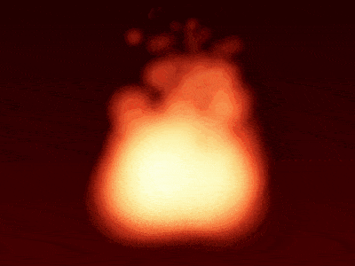

+++
title = '燃烧的火焰'
date = 2018-07-24T17:17:25+08:00
image = '/test-hugo-deploy/img/thumbs/088.png'
summary = '#88'
+++



## 效果预览

点击链接可以在 Codepen 预览。

[https://codepen.io/comehope/pen/xJdVxx](https://codepen.io/comehope/pen/xJdVxx)

## 可交互视频

此视频是可以交互的，你可以随时暂停视频，编辑视频中的代码。

[https://scrimba.com/p/pEgDAM/cP6LRSk](https://scrimba.com/p/pEgDAM/cP6LRSk)

## 源代码下载

每日前端实战系列的全部源代码请从 github 下载：

[https://github.com/comehope/front-end-daily-challenges](https://github.com/comehope/front-end-daily-challenges)

## 代码解读

定义 dom，容器中包含 3 个元素，每个元素代表组成火焰的 1 个火苗：
```html
<div class="flame">
    <span></span>
    <span></span>
    <span></span>
</div>
```

居中显示：
```css
body {
  margin: 0;
  height: 100vh;
  display: flex;
  align-items: center;
  justify-content: center;
  background: linear-gradient(black, maroon);
}
```

定义容器尺寸：
```css
.flame {
    width: 10em;
    height: 12em;
    font-size: 24px;
}
```

画出火苗：
```css
.flame {
    position: relative;
}

.flame span {
    position: absolute;
    width: 5em;
    height: 5em;
    background: radial-gradient(
        orangered 20%,
        rgba(255, 69, 0, 0) 70%
    );
    border-radius: 50%;
    bottom: 0;
}
```

用变量画出多个火苗，其中 --particles 是火苗的数量：
```css
.flame {
    --particles: 3;
}

.flame span {
    left: calc((var(--n) - 1) * 5em / var(--particles));
}

.flame span:nth-child(1) {
  --n: 1;
}

.flame span:nth-child(2) {
  --n: 2;
}

.flame span:nth-child(3) {
  --n: 3;
}
```

修改混合模式，使火苗重叠的部分变亮：
```css
.flame span {
    mix-blend-mode: screen;
}
```

增加火焰升腾的动画效果：
```css
.flame span {
    animation: rise 1s ease-in infinite;
}

@keyframes rise {
    from {
        transform: translateY(0) scale(1);
        filter: opacity(0);
    }
    
    25% {
        filter: opacity(1);
    }
    
    to {
        transform: translateY(-10em) scale(0);
        filter: opacity(0);
    }
}
```

用变量设置火苗升起的延时时间，使火苗陆续升起：
```css
.flame span {
    animation-delay: calc(var(--rnd) * 1s);
}

.flame span:nth-child(1) {
  --n: 1;
  --rnd: 0.1234;
}

.flame span:nth-child(2) {
  --n: 2;
  --rnd: 0.3456;
}

.flame span:nth-child(3) {
  --n: 3;
  --rnd: 0.6789;
}
```

接下来用 d3 来批量处理 dom。
引用 d3 库：
```html
<script src="https://d3js.org/d3.v5.min.js"></script>
```

用 d3 为 css 中的 --particles 变量赋值：
```javascript
const COUNT_OF_PARTICLES = 3;

d3.select('.flame')
    .style('--particles', COUNT_OF_PARTICLES);
```

用 d3 创建 dom 中的火苗元素：
```javascript
d3.select('.flame')
    .style('--particles', COUNT_OF_PARTICLES)
    .selectAll('span')
    .data(d3.range(COUNT_OF_PARTICLES))
    .enter()
    .append('span');
```

用 d3 为火苗元素的 css 中的 --n 和 --rnd 变量赋值：
```javascript
d3.select('.flame')
    .style('--particles', COUNT_OF_PARTICLES)
    .selectAll('span')
    .data(d3.range(COUNT_OF_PARTICLES))
    .enter()
    .append('span')
    .style('--n', (d) => d + 1)
    .style('--rnd', () => Math.random());
```

删除掉 dom 中的火苗元素，删除掉 css 中的变量声明。

最后，把火苗元素设置为 100 个，形成火焰效果：
```javascript
const COUNT_OF_PARTICLES = 100;
```

大功告成！
