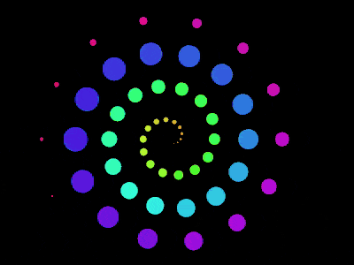

+++
title = '旋臂粒子动画'
date = 2018-07-25T17:17:40+08:00
image = '/test-hugo-deploy/img/thumbs/089.png'
summary = '#89'
+++



## 效果预览

点击链接可以在 Codepen 预览。

[https://codepen.io/comehope/pen/xJrOqd](https://codepen.io/comehope/pen/xJrOqd)

## 可交互视频

此视频是可以交互的，你可以随时暂停视频，编辑视频中的代码。

[https://scrimba.com/p/pEgDAM/cr6Vetm](https://scrimba.com/p/pEgDAM/cr6Vetm)

## 源代码下载

每日前端实战系列的全部源代码请从 github 下载：

[https://github.com/comehope/front-end-daily-challenges](https://github.com/comehope/front-end-daily-challenges)

## 代码解读

定义 dom，容器中包含 6 个 内含 `<span>` 的 `<div>` 元素，每个 `<div>` 元素代表 1 个粒子：
```html
<section class="container">
    <div><span></span></div>
    <div><span></span></div>
    <div><span></span></div>
    <div><span></span></div>
    <div><span></span></div>
    <div><span></span></div>
</section>
```

居中显示：
```css
body {
    margin: 0;
    height: 100vh;
    display: flex;
    align-items: center;
    justify-content: center;
    background-color: black;
}
```

定义容器尺寸：
```css
.container {
    width: 70vmin;
    height: 70vmin;
}
```

在容器中定位 `<div>`，并在 `<div>` 中用 `<span>` 画出粒子：
```css
.container {
    display: flex;
    align-items: center;
    justify-content: center;
}

.container div {
    position: absolute;
    width: 10vmin;
    height: 10vmin;
}

.container div span {
    position: absolute;
    width: inherit;
    height: inherit;
    border-radius: 50%;
    background-color: limegreen;
    transform: translateX(300%);
}
```

用变量定义粒子的旋转角度，其中 --particles-per-circle 每圈的粒子数，因为每圈有 3 个粒子，所以圈中有 3 个位置，每个位置有 2 个粒子重叠在一起，此时看起来是只有 3 个粒子的样子：
```css
.container {
    --particles-per-circle: 3;
}

.container div {
    transform: rotate(calc(var(--n) / var(--particles-per-circle) * -360deg));
}

.container div:nth-child(1) {
    --n: 1;
}

.container div:nth-child(2) {
    --n: 2;
}

.container div:nth-child(3) {
    --n: 3;
}

.container div:nth-child(4) {
    --n: 4;
}

.container div:nth-child(5) {
    --n: 5;
}

.container div:nth-child(6) {
    --n: 6;
}
```

定义粒子从中心向外侧的运动效果：
```css
.container div span {
    animation: move 2s linear infinite;
}

@keyframes move {
    from {
        transform: translateX(0) scale(0);
    }

    70% {
        transform: translateX(210%) scale(0.55);
    }

    to {
        transform: translateX(300%) scale(0);
    }
}
```

再增加运动时让粒子变色的效果，沿色相环取了 10 个颜色：
```css
.container div span {
    animation: 
        move 2s linear infinite,
        change-color 2s linear infinite;
}

@keyframes change-color {
    0%, 100% {
        background-color: hsl(calc(0 / 100 * 360deg), 80%, 55%);
    }

    10% {
        background-color: hsl(calc(10 / 100 * 360deg), 80%, 55%);
    }

    20% {
        background-color: hsl(calc(20 / 100 * 360deg), 80%, 55%);
    }

    30% {
        background-color: hsl(calc(30 / 100 * 360deg), 80%, 55%);
    }

    40% {
        background-color: hsl(calc(40 / 100 * 360deg), 80%, 55%);
    }

    50% {
        background-color: hsl(calc(50 / 100 * 360deg), 80%, 55%);
    }

    60% {
        background-color: hsl(calc(60 / 100 * 360deg), 80%, 55%);
    }

    70% {
        background-color: hsl(calc(70 / 100 * 360deg), 80%, 55%);
    }

    80% {
        background-color: hsl(calc(80 / 100 * 360deg), 80%, 55%);
    }

    90% {
        background-color: hsl(calc(90 / 100 * 360deg), 80%, 55%);
    }
}
```

用变量设置动画延时，这时可以看到 6 个粒子陆续出现了。其中 --circles 表示圈数；--particles 表示粒子数，它等于每圈的粒子数与圈数的积：
```css
.container {
    --circles: 2;
    --particles: calc(var(--particles-per-circle) * var(--circles));
}

.container div span {
    animation-delay: calc(var(--n) / var(--particles) * -2s);
}
```

接下来用 d3 来批量创建粒子。
引入 d3 库：
```html
<script src="https://d3js.org/d3.v5.min.js"></script>
```

用 d3 为 --particles-per-circle 和 --circles 变量赋值：
```javascript
const PARTICLES_PER_CIRCLE = 3;
const CIRCLES = 2;

d3.select('.container')
    .style('--particles-per-circle', PARTICLES_PER_CIRCLE)
    .style('--circles', CIRCLES);
```

用 d3 创建粒子 dom 元素：
```javascript
const COUNT_OF_PARTICLES = PARTICLES_PER_CIRCLE * CIRCLES;

d3.select('.container')
    .style('--particles-per-circle', PARTICLES_PER_CIRCLE)
    .style('--circles', CIRCLES)
    .selectAll('div')
    .data(d3.range(COUNT_OF_PARTICLES))
    .enter()
    .append('div')
    .append('span');
```

用 d3 为粒子元素的 --n 变量赋值：
```javascript
d3.select('.container')
    .style('--particles-per-circle', PARTICLES_PER_CIRCLE)
    .style('--circles', CIRCLES)
    .selectAll('div')
    .data(d3.range(COUNT_OF_PARTICLES))
    .enter()
    .append('div')
    .style('--n', (d) => d + 1)
    .append('span');
```

删除掉 dom 中的粒子元素，以及用 css 声明的变量。

最后，调整每圈的粒子数和圈数，形成旋臂效果：
```javascript
const PARTICLES_PER_CIRCLE = 14;
const CIRCLES = 4;
```

大功告成！
