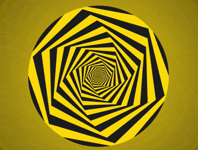

+++
title = '无尽的六边形空间'
date = 2018-07-26T17:31:12+08:00
image = '/test-hugo-deploy/img/thumbs/090.png'
summary = '#90'
+++



## 效果预览

点击链接可以在 Codepen 预览。

[https://codepen.io/comehope/pen/NBvrWL](https://codepen.io/comehope/pen/NBvrWL)

## 可交互视频

此视频是可以交互的，你可以随时暂停视频，编辑视频中的代码。

[https://scrimba.com/p/pEgDAM/czD3PhM](https://scrimba.com/p/pEgDAM/czD3PhM)

## 源代码下载

每日前端实战系列的全部源代码请从 github 下载：

[https://github.com/comehope/front-end-daily-challenges](https://github.com/comehope/front-end-daily-challenges)

## 代码解读

定义 dom，容器中包含 1 个内含 5 个 `<span>` 的 `<div>`：
```html
<div class="container">
    <div class="hxgns">
        <span></span>
        <span></span>
        <span></span>
        <span></span>
        <span></span>
    </div>
</div>
```

居中显示：
```css
body {
    margin: 0;
    height: 100vh;
    display: flex;
    align-items: center;
    justify-content: center;
    background: radial-gradient(circle at center, gold, black);
}
```

定义圆形的外层容器的尺寸：
```css
.container {
    width: 20em;
    height: 20em;
    font-size: 20px;
    border-radius: 50%;
}
```

在六边形容器中画出 1 个矩形：
```css
.hexagons {
    width: inherit;
    height: inherit;
    display: flex;
    align-items: center;
    justify-content: center;
}

.hexagons span {
    position: absolute;
    width: calc(20em / 1.732);
    height: inherit;
    background-color: currentColor;
    transform: scale(var(--scale)) rotate(calc(var(--n) * 6deg));
}
```

用伪元素再创建 2 个相同大小的矩形，一起组成一个六边形：
```css
.hexagons span:before,
.hexagons span:after {
    content: '';
    position: absolute;
    width: inherit;
    height: inherit;
    background-color: currentColor;
}

.hexagons span:before {
    transform: rotate(60deg);
}

.hexagons span:after {
    transform: rotate(-60deg);
}
```

让六边形的颜色交错呈现：
```css
.hexagons span:nth-child(odd) {
    color: gold;
}

.hexagons span:nth-child(even) {
    color: #222;
}
```

设置变量，让六边形逐渐缩小，小六边形重叠在大六边形的上面：
```css
.hexagons span {
    transform: scale(var(--scale)) ;
}

.hexagons span:nth-child(1) {
    --scale: 1;
}

.hexagons span:nth-child(2) {
    --scale: calc(1 * 0.9);
}

.hexagons span:nth-child(3) {
    --scale: calc(1 * 0.9 * 0.9);
}

.hexagons span:nth-child(4) {
    --scale: calc(1 * 0.9 * 0.9 * 0.9);
}

.hexagons span:nth-child(5) {
    --scale: calc(1 * 0.9 * 0.9 * 0.9 * 0.9);
}
```

再设置变量，让六边形依次倾斜不同的角度：
```css
.hexagons span {
    transform: scale(var(--scale)) rotate(calc(var(--n) * 6deg));
}

.hexagons span:nth-child(1) {
    --n: 1;
}

.hexagons span:nth-child(2) {
    --n: 2;
}

.hexagons span:nth-child(3) {
    --n: 3;
}

.hexagons span:nth-child(4) {
    --n: 4;
}

.hexagons span:nth-child(5) {
    --n: 5;
}
```

定义动画效果：
```css
.hexagons {
    animation: twist 0.5s linear infinite;
}

@keyframes twist {
    from {
        transform: rotate(0deg) scale(1);
    }

    to {
        transform: rotate(calc(6deg * -2)) scale(1.25);
    }
}
```

隐藏容器外的内容：
```css
.container {
    overflow: hidden;
}
```

接下来用 d3 来批量创建六边形。
引入 d3 库：
```html
<script src="https://d3js.org/d3.v5.min.js"></script>
```

用 d3 创建六边形的 dom 元素：
```javascript
const COUNT = 5;

d3.select('.hexagons')
    .selectAll('span')
    .data(d3.range(COUNT))
    .enter()
    .append('span');
```

用 d3 为六边形的 --n 和 --scale 变量赋值：
```javascript
d3.select('.hexagons')
    .selectAll('span')
    .data(d3.range(COUNT))
    .enter()
    .append('span')
    .style('--scale', (d) => Math.pow(0.9, d))
    .style('--n', (d) => d + 1);
```

删除掉 html 文件中的六边形 dom 元素，和 css 文件中声明的变量。

最后，把六边形的数量改为 100 个：
```javascript
const COUNT = 100;
```

大功告成！
