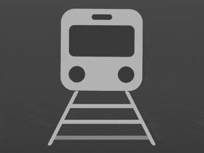

+++
title = '火车 loader'
date = 2018-07-27T17:31:34+08:00
image = '/fe/img/thumbs/091.png'
summary = '#91'
+++



## 效果预览

点击链接可以在 Codepen 预览。

[https://codepen.io/comehope/pen/RBLWzJ](https://codepen.io/comehope/pen/RBLWzJ)

## 可交互视频

此视频是可以交互的，你可以随时暂停视频，编辑视频中的代码。

[https://scrimba.com/p/pEgDAM/cawN3f9](https://scrimba.com/p/pEgDAM/cawN3f9)

## 源代码下载

每日前端实战系列的全部源代码请从 github 下载：

[https://github.com/comehope/front-end-daily-challenges](https://github.com/comehope/front-end-daily-challenges)

## 代码解读

定义 dom，容器中包含 2 个元素，`train` 代表火车，`track` 代表铁轨，其中包含的 3 个 `<span>` 代表 3 根枕木。
```html
<div class="loader">
    <div class="train"></div>
    <div class="track">
        <span></span>
        <span></span>
        <span></span>
    </div>
</div>
```

居中显示：
```css
body{
    margin: 0;
    height: 100vh;
    display: flex;
    align-items: center;
    justify-content: center;
    background: linear-gradient(#666, #333);
}
```

定义容器尺寸：
```css
.loader {
    width: 8em;
    height: 10em;
    font-size: 20px;
}
```

先画火车。
画出火车的轮廓：
```css
.train {
    width: 6em;
    height: 6em;
    color: #444;
    background: #bbb4ab;
    border-radius: 1em;
    position: relative;
    left: 1em;
}
```

用 ::before 伪元素画出车窗：
```css
.train::before {
    content: '';
    position: absolute;
    width: 80%;
    height: 2.3em;
    background-color: currentColor;
    border-radius: 0.4em;
    top: 1.2em;
    left: 10%;
}
```

再用 ::after 伪元素画出车窗上的信号灯：
```css
.train::after {
    content: '';
    position: absolute;
    width: 25%;
    height: 0.4em;
    background-color: currentColor;
    border-radius: 0.3em;
    top: 0.4em;
    left: calc((100% - 25%) / 2);
}
```

利用径向渐变画出车灯：
```css
.train {
    background: 
        radial-gradient(circle at 20% 80%, currentColor 0.6em, transparent 0.6em),
        radial-gradient(circle at 80% 80%, currentColor 0.6em, transparent 0.6em),
        #bbb;
}
```

接下来画铁轨和枕木。
定义铁轨的宽度，比火车稍宽：
```css
.track {
    width: 8em;
}
```

用伪元素画出铁轨：
```css
.track {
    position: relative;
}

.track::before,
.track::after {
    content: '';
    position: absolute;
    width: 0.3em;
    height: 4em;
    background-color: #bbb;
    border-radius: 0.4em;
    transform-origin: bottom;
}
```

把铁轨分别放置在两侧，并形成近大远小的视觉效果：
```css
.track::before {
    left: 0;
    transform: skewX(-27deg);
}

.track::after {
    right: 0;
    transform: skewX(27deg);
}
```

画出枕木，这是距离观察者最近的效果，目前 3 根枕木是重叠在一起的：
```css
.track span {
    width: inherit;
    height: 0.3em;
    background-color: #bbb;
    position: absolute;
    top: 4em;
}
```

设置铁轨的动画效果：
```css
.track span {
    animation: track-animate 1s linear infinite;
}

@keyframes track-animate {
    0% {
        transform: translateY(-0.5em) scaleX(0.9);
        filter: opacity(0);
    }

    10%, 90% {
        filter: opacity(1);
    }

    100% {
        transform: translateY(-4em) scaleX(0.5);
        filter: opacity(0);
    }
}
```

为另外 2 根枕木设置动画延时，使铁轨看起来就像永远走不完的样子：
```css
.track span:nth-child(2) {
    animation-delay: -0.33s;
}

.track span:nth-child(3) {
    animation-delay: -0.66s;
}
```

最后，为火车增加动画效果，看起来就像行驶中在微微晃动：
```css
.train {
    animation: train-animate 1.5s infinite ease-in-out;
}

@keyframes train-animate {
    0%, 100% {
        transform: rotate(0deg);
    }

    25%, 75% {
        transform: rotate(0.5deg);
    }

    50% {
        transform: rotate(-0.5deg);
    }
}
```

大功告成！
