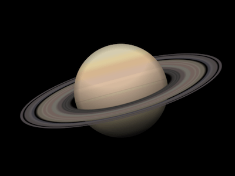

+++
title = '土星'
date = 2018-07-28T17:31:47+08:00
image = '/fe/img/thumbs/092.png'
summary = '#92'
+++



## 效果预览

点击链接可以在 Codepen 预览。

[https://codepen.io/comehope/pen/EpbaQX](https://codepen.io/comehope/pen/EpbaQX)

## 可交互视频

此视频是可以交互的，你可以随时暂停视频，编辑视频中的代码。

[https://scrimba.com/p/pEgDAM/cBdyeTw](https://scrimba.com/p/pEgDAM/cBdyeTw)

## 源代码下载

每日前端实战系列的全部源代码请从 github 下载：

[https://github.com/comehope/front-end-daily-challenges](https://github.com/comehope/front-end-daily-challenges)

## 代码解读

定义 dom，容器本身表示土星星球，其中的 `ring` 元素表示土星环：
```html
<div class="saturn">
        <span class="rings"></span>
    </div>
```

居中显示：
```css
body {
    margin: 0;
    height: 100vh;
    display: flex;
    align-items: center;
    justify-content: center;
    background-color: black;
}
```

定义容器尺寸：
```css
.saturn {
    width: 20em;
    height: 20em;
    font-size: 20px;
}
```

画出土星星球（此为草稿，后面还会细化）：
```css
.saturn {
    position: relative;
}

.saturn::before,
.saturn::after {
    content: '';
    position: absolute;
    width: 9em;
    height: 9em;
    background: linear-gradient(
        palegoldenrod 0%,
        tan 10%,
        burlywood 30%,
        palegoldenrod 60%,
        darkgray 100%
    );
    border-radius: 50%;
    left: calc((20em - 9em) / 2);
    top: calc((20em - 9em) / 2);
}
```

画出土星环（此为草稿，后面还会细化）：
```css
.rings {
    position: absolute;
    width: inherit;
    height: inherit;
    background: radial-gradient(
        transparent 35%,
        dimgray 40%,
        slategray 50%,
        transparent 60%,
        dimgray 60%,
        slategray 70%,
        transparent 70%
    );
}
```

改变观察土星环的视角：
```css
.rings {
    transform: rotateX(75deg);
}
```

为了使土星呈现被土星环环绕的效果，把土星分为上下两半，使它们和土星环的图层顺序从底到顶依次为：星球的下半部、土星环、星球的上半部：
```css
.saturn::before {
    clip-path: inset(50% 0 0 0);
}

.saturn::after {
    clip-path: inset(0 0 50% 0);
}
```

至此，画出了土星的整体结构，接下来完善细节。
为土星环涂上丰富的渐变色：
```css
.rings {
    background: radial-gradient(
        rgba(24,19,25,0) 0%,
        rgba(53,52,51,0) 34%,
        rgba(55,54,52,1) 36%,
        rgba(56,55,53,1) 37%,
        rgba(68,67,66,1) 38%,
        rgba(56,55,53,1) 39%,
        rgba(68,67,66,1) 40%,
        rgba(56,55,53,1) 41%,
        rgba(87,77,76,1) 42%,
        rgba(87,77,76,1) 44%,
        rgba(113,110,103,1) 46%,
        rgba(113,110,103,1) 48%,
        rgba(113,98,93,1) 49%,
        rgba(113,98,93,1) 51%,
        rgba(122,115,105,1) 52%,
        rgba(113,98,93,1) 53%,
        rgba(113,98,93,1) 54%,
        rgba(122,115,105,1) 55%,
        rgba(106,99,89,1) 56%,
        rgba(106,99,89,1) 58%,
        rgba(79,76,76,0) 60%,
        rgba(65,64,70,1) 61%,
        rgba(65,64,70,1) 62%,
        rgba(90,85,89,1) 63%,
        rgba(78,74,73,1) 65%,
        rgba(78,73,74,1) 67%,
        rgba(78,73,74,0) 68%,
        rgba(78,73,75,1) 69%,
        rgba(78,73,75,1) 70%,
        rgba(78,73,76,0) 71%,
        rgba(77,72,76,0) 72%,
        rgba(24,19,25,0) 100%
    );
}
```

为星球涂上丰富的渐变色：
```css
.saturn::before,
.saturn::after {
    background:
        linear-gradient(
            rgba(212,203,174,1) 0%,
            rgba(212,203,174,1) 10%,
            rgba(221,203,157,1) 15%,
            rgba(221,203,157,1) 17%,
            rgba(213,181,143,1) 22%,
            rgba(213,181,143,1) 26%,
            rgba(208,180,158,1) 32%,
            rgba(208,180,158,1) 36%,
            rgba(218,188,162,1) 37%,
            rgba(218,188,162,1) 39%,
            rgba(211,184,157,1) 41%,
            rgba(211,184,157,1) 49%,
            rgba(205,186,156,1) 51%,
            rgba(205,186,156,1) 52%,
            rgba(202,176,153,1) 53%,
            rgba(202,176,153,1) 65%,
            rgba(190,177,145,1) 68%,
            rgba(190,177,145,1) 80%,
            rgba(150,144,130,1) 91%,
            rgba(150,144,130,1) 95%,
            rgba(131,129,117,1) 97%,
            rgba(131,129,117,1) 100%
        );
}
```

再为星球增加光照效果：
```css
.saturn::before,
.saturn::after {
    background:
        radial-gradient(
            circle at top, 
            transparent 40%,
            black
        ),
        radial-gradient(
            transparent 62%,
            black
        ),
        linear-gradient(
            rgba(212,203,174,1) 0%,
            rgba(212,203,174,1) 10%,
            rgba(221,203,157,1) 15%,
            rgba(221,203,157,1) 17%,
            rgba(213,181,143,1) 22%,
            rgba(213,181,143,1) 26%,
            rgba(208,180,158,1) 32%,
            rgba(208,180,158,1) 36%,
            rgba(218,188,162,1) 37%,
            rgba(218,188,162,1) 39%,
            rgba(211,184,157,1) 41%,
            rgba(211,184,157,1) 49%,
            rgba(205,186,156,1) 51%,
            rgba(205,186,156,1) 52%,
            rgba(202,176,153,1) 53%,
            rgba(202,176,153,1) 65%,
            rgba(190,177,145,1) 68%,
            rgba(190,177,145,1) 80%,
            rgba(150,144,130,1) 91%,
            rgba(150,144,130,1) 95%,
            rgba(131,129,117,1) 97%,
            rgba(131,129,117,1) 100%
        );
}
```

最后，把画面旋转一点角度：
```css
.saturn {
    transform: rotate(-15deg);
}
```

大功告成！
