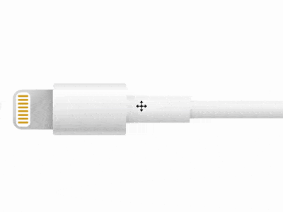

+++
title = '闪电连接线'
date = 2018-07-30T17:32:07+08:00
image = '/test-hugo-deploy/img/thumbs/093.png'
summary = '#93'
+++



## 效果预览

点击链接可以在 Codepen 预览。

[https://codepen.io/comehope/pen/RBjdzZ](https://codepen.io/comehope/pen/RBjdzZ)

## 可交互视频

此视频是可以交互的，你可以随时暂停视频，编辑视频中的代码。

[https://scrimba.com/p/pEgDAM/cgkE6C6](https://scrimba.com/p/pEgDAM/cgkE6C6)

## 源代码下载

每日前端实战系列的全部源代码请从 github 下载：

[https://github.com/comehope/front-end-daily-challenges](https://github.com/comehope/front-end-daily-challenges)

## 代码解读

定义 dom，容器中包含 2 个元素，分别代表插头和线缆：
```html
<div class="cable">
    <span class="head"></span>
    <span class="body"></span>
</div>
```

居中显示：
```css
body {
    margin: 0;
    height: 100vh;
    display: flex;
    align-items: center;
}
```

定义容器尺寸：
```css
.cable {
    display: flex;
    align-items: center;
    font-size: 10px;
    margin-left: 5em;
}
```

画出插头的轮廓：
```css
.head {
    width: 8.5em;
    height: 8.5em;
    border-radius: 2em 0 0 2em;
}
```

画出插头上针脚的轮廓：
```css
.head {
    position: relative;
}

.head::before {
    content: '';
    position: absolute;
    width: 3em;
    height: 7.3em;
    top: calc((8.5em - 7.3em) / 2);
    left: 0.7em;
    border-radius: 1em;
    box-sizing: border-box;
}
```

画出线缆中手持部位的轮廓：
```css
.body {
    width: 15.5em;
    height: 11em;
    border-radius: 0.5em;
}
```

画出线缆中稍粗部位的轮廓：
```css
.body {
    position: relative;
    display: flex;
    align-items: center;
}

.body::before {
    content: '';
    position: absolute;
    width: 13.5em;
    height: 6em;
    left: 15.5em;
}
```

画出线缆的延长线部分：
```css
.body::after {
    content: '';
    position: absolute;
    width: 100vh;
    height: 3.9em;
    left: calc(15.5em + 13.5em);
}
```

隐藏画面外的部分：
```css
body {
    overflow: hidden;
}
```

接下来绘制细节。
为延长线涂上渐变色：
```css
.body::after {
    background:
        linear-gradient(
            white,
            hsl(0, 0%, 96%) 5%,  
            hsl(0, 0%, 97%) 25%, 
            hsl(0, 0%, 95%) 40%, 
            hsl(0, 0%, 81%) 95%,
            white
        );
}
```

为线缆中稍粗部位涂上渐变色：
```css
.body::before {
    background:
        linear-gradient(
            white,
            hsl(0, 0%, 96%) 5%,  
            hsl(0, 0%, 98%) 20%, 
            hsl(0, 0%, 95%) 50%, 
            hsl(0, 0%, 81%) 95%,
            white
        );
}
```

为线缆中手持部位涂上渐变色：
```css
.body {
    background:linear-gradient(
        hsl(0, 0%, 91%),
        white 15%, 
        hsl(0, 0%, 93%) 50%, 
        hsl(0, 0%, 87%) 70%,
        hsl(0, 0%, 79%) 90%,
        hsl(0, 0%, 84%), 
        hsl(0, 0%, 86%)
    );
}
```

为插头涂上渐变色：
```css
.head {
    background:
        linear-gradient(
            -45deg, 
            hsl(0, 0%, 75%),
            hsl(0, 0%, 79%),
            hsl(0, 0%, 78%),
            hsl(0, 0%, 87%) 80%
        );
}
```

在插头上画出针脚：
```css
.head::before {
    background-color: white;
}

.head::after {
    content: '';
    position: absolute;
    box-sizing: border-box;
    width: 2.2em;
    height: 0.4em;
    color: goldenrod;
    background-color: currentColor;
    border-radius: 0.5em;
    left: 1.1em;
    top: 1.2em;
    box-shadow: 
        0 0.8em 0,
        0 1.6em 0,
        0 2.4em 0,
        0 3.2em 0,
        0 4em 0,
        0 4.8em 0,
        0 5.6em 0;
}
```

接下来添加阴影，使线缆更立体。
绘制插头上的阴影：
```css
.head {
    background:
        linear-gradient(
            90deg, 
            transparent 80%,
            rgba(0,0,0,12%)
        ),
        linear-gradient(
            -45deg, 
            hsl(0, 0%, 75%),
            hsl(0, 0%, 79%),
            hsl(0, 0%, 78%),
            hsl(0, 0%, 87%) 80%
        );
}
```

绘制线缆手持部分的阴影：
```css
.body::before {
    background:
        linear-gradient(
            45deg, 
            rgba(0,0,0,4%) 10%,
            transparent 20%
        ),    
        linear-gradient(
            90deg, 
            rgba(0,0,0,4%), 
            transparent 10%
        ),
        linear-gradient(
            white,
            hsl(0, 0%, 96%) 5%,  
            hsl(0, 0%, 98%) 20%, 
            hsl(0, 0%, 95%) 50%, 
            hsl(0, 0%, 81%) 95%,
            white
        );
}
```

绘制线缆中稍粗部位的阴影：
```css
.body::after {
    background:
        linear-gradient(
            45deg, 
            rgba(0,0,0,4%),
            transparent 4%
        ),
        linear-gradient(
            90deg, 
            rgba(0,0,0,4%),
            transparent 2%
        ),
        linear-gradient(
            white,
            hsl(0, 0%, 96%) 5%,  
            hsl(0, 0%, 97%) 25%, 
            hsl(0, 0%, 95%) 40%, 
            hsl(0, 0%, 81%) 95%,
            white
        );
}
```

最后，为画面增加入场动画
```css
.cable {
    animation: show 5s linear infinite;
}

@keyframes show {
    0% {
        transform: translateX(100vw);
    }

    20%, 100% {
        transform: translateX(0);
    }
}
```

大功告成！
