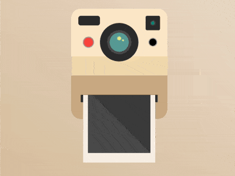

+++
title = '拍立得照相机'
date = 2018-07-31T17:32:24+08:00
image = '/fe/img/thumbs/094.png'
summary = '#94'
+++



## 效果预览

点击链接可以在 Codepen 预览。

[https://codepen.io/comehope/pen/YjYgey](https://codepen.io/comehope/pen/YjYgey)

## 可交互视频

此视频是可以交互的，你可以随时暂停视频，编辑视频中的代码。

[https://scrimba.com/p/pEgDAM/cpQpGtQ](https://scrimba.com/p/pEgDAM/cpQpGtQ)

## 源代码下载

每日前端实战系列的全部源代码请从 github 下载：

[https://github.com/comehope/front-end-daily-challenges](https://github.com/comehope/front-end-daily-challenges)

## 代码解读

定义 dom，容器中包含 2 个元素，分别代表镜头和照片：
```html
<div class="camera">
    <span class="lens"></span>
    <span class="picture"></span>
</div>
```

居中显示：
```css
body {
    margin: 0;
    height: 100vh;
    display: flex;
    align-items: center;
    justify-content: center;
    background: linear-gradient(to left bottom, linen, tan);
}
```

画出相机的轮廓：
```css
.camera {
    width: 20em;
    height: 23em;
    font-size: 10px;
    background: 
        linear-gradient(
            blanchedalmond, blanchedalmond 10em,
            wheat 10em, wheat 14em,
            tan 14em
        );
    border-radius: 2em;
}
```

画出镜头的轮廓：
```css
.camera {
    position: relative;
}

.lens {
    position: absolute;
    width: 8em;
    height: 8em;
    background: 
        radial-gradient(
            cadetblue 2em,
            #555 2em, #555 2.5em,
            #333 2.5em, #333 4em
        );
    border-radius: 50%;
    top: 3em;
    left: 6em;
}
```

用线性渐变画出下方照片的出口：
```css
.camera {
    background: 
        linear-gradient(
            transparent 18em,
            #333 18em, #333 19.5em,
            transparent 19.5em
        ) no-repeat center / 80% 100%,
        linear-gradient(
            blanchedalmond, blanchedalmond 10em,
            wheat 10em, wheat 14em,
            tan 14em
        );
    border-radius: 2em;
    position: relative;
}
```

接下来修饰细节。
用伪元素画出相机的取景器和闪光灯：
```css
.camera::before {
    content: '';
    position: absolute;
    width: 4.5em;
    height: 2em;
    background-color: #333;
    border-radius: 0.5em;
    top: 1.5em;
    left: 1.5em;
}

.camera::after {
    content: '';
    position: absolute;
    width: 3em;
    height: 3em;
    background-color: #333;
    background-image: radial-gradient(
        teal 10%,
        #333 30%,
        transparent 40%
    );
    right: 1.5em;
    top: 1.5em;
    border-radius: 0.3em;
}
```

用径向渐变画出相机上的按钮：
```css
.camera {
    background: 
        radial-gradient(
            circle at 17em 7em,
            black 0.8em,
            darkgray 0.8em, darkgray 1em,
            transparent 1em
        ),
        radial-gradient(
            circle at 3.6em 7em,
            tomato 1em,
            darkgray 1em, darkgray 1.2em,
            transparent 1.2em
        ),
        linear-gradient(
            transparent 18em,
            #333 18em, #333 19.5em,
            transparent 18em
        ) no-repeat center / 80% 100%,
        linear-gradient(
            blanchedalmond, blanchedalmond 10em,
            wheat 10em, wheat 14em,
            tan 14em
        );
}
```

用径向渐变画出镜头上的光影：
```css
.lens {
    background: 
        radial-gradient(
            circle at 60% 45%,
            khaki 0.1em,
            transparent 0.3em
        ),
        radial-gradient(
            circle at 50% 40%,
            khaki 0.3em,
            transparent 0.5em
        ),
        radial-gradient(
            cadetblue 2em,
            #555 2em, #555 2.5em,
            #333 2.5em, #333 4em
        );
}
```

接下来制作动画效果。
用伪元素模拟快门：
```css
.lens::before,
.lens::after {
    content: '';
    position: absolute;
    width: 5em;
    height: 0.1em;
    background-color: #333;
}

.lens::before {
    top: 1em;
}

.lens::after {
    bottom: 1em;
}
```

增加快门开合动画效果：
```css
.lens::before,
.lens::after {
    animation: take-a-photo 3s infinite;
}

@keyframes take-a-photo {
    10% {
        height: calc(50% - 1em);
    }

    20% {
        height: 0.1em;
    }
}
```

画出照片：
```css
.picture {
    position: absolute;
    width: inherit;
    height: 13em;
    top: 18em;
}

.picture::before {
    content: '';
    position: absolute;
    box-sizing: border-box;
    width: 15em;
    height: 15em;
    background: #555;
    left: 2.5em;
    border: solid linen;
    border-width: 0 1em 2em 1em;
    bottom: 0;
}
```

增加打印照片的动画效果：
```css
.picture {
    height: 0em;
    overflow: hidden;
    animation: print 3s infinite;
}

@keyframes print {
    30% {
        height: 0em;
    }

    80%, 100% {
        height: 13em;
    }
}
```

最后，把相机向上挪一点，保持垂直居中：
```css
.camera {
    transform: translateY(-3em);
}
```

大功告成！
