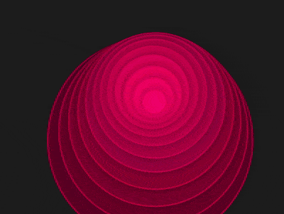

+++
title = '扭动的蠕虫'
date = 2018-08-01T17:34:24+08:00
image = '/fe/img/thumbs/095.png'
summary = '#95'
+++



## 效果预览

点击链接可以在 Codepen 预览。

[https://codepen.io/comehope/pen/QBQJMg](https://codepen.io/comehope/pen/QBQJMg)

## 可交互视频

此视频是可以交互的，你可以随时暂停视频，编辑视频中的代码。

[https://scrimba.com/p/pEgDAM/c9mydU8](https://scrimba.com/p/pEgDAM/c9mydU8)

## 源代码下载

每日前端实战系列的全部源代码请从 github 下载：

[https://github.com/comehope/front-end-daily-challenges](https://github.com/comehope/front-end-daily-challenges)

## 代码解读

定义 dom，容器中包含 3 個元素，代表蠕虫的 3 个体节：
```html
<div class="worm">
    <span></span>
    <span></span>
    <span></span>
</div>
```

居中显示：
```css
body {
    margin: 0;
    height: 100vh;
    display: flex;
    align-items: center;
    justify-content: center;
    background-color: #222;
}
```

画出蠕虫最大的体节：
```css
.worm {
    display: flex;
    align-items: center;
    justify-content: center;
}

.worm span {
    position: absolute;
    width: 90vmin;
    height: 90vmin;
    background-color: hsl(336, 100%, 19%);
    border-radius: 50%;
    border: 3px solid;
    border-color: hsl(336, 100%, 36%);
}
```

定义 css 变量：
```css
.worm {
    --particles: 3;
}

.worm span:nth-child(1) {
    --n: 1;
}

.worm span:nth-child(2) {
    --n: 2;
}

.worm span:nth-child(3) {
    --n: 3;
}
```

用变量定义体节的尺寸，画出其他体节：
```css
.worm span {
    --diameter: calc(100vmin - var(--n) * 90vmin / var(--particles));
    width: var(--diameter);
    height: var(--diameter);
}
```

用变量定义体节的颜色，使它们显得有层次感：
```css
.worm span {
    background-color: hsl(336, 100%, calc((19 + var(--n) * 3) * 1%));
    border-color: hsl(336, 100%, calc((36 + var(--n) * 1) * 1%));
    box-shadow: 0 0 33px rgba(0, 0, 0, 0.3);
}
```

定义动画效果：
```css
.worm span {
    animation: rotating 4s infinite cubic-bezier(0.6, -0.5, 0.3, 1.5);
}

@keyframes rotating {
    from {
        transform-origin: 0%;
    }

    to {
        transform: rotate(1turn);
        transform-origin: 0% 50%;
    }
}
```

用变量设置动画延时：
```css
.worm span {
    animation-delay: calc(1s - var(--n) * 100ms);
}
```

隐藏页面外的内容：
```css
body {
    overflow: hidden;
}
```

接下来用 d3 批量处理 dom 元素。
引入 d3 库：
```html
<script src="https://d3js.org/d3.v5.min.js"></script>
```

用 d3 为 --particles 变量赋值：
```javascript
const COUNT_OF_PARTICLES = 3;

d3.select('.worm')
    .style('--particles', COUNT_OF_PARTICLES);
```

用 d3 创建 dom 元素：
```javascript
d3.select('.worm')
    .style('--particles', COUNT_OF_PARTICLES)
    .selectAll('span')
    .data(d3.range(COUNT_OF_PARTICLES))
    .enter()
    .append('span');
```

用 d3 为 dom 元素的 --n 属性赋值：
```javascript
d3.select('.worm')
    .style('--particles', COUNT_OF_PARTICLES)
    .selectAll('span')
    .data(d3.range(COUNT_OF_PARTICLES))
    .enter()
    .append('span')
    .style('--n', (d) => d + 1);
```

删除掉 html 文件中声明 dom 元素的代码，删除掉 css 文件中声明 --particles 和 --n 变量的代码。

最后，把 dom 元素数设置为 12 个：
```javascript
const COUNT_OF_PARTICLES = 12;
```

大功告成！
