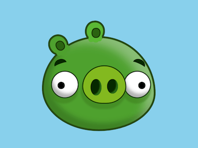

+++
title = '愤怒小鸟的绿猪'
date = 2018-08-07T17:38:18+08:00
image = '/fe/img/thumbs/098.png'
summary = '#98'
+++



## 效果预览

点击链接可以在 Codepen 预览。

[https://codepen.io/comehope/pen/VBGWqX](https://codepen.io/comehope/pen/VBGWqX)

## 可交互视频

此视频是可以交互的，你可以随时暂停视频，编辑视频中的代码。

[https://scrimba.com/p/pEgDAM/cVweZAr](https://scrimba.com/p/pEgDAM/cVweZAr)

## 源代码下载

每日前端实战系列的全部源代码请从 github 下载：

[https://github.com/comehope/front-end-daily-challenges](https://github.com/comehope/front-end-daily-challenges)

## 代码解读

定义 dom，容器中包含 3 个元素，分别代表耳朵、眼睛、鼻子：
```html
<div class="pig">
    <span class="ears"></span>
    <span class="eyes"></span>
    <span class="nose"></span>
</div>
```

居中显示：
```css
body {
    margin: 0;
    height: 100vh;
    display: flex;
    align-items: center;
    justify-content: center;
    background-color: skyblue;
}
```

设置伪元素的共有属性，后面有多处用到伪元素：
```css
.pig::before,
.pig::after,
.pig *::before,
.pig *::after {
    content: '';
    position: absolute;
}
```

定义容器尺寸：
```css
.pig {
    width: 12em;
    height: 10em;
    font-size: 20px;
    background-color: #50a032;
    border: 0.2em solid #2b4d13;
}
```

用圆角属性画出头部轮廓：
```css
.pig {
    border-radius: 50% 50% 50% 50% / 55% 60% 40% 45%;
}
```

画出鼻子的轮廓：
```css
.pig {
    position: relative;
}

.nose {
    position: absolute;
    width: 4.6em;
    height: 4em;
    background-color: #82b923;
    border: 0.1em solid #1d3c07;
    border-radius: 50% 50% 45% 45% / 55% 55% 45% 45%;
    top: 3em;
    left: 4.2em;
}
```

用伪元素画出鼻孔：
```css
.nose::before,
.nose::after {
    width: 1.2em;
    background-color: #0f2d00;
    border-radius: 50%;
    top: 1.4em;
}

.nose::before {
    left: 0.8em;
    height: 1.8em;
}

.nose::after {
    right: 0.8em;
    height: 1.6em;
}
```

画出眼睛的轮廓：
```css
.eyes::before,
.eyes::after {
    width: 2.8em;
    height: 2.8em;
    background: white;
    border-radius: 50%;
    border: 0.1em solid #193c09;
    top: 3.6em;
}

.eyes::before {
    left: 0.8em;
}

.eyes::after {
    right: 0.3em;
}
```

用径向渐变画出眼珠：
```css
.eyes::before,
.eyes::after {
    background: 
        radial-gradient(
            circle at var(--eyeball-left) 1.5em,
            black 0.4em,
            transparent 0.4em
        ),
        white;
}

.eyes::before {
    --eyeball-left: 1em;
}

.eyes::after {
    --eyeball-left: 1.9em;
}
```

画出内耳的轮廓：
```css
.ears::before,
.ears::after {
    width: 0.8em;
    height: 0.9em;
    background-color: #2f6317;
    border: 0.1em solid #1d3a0d;
    border-radius: 45% 45% 45% 45% / 55% 45% 55% 45%;
}

.ears::before {
    top: 0.3em;
    left: 1.3em;
}

.ears::after {
    top: -1.1em;
    right: 5.8em;
}
```

用阴影画出外耳：
```css
.ears::before {
    color: #50a032;
    box-shadow: 
        0.4em 0.7em 0 -0.2em,
        -0.2em 0.7em 0 -0.1em,
        -0.6em 0.5em 0 -0.2em,
        -0.1em -0.2em 0 0.4em,
        -0.1em -0.2em 0 0.6em #2b4d13;
    transform: rotate(-40deg);
}

.ears::after {
    color: #5cb739;
    box-shadow: 
        0.3em 0.6em 0 -0.2em,
        -0.1em 0.6em 0 -0.1em,
        -0.6em 0.6em 0 -0.2em,
        -0.1em -0.2em 0 0.4em,
        -0.1em -0.2em 0 0.6em #2b4d13;
    transform: rotate(-6deg);
}
```

用伪元素画出眉毛：
```css
.pig::before,
.pig::after {
    width: 1.4em;
    height: 1em;
    border-top: 0.5em solid #0f2d00;
    top: 2.3em;
    border-radius: 50% 50% 0 0 / 40% 40% 0 0;
}

.pig::before {
    left: 1.2em;
    transform: rotate(-20deg);
}

.pig::after {
    right: 1em;
    transform: rotate(25deg);
}
```

接下来设置阴影，增加立体效果。
为头部增加阴影效果：
```css
.pig {
    box-shadow: 
        inset -1.5em 1em 1.5em -0.5em rgba(255, 255, 255, 0.3),
        inset 0.5em -0.5em 0.8em 0.2em rgba(0, 0, 0, 0.2);
}
```

为鼻子增加阴影效果：
```css
.nose {
    box-shadow: -0.1em 0.5em 0.2em 0.1em rgba(68, 132, 36, 0.6);
}

.nose::before,
.nose::after {
    box-shadow: inset -0.3em -0.2em 0.1em -0.1em #2d6b1f;
}
```

为眼睛增加阴影效果：
```css
.eyes::before,
.eyes::after {
    box-shadow: 
        inset 0.3em -0.6em 0.5em -0.2em rgba(0, 0, 0, 0.3),
        -0.1em 0.5em 0.2em 0.1em rgba(68, 132, 36, 0.6);
}
```

大功告成！
