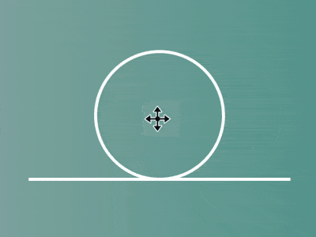

+++
title = '过山车 loader'
date = 2018-08-08T17:38:51+08:00
image = '/fe/img/thumbs/099.png'
summary = '#99'
+++



## 效果预览

点击链接可以在 Codepen 预览。

[https://codepen.io/comehope/pen/KBxYZg/](https://codepen.io/comehope/pen/KBxYZg/)

## 可交互视频

此视频是可以交互的，你可以随时暂停视频，编辑视频中的代码。

[https://scrimba.com/p/pEgDAM/cagbkSL](https://scrimba.com/p/pEgDAM/cagbkSL)

## 源代码下载

每日前端实战系列的全部源代码请从 github 下载：

[https://github.com/comehope/front-end-daily-challenges](https://github.com/comehope/front-end-daily-challenges)

## 代码解读
定义 dom，容器中包含 3 个元素，代表 3 个圆点：
```html
<div class="loader">
    <span></span>
    <span></span>
    <span></span>
</div>
```

居中显示：
```css
body {
    margin: 0;
    height: 100vh;
    display: flex;
    align-items: center;
    justify-content: center;
    background: linear-gradient(to right, silver, teal);
}
```

定义摩天轮的直径，其他长度均以此值为基本尺度：
```css
.loader {
    --diameter: 10em;
}
```

定义容器尺寸，宽是高的2倍：
```css
.loader {
    --width: calc(var(--diameter) * 2);
    width: var(--width);
    height: var(--diameter);
}
```

定义伪元素的共享属性：
```css
.loader {
    position: relative;
}

.loader::before,
.loader::after {
    content: '';
    position: absolute;
    bottom: 0;
}
```

画出底部的轨道，同时定义了一个表示线粗细的变量：
```css
.loader {
    --stroke-width: calc(var(--diameter) / 40);
    color: white;
}

.loader::before {
    width: inherit;
    height: var(--stroke-width);
    background-color: currentColor;
}
```

画出中部的圆形轨道：
```css
.loader::after {
    box-sizing: border-box;
    width: var(--diameter);
    height: var(--diameter);
    border: var(--stroke-width) solid;
    border-radius: 50%;
    left: 25%;
}
```

画出一个圆点，同时定义了一个表示圆点直径的变量：
```css
.loader {
    --dot-diameter: calc(var(--diameter) / 10);
}

.loader span {
    position: absolute;
    width: var(--dot-diameter);
    height: var(--dot-diameter);
    background-color: currentColor;
    border-radius: 50%;
    bottom: var(--stroke-width);
    left: calc((var(--width) - var(--dot-diameter)) / 2);
}
```

为圆点增加沿圆形轨道旋转的动画效果：
```css
.loader span {
    animation:
        rotating 2s linear infinite;
    --vertical-center: calc((var(--diameter) / 2 - var(--stroke-width) - var(--dot-diameter)) * -1);
    transform-origin: 50% var(--vertical-center);
}

@keyframes rotating {
    0%, 10% {
        transform: rotate(0deg);
    }

    60%, 100% {
        transform: rotate(-1turn);
    }
}
```

为圆点增加移动的动画效果：
```css
.loader span {
    animation:
        run 2s linear infinite,
        rotating 2s linear infinite;
}

@keyframes run {
    0% {
        left: calc(var(--dot-diameter) * -1);
    }

    10%, 60% {
        left: calc((var(--width) - var(--dot-diameter)) / 2);
    }

    70%, 100% {
        left: calc(var(--width));
    }
}
```

为另外 2 个圆点设置动画延时，使 3 个圆点看起来像是紧挨着的 3 个车厢：
```css
.loader span:nth-child(1) {
    animation-delay: 0.075s;
}

.loader span:nth-child(2) {
    animation-delay: 0.15s;
}
```

最后，隐藏容器外的内容：
```css
.loader {
    overflow: hidden;
}
```

大功告成！
