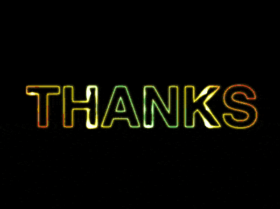

+++
title = '闪光的霓虹文字'
date = 2018-08-09T17:39:07+08:00
image = '/test-hugo-deploy/img/thumbs/100.png'
summary = '#100'
+++



## 效果预览

点击链接可以在 Codepen 预览。

[https://codepen.io/comehope/pen/GBwvxw](https://codepen.io/comehope/pen/GBwvxw)

## 可交互视频

此视频是可以交互的，你可以随时暂停视频，编辑视频中的代码。

[https://scrimba.com/p/pEgDAM/cNLqJhR](https://scrimba.com/p/pEgDAM/cNLqJhR)

## 源代码下载

每日前端实战系列的全部源代码请从 github 下载：

[https://github.com/comehope/front-end-daily-challenges](https://github.com/comehope/front-end-daily-challenges)

## 代码解读

定义 dom，容器中的 3 个元素分别代表文本、渐变背景和光影，其中文本还包含一个数据属性 `data-text`：
```html
<div class="neon">
    <span class="text" data-text="thanks">thanks</span>
    <span class="gradient"></span>
    <span class="spotlight"></span>
</div>
```

居中显示：
```css
body {
    margin: 0;
    height: 100vh;
    display: flex;
    align-items: center;
    justify-content: center;
    background-color: black;
}
```

设置文字样式：
```css
.text {
    background-color: black;
    color: white;
    font-size: 180px;
    font-weight: bold;
    font-family: sans-serif;
    text-transform: uppercase;
}
```

用伪元素和数据属性增加文字，产生描边效果：
```css
.text::before {
    content: attr(data-text);
    position: absolute;
    color: white;
    filter: blur(0.02em);
}
```

用混色模式产生描边效果：
```css
.text::before {
    mix-blend-mode: difference;
}
```

设置渐变色背景：
```css
.neon {
    position: relative;
}

.gradient {
    position: absolute;
    background: linear-gradient(45deg, red, gold, lightgreen, gold, red);
    top: 0;
    left: 0;
    right: 0;
    bottom: 0;
}
```

用混色模式把背景作用到文字上：
```css
.gradient {
    mix-blend-mode: multiply;
}
```

用径向渐变制作光影背景：
```css
.spotlight {
    position: absolute;
    top: 0;
    left: 0;
    right: 0;
    bottom: 0;
    background: 
        radial-gradient(
            circle,
            white,
            transparent 25%
        ) center / 25% 25%,
        radial-gradient(
            circle,
            white,
            black 25%
        ) center / 12.5% 12.5%;
}
```

设置光影移动的动画效果：
```css
.neon {
    overflow: hidden;
}

.spotlight {
    top: -100%;
    left: -100%;
    animation: light 5s linear infinite;
}

@keyframes light {
    to {
        transform: translate(50%, 50%);
    }
}
```

用混色模式把光影作用到渐变背景上：
```css
.spotlight {
    mix-blend-mode: color-dodge;
}
```

最后，调高亮度，并且使文字不能被选中：
```css
.neon {
    filter: brightness(200%);
}

.text {
    user-select: none;
}
```

大功告成！
