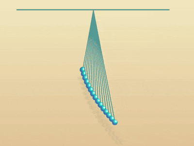

+++
title = '一组摆线'
date = 2018-08-10T17:39:23+08:00
image = '/test-hugo-deploy/img/thumbs/101.png'
summary = '#101'
+++



## 效果预览

点击链接可以在 Codepen 预览。

[https://codepen.io/comehope/pen/vavZPx](https://codepen.io/comehope/pen/vavZPx)

## 可交互视频

此视频是可以交互的，你可以随时暂停视频，编辑视频中的代码。

[https://scrimba.com/p/pEgDAM/c3q6LH7](https://scrimba.com/p/pEgDAM/c3q6LH7)

## 源代码下载

每日前端实战系列的全部源代码请从 github 下载：

[https://github.com/comehope/front-end-daily-challenges](https://github.com/comehope/front-end-daily-challenges)

## 代码解读

定义 dom，容器中包含 3 个元素，代表 3 条摆线：
```html
<div class="pendulums">
    <span></span>
    <span></span>
    <span></span>
</div>
```

居中显示：
```css
body {
    margin: 0;
    height: 100vh;
    display: flex;
    align-items: center;
    justify-content: center;
    background: linear-gradient(lightyellow, burlywood);
}
```

定义容器的尺寸，并画出固定摆线示意墙：
```css
.pendulums {
    width: 40em;
    height: 30em;
    font-size: 10px;
    border-top: 0.3em solid cadetblue;
}
```

画出一条摆线：
```css
.pendulums {
    position: relative;
}

.pendulums span {
    position: absolute;
    width: 0.2em;
    height: 15em;
    background-color: cadetblue;
    left: 50%;
}
```

用伪元素画出摆线底部悬挂的小球：
```css
.pendulums span::before {
    content: '';
    position: absolute;
    width: 1.5em;
    height: 1.5em;
    background: steelblue;
    border-radius: 50%;
    top: 100%;
    left: -0.75em;
}
```

用径向渐变为小球增加光影：
```css
.pendulums span::before {
    background: radial-gradient(
        circle at 70% 35%,
        white,
        darkturquoise 30%,
        steelblue 50%
    );
}
```

用伪元素画出小球的阴影：
```css
.pendulums span::after {
    content: '';
    position: absolute;
    width: 2em;
    height: 0.3em;
    background-color: rgba(0, 0, 0, 0.2);
    top: 120%;
    left: -1em;
    filter: blur(0.4em);
}
```

以摆线的顶点为原点，将摆线向左旋转：
```css
.pendulums span {
    transform-origin: 50% top;
    transform: rotate(25deg);
}
```

让摆线摆动起来：
```css
.pendulums span {
    animation: swing ease-in-out infinite;
    animation-duration: 1.5s;
}

@keyframes swing {
    50% {
        transform: rotate(-25deg);
    }
}
```

为每条摆线定义下标变量：
```css
.pendulums span:nth-child(1) {
    --n: 1;
}

.pendulums span:nth-child(2) {
    --n: 2;
}

.pendulums span:nth-child(3) {
    --n: 3;
}
```

用变量设置摆线的长度，和动画的时长，都是逐渐增大的等差数列：
```css
.pendulums span {
    height: calc((var(--n) - 1) * 1em + 15em);
    animation-duration: calc((var(--n) - 1) * 0.02s + 1.5s);
}
```

接下来用 d3 来批量处理 dom 元素和 css 变量：
引入 d3 库：
```html
<script src="https://d3js.org/d3.v5.min.js"></script>
```

用 d3 创建摆线的 dom 元素：
```javascript
const COUNT = 3;

d3.select('.pendulums')
    .selectAll('span')
    .data(d3.range(COUNT))
    .enter()
    .append('span')
```

用 d3 定义摆线的下标变量：
```javascript
d3.select('.pendulums')
    .selectAll('span')
    .data(d3.range(COUNT))
    .enter()
    .append('span')
    .style('--n', (d) => d + 1);
```

删除掉 html 文件中相关的 dom 定义和 css 文件中的变量定义。

最后，把摆线的数量调整为 15 个。
```javascript
const COUNT = 15;
```

大功告成！
