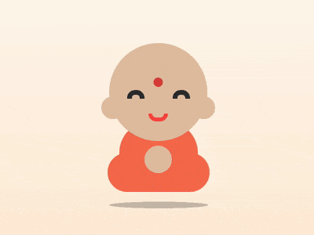

+++
title = '小和尚'
date = 2018-08-11T17:39:38+08:00
image = '/fe/img/thumbs/102.png'
summary = '#102'
+++



## 效果预览

点击链接可以在 Codepen 预览。

[https://codepen.io/comehope/pen/oMmYXp](https://codepen.io/comehope/pen/oMmYXp)

## 可交互视频

此视频是可以交互的，你可以随时暂停视频，编辑视频中的代码。

[https://scrimba.com/p/pEgDAM/cydezCM](https://scrimba.com/p/pEgDAM/cydezCM)

## 源代码下载

每日前端实战系列的全部源代码请从 github 下载：

[https://github.com/comehope/front-end-daily-challenges](https://github.com/comehope/front-end-daily-challenges)

## 代码解读

定义 dom，容器中包含的几个元素分别代表头部、眼睛、嘴、身体和腿：
```html
<div class="buddha">
    <div class="head"></div>
    <div class="eyes"></div>
    <span class="mouth"></span>
    <span class="body"></span>
    <span class="legs"></span>
    <span class="shadow"></span>
</div>
```

居中显示：
```css
body {
	margin: 0;
	height: 100vh;
	display: flex;
	align-items: center;
	justify-content: center;
	background: linear-gradient(white, bisque);
}
```

定义容器尺寸、设置子元素水平居中对齐：
```css
.buddha {
    width: 13em;
    height: 19em;
    font-size: 20px;
    border: 1px dashed black;
    display: flex;
    align-items: center;
    flex-direction: column;
    position: relative;
}
```

画出头部轮廓：
```css
.head {
    width: 12.5em;
    height: 12.5em;
    color: peachpuff;
    background: currentColor;
    border-radius: 50%;
    filter: brightness(0.9);
}
```

用伪元素画出眼睛：
```css
.eyes::before,
.eyes::after {
    content: '';
    position: absolute;
    width: 1em;
    height: 0.5em;
    border: 0.6em solid #333;
    border-radius: 1em 1em 0 0;
    border-bottom: none;
    top: 6em;
}

.eyes::before {
    left: 2.5em;
}

.eyes::after {
    right: 2.5em;
}
```

画出嘴巴：
```css
.mouth {
    position: absolute;
    width: 1.5em;
    height: 0.5em;
    border: 0.5em solid tomato;
    border-radius: 0 0 1.5em 1.5em;
    border-top: none;
    top: 9em;
}
```

画出身体：
```css
.body {
    position: absolute;
    width: 10em;
    height: 8em;
    background-color: coral;
    border-radius: 4em;
    bottom: 1em;
    z-index: -1;
}
```

画出腿：
```css
.legs {
    position: absolute;
    width: inherit;
    height: 5em;
    background-color: coral;
    border-radius: 2.5em;
    bottom: 0;
    z-index: -1;
}
```

用阴影画出耳朵和手：
```css
.head {
    box-shadow: 
		5.8em 2em 0 -4.8em, /* ear right*/
		-5.8em 2em 0 -4.8em, /* ear left*/
        0 8.6em 0 -4.5em; /* hand */
}
```

用径向渐变画出眉心：
```css
.head {
    background: 
		radial-gradient(
			circle at 50% 40%,
			tomato 0.6em,
			transparent 0.6em
		), /* circle between eyebrows */
		currentColor;
}
```

画出身体的阴影：
```css
.shadow {
    position: absolute;
    width: inherit;
    height: 5em;
    background-color: rgba(0, 0, 0, 0.2);
    border-radius: 50%;
    bottom: -4em;
    transform: rotateX(100deg);
}
```

让小和尚上下浮动：
```css
.buddha {
    animation: animate 3s ease-in-out infinite;
}

@keyframes animate {
    50% {
        transform: translateY(-2em);
    }
}
```

让阴影保持在固定位置，不随着人浮动：
```css
.shadow {
    animation: shadow-animate 3s ease-in-out infinite;
}

@keyframes shadow-animate {
    50% {
        transform: rotateX(100deg) translateY(-10em) scale(0.7);
    }
}
```

大功告成！
