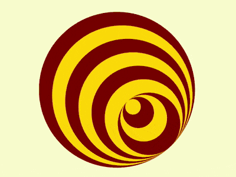

+++
title = '监控眼'
date = 2018-08-12T17:39:57+08:00
image = '/test-hugo-deploy/img/thumbs/103.png'
summary = '#103'
+++



## 效果预览

点击链接可以在 Codepen 预览。

[https://codepen.io/comehope/pen/GBzLdy](https://codepen.io/comehope/pen/GBzLdy)

## 可交互视频

此视频是可以交互的，你可以随时暂停视频，编辑视频中的代码。

[https://scrimba.com/p/pEgDAM/cGENVuR](https://scrimba.com/p/pEgDAM/cGENVuR)

## 源代码下载

每日前端实战系列的全部源代码请从 github 下载：

[https://github.com/comehope/front-end-daily-challenges](https://github.com/comehope/front-end-daily-challenges)

## 代码解读

定义 dom，容器中包含 10 个元素，每个元素代表 1 个圆环：
```html
<div class="circles">
    <span></span>
    <span></span>
    <span></span>
    <span></span>
    <span></span>
    <span></span>
    <span></span>
    <span></span>
    <span></span>
    <span></span>
</div>
```

居中显示：
```css
body {
    margin: 0;
    height: 100vh;
    display: flex;
    align-items: center;
    justify-content: center;
    background-color: lightgoldenrodyellow;
}
```

定义容器尺寸和其中子元素的布局方式：
```css
.circles {
    width: 10em;
    height: 10em;
    font-size: 30px;
    border: 1px dashed black;
    display: flex;
    justify-content: center;
}
```

为每个圆环定义下标变量：
```css
.circles span:nth-child(1) {
    --n: 1;
}

.circles span:nth-child(2) {
    --n: 2;
}

.circles span:nth-child(3) {
    --n: 3;
}

.circles span:nth-child(4) {
    --n: 4;
}

.circles span:nth-child(5) {
    --n: 5;
}

.circles span:nth-child(6) {
    --n: 6;
}

.circles span:nth-child(7) {
    --n: 7;
}

.circles span:nth-child(8) {
    --n: 8;
}

.circles span:nth-child(9) {
    --n: 9;
}

.circles span:nth-child(10) {
    --n: 10;
}
```

设置每个的圆环的尺寸，颜色黑白间隔：
```css
.circles {
    position: relative;
}

.circles span {
    position: absolute;
    --diameter: calc(10em - (var(--n) - 1) * 1em);
    width: var(--diameter);
    height: var(--diameter);
    border-radius: 50%;
}

.circles span:nth-child(odd) {
    background-color: darkred;
}

.circles span:nth-child(even) {
    background-color: gold;
}
```

把尺寸最小的 3 个圆环向下移动，形成凹陷的效果：
```css
.circles span:nth-child(n+8) {
    top: calc((var(--n) - 7) * 1em);
}
```

让容器旋转起来，就好像一只监视的眼睛转来转去：
```css
.circles {
    animation: rotating 5s linear infinite;
}

@keyframes rotating {
    to {
        transform: rotate(1turn);
    }
}
```

大功告成！
