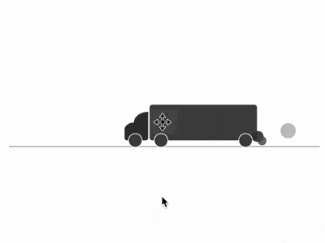

+++
title = '卡车 loader'
date = 2018-08-13T17:40:10+08:00
image = '/fe/img/thumbs/104.png'
summary = '#104'
+++



## 效果预览

点击链接可以在 Codepen 预览。

[https://codepen.io/comehope/pen/vaPGRz](https://codepen.io/comehope/pen/vaPGRz)

## 可交互视频

此视频是可以交互的，你可以随时暂停视频，编辑视频中的代码。

[https://scrimba.com/p/pEgDAM/cz32DUd](https://scrimba.com/p/pEgDAM/cz32DUd)

## 源代码下载

每日前端实战系列的全部源代码请从 github 下载：

[https://github.com/comehope/front-end-daily-challenges](https://github.com/comehope/front-end-daily-challenges)

## 代码解读

定义 dom，容器代表卡车，包含的 2 个子元素代表车头和尾气；`<hr>` 代表道路：
```html
<div class="truck">
    <span class="cab"></span>
    <span class="smoke"></span>
</div>
<hr>
```

居中显示，同时道路与页面之间留出空间：
```css
body {
    margin: 10%;
    padding-top: 40%;
}
```

画出卡车车厢：
```css
.truck {
    width: 15em;
    height: 5em;
    font-size: 10px;
    background-color: #444;
    border-radius: 0.4em;
}
```

用伪元素画出车厢的车轮：
```css
.truck {
    position: relative;
}

.truck::before,
.truck::after {
    content: '';
    position: absolute;
    box-sizing: border-box;
    width: 2em;
    height: 2em;
    background-color: #444;
    border: 0.1em solid white;
    border-radius: 50%;
    bottom: -1em;
}

.truck::before {
    left: 0.6em;
}

.truck::after {
    right: 0.6em;
}
```

画出车头：
```css
.cab {
    position: absolute;
    width: 3.3em;
    height: 2.5em;
    background-color: #333;
    left: -3.5em;
    bottom: 0;
    border-radius: 40% 0 0.4em 0.4em;
}

.cab::before {
    content: '';
    position: absolute;
    width: 2em;
    height: 1.5em;
    background-color: #333;
    top: -1.5em;
    right: 0;
    border-radius: 100% 0 0 0;
}
```

画出车头的车轮：
```css
.cab::after {
    content: '';
    position: absolute;
    box-sizing: border-box;
    width: 2em;
    height: 2em;
    background-color: #444;
    border: 0.1em solid white;
    border-radius: 50%;
    bottom: -1em;
    left: 0.5em;
}
```

画出尾气的初始状态：
```css
.smoke,
.smoke::before,
.smoke::after {
    content: '';
    position: absolute;
    width: 1em;
    height: 1em;
    background-color: #333;
    right: -0.1em;
    bottom: -0.5em;
    border-radius: 50%;
}
```

增加排出尾气的动画：
```css
.smoke {
    animation: smoke-1 2s infinite;
}

.smoke::before {
    animation: smoke-2 2s infinite;
}

.smoke::after {
    animation: smoke-3 2s infinite;
}

@keyframes smoke-1 {
    to {
        width: 3em;
        height: 3em;
        right: -3em;
        bottom: 0.5em;
    }
}

@keyframes smoke-2 {
    to {
        width: 2.5em;
        height: 2.5em;
        right: -6em;
        bottom: 0.8em;
    }
}

@keyframes smoke-3 {
    to {
        width: 3.5em;
        height: 3.5em;
        right: -4em;
        bottom: 0.2em;
    }
}
```

增加尾气的飘散效果：
```css
.smoke {
    animation:
        drift 2s infinite,
        smoke-1 2s infinite;
}

.smoke::before {
    animation: 
        drift 3s infinite,
        smoke-2 3s infinite;
}

.smoke::after {
    animation: 
        drift 4s infinite,
        smoke-3 4s infinite;
}

@keyframes drift {
    0%, 100% {
        filter: opacity(0);
    }

    15% {
        filter: opacity(0.9);
    }
}
```

增加卡车行驶的动画效果：
```css
.truck {
    animation: 
        move 5s infinite;
}

@keyframes move {
    0% {
        margin-left: 90%;
    }

    50% {
        margin-left: 45%;
    }

    100% {
        margin-left: 0;
    }

    0%, 100% {
        filter: opacity(0);
    }

    10%, 90% {
        filter: opacity(1);
    }
}
```

增加卡片行驶中颠簸的动画效果：
```css
.truck {
    animation: 
        put-put 2s infinite,
        move 10s infinite;
}

@keyframes put-put {
    0% {
        margin-top: 0;
        height: 5em;
    }

    5% {
        margin-top: -0.2em;
        height: 5.2em;
    }

    20% {
        margin-top: -0.1em;
        height: 5em;
    }

    35% {
        margin-top: 0.1em;
        height: 4.9em;
    }

    40% {
        margin-top: -0.1em;
        height: 5.1em;
    }

    60% {
        margin-top: 0.1em;
        height: 4.9em;
    }

    75% {
        margin-top: 0;
        height: 5em;
    }

    80% {
        margin-top: -0.4em;
        height: 5.2em;
    }

    100% {
        margin-top: 0.1em;
        height: 4.9em;
    }
}
```

大功告成！
