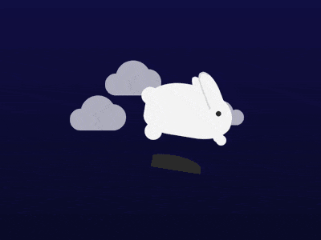

+++
title = '玉兔'
date = 2018-08-14T17:40:27+08:00
image = '/test-hugo-deploy/img/thumbs/105.png'
summary = '#105'
+++



## 效果预览

点击链接可以在 Codepen 预览。

[https://codepen.io/comehope/pen/yqrNJm](https://codepen.io/comehope/pen/yqrNJm)

## 可交互视频

此视频是可以交互的，你可以随时暂停视频，编辑视频中的代码。

[https://scrimba.com/p/pEgDAM/cPEygSr](https://scrimba.com/p/pEgDAM/cPEygSr)

## 源代码下载

每日前端实战系列的全部源代码请从 github 下载：

[https://github.com/comehope/front-end-daily-challenges](https://github.com/comehope/front-end-daily-challenges)

## 代码解读

定义 dom，页面中包含 2 个元素，分别代表兔子和云朵：
```html
<div class="rabbit"></div>
<div class="clouds"></div>
```

居中显示：
```css
body {
    margin: 0;
    height: 100vh;
    display: flex;
    align-items: center;
    justify-content: center;
    background: linear-gradient(midnightblue, black);
    font-size: 30px;
}
```

画出兔子的身体：
```css
.rabbit {
    width: 5em;
    height: 3em;
    color: whitesmoke;
    background: currentColor;
    border-radius: 70% 90% 60% 50%;
}
```

用径向渐变画出兔子的眼睛：
```css
.rabbit {
    background: 
        radial-gradient(
            circle at 4.2em 1.4em,
            #333 0.15em,
            transparent 0.15em
        ), /* eye */
        currentColor;
}
```

用伪元素画出兔子的右耳：
```css
.rabbit::before {
    content: '';
    position: absolute;
    width: 0.75em;
    height: 2em;
    background-color: currentColor;
    border-radius: 50% 100% 0 0;
    transform: rotate(-30deg);
    top: -1em;
    right: 1em;
}
```

用阴影画出兔子的左耳：
```css
.rabbit::before {
    border: 0.1em solid;
    border-color: gainsboro transparent transparent gainsboro;
    box-shadow: -0.5em 0 0 -0.1em;
}
```

用伪元素画出兔子的尾巴：
```css
.rabbit::after {
    content: '';
    position: absolute;
    width: 1em;
    height: 1em;
    background-color: currentColor;
    border-radius: 50%;
    left: -0.3em;
    top: 0.5em;
}
```

用阴影画出兔子的腿：
```css
.rabbit::after {
    box-shadow: 
        0.5em 1em 0,
        4em 1em 0 -0.2em,
        4em 1em 0 -0.2em;
}
```

画出兔子的影子：
```css
.rabbit {
    box-shadow: -0.2em 1em 0 -0.75em #333;
}
```

画出一个云朵：
```css
.clouds {
    width: 2em;
    height: 2em;
    color: whitesmoke;
    background: currentColor;
    border-radius: 100% 100% 0 0;
    transform: translate(0, -5em);
}

.clouds::before,
.clouds::after {
    content: '';
    position: absolute;
    background-color: currentColor;
    bottom: 0;
}

.clouds::before {
    width: 1.25em;
    height: 1.25em;
    border-radius: 100% 100% 0 100%;
    left: -30%;
}

.clouds::after {
    width: 1.5em;
    height: 1.5em;
    border-radius: 100% 100% 100% 0;
    right: -30%;
}
```

用阴影再画 2 个云朵：
```css
.rabbit {
    z-index: 1;
}

.clouds,
.clouds::before,
.clouds::after {
    box-shadow: 
    5em 2em 0 -0.3em,
    -2em 2em 0 0;
}
```

接下来制作动画效果。
增加兔子跳动的动画：
```css
.rabbit {
    animation: hop 3s linear infinite;
}

@keyframes hop {
    20% {
        transform: rotate(-10deg) translate(1em, -2em);
        box-shadow: -0.2em 1em 0 -1em #333;
    }

    40% {
        transform: rotate(10deg) translate(3em, -4em);
        box-shadow: -0.2em 3.25em 0 -1.1em #333;
    }

    60%, 75% {
        transform: rotate(0deg) translate(4em, 0);
        box-shadow: -0.2em 1em 0 -0.75em #333;
    }
}
```

增加兔子的腿的伸缩动画：
```css
.rabbit::after {
    animation: kick 3s infinite linear;
}

@keyframes kick {
    40% {
        box-shadow: 
            0.5em 2em 0,
            4.2em 1.75em 0 -0.2em,
            4.4em 1.9em 0 -0.2em;
    }
}
```

增加云朵飘动的动画：
```css
.clouds {
    animation: cloudy 3s infinite linear forwards;
    filter: opacity(0);
}

@keyframes cloudy {
    40% {
        transform: translate(-3em, -5em);
        filter: opacity(0.75);
    }

    55% {
        transform: translate(-4em, -5em);
        filter: opacity(0);
    }
}
```

大功告成！
