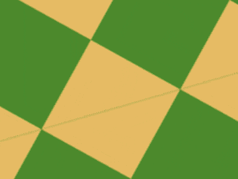

+++
title = '没有 DOM 的动画'
date = 2018-08-15T17:40:42+08:00
image = '/test-hugo-deploy/img/thumbs/106.png'
summary = '#106'
+++



## 效果预览

点击链接可以在 Codepen 预览。

[https://codepen.io/comehope/pen/JBqjqm](https://codepen.io/comehope/pen/JBqjqm)

## 可交互视频

此视频是可以交互的，你可以随时暂停视频，编辑视频中的代码。

[https://scrimba.com/p/pEgDAM/cD3KwTw](https://scrimba.com/p/pEgDAM/cD3KwTw)

## 源代码下载

每日前端实战系列的全部源代码请从 github 下载：

[https://github.com/comehope/front-end-daily-challenges](https://github.com/comehope/front-end-daily-challenges)

## 代码解读

没有 dom 元素，直接写 css。
设置页面空间：
```css
body {
    position: fixed;
    margin: 0;
    width: 100vw;
    height: 100vh;
}
```

用伪元素设置背景图案：
```css
body::before {
    content: '';
    position: fixed;
    width: 200vmax;
    height: 200vmax;
    background-color: steelblue;
    color: turquoise;
    background-image: 
        linear-gradient(
            45deg, 
            currentColor 25%, 
            transparent 25%, transparent 75%, 
            currentColor 75%),
        linear-gradient(
            45deg, 
            currentColor 25%, 
            transparent 25%, transparent 75%, 
            currentColor 75%);
    background-position: 0 0, 5vmax 5vmax;
    background-size: 10vmax 10vmax;
```

平移背景图案：
```css
body::before {
    top: 50%;
    left: 50%;
    animation: 
        9s move infinite ease-in-out alternate;
}

@keyframes move {
    from {
        left: -40%;
        top: -40%;
    }

    to {
        left: -60%;
        top: -60%;
    }
}
```

让背景图案转动起来：
```css
body::before {
    animation: 
        9s move infinite ease-in-out alternate,
        9s -1.5s rotating infinite ease-in-out alternate;
}

@keyframes rotating {
    to {
        transform: rotate(180deg);
    }
}
```

平移页面：
```css
body {
    top: 50%;
    left: 50%;
    animation: 
        3s move infinite ease-in-out alternate;
}
```

缩放页面：
```css
body {
    animation: 
        3s move infinite ease-in-out alternate,
        3s zoom infinite ease-in-out alternate;
}

@keyframes zoom {
    to {
        transform: scale(10);
    }
}
```

最后，增加变色效果：
```css
@keyframes rotating {
    to {
        transform: rotate(180deg);
        filter: hue-rotate(1turn);
    }
}
```

大功告成！
