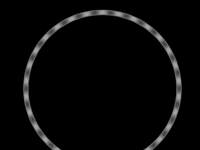

+++
title = '黑白间色动画'
date = 2018-08-17T17:41:11+08:00
image = '/test-hugo-deploy/img/thumbs/108.png'
summary = '#108'
+++



## 效果预览

点击链接可以在 Codepen 预览。

[https://codepen.io/comehope/pen/Yjomyd](https://codepen.io/comehope/pen/Yjomyd)

## 可交互视频

此视频是可以交互的，你可以随时暂停视频，编辑视频中的代码。

[https://scrimba.com/p/pEgDAM/cydZrfr](https://scrimba.com/p/pEgDAM/cydZrfr)

## 源代码下载

每日前端实战系列的全部源代码请从 github 下载：

[https://github.com/comehope/front-end-daily-challenges](https://github.com/comehope/front-end-daily-challenges)

## 代码解读

定义 dom，容器中包含 3 个子元素，每个子元素代表一个圆：
```html
<div class="circles">
    <span></span>
    <span></span>
    <span></span>
</div>
```

居中显示：
```css
body {
    margin: 0;
    height: 100vh;
    display: flex;
    align-items: center;
    justify-content: center;
    background-color: black;
}
```

定义容器尺寸：
```css
.circles {
    width: 60vmin;
    height: 60vmin;
}
```

画出容器中的1个圆：
```css
.circles {
    position: relative;
}

.circles span {
    position: absolute;
    box-sizing: border-box;
    width: 50%;
    height: 50%;
    background-color: white;
    border-radius: 50%;
    left: 25%;
}
```

定义变量，画出多个圆，每个圆围绕着第 1 个圆的底部中点旋转，围成一个更大的圆形：
```css
.circles {
    --particles: 3;
}

.circles span {
    transform-origin: bottom center;
    --deg: calc(360deg / var(--particles) * (var(--n) - 1));
    transform: rotate(var(--deg));
}

.circles span:nth-child(1) {
    --n: 1;
}

.circles span:nth-child(2) {
    --n: 2;
}

.circles span:nth-child(3) {
    --n: 3;
}
```

为子元素增加动画效果：
```css
.circles span {
    animation: rotating 5s ease-in-out infinite;
}

@keyframes rotating {
    0% {
        transform: rotate(0);
    }

    50% {
        transform: rotate(var(--deg)) translateY(0);
    }

    100% {
        transform: rotate(var(--deg)) translateY(100%) scale(2);
    }
}
```

设置子元素混色模式，使子元素间交叠的部分显示成黑色：
```css
.circles span {
    mix-blend-mode: difference;
}
```

为容器增加动画效果，抵销子元素放大，使动画流畅衔接：
```css
.circles {
    animation: zoom 5s linear infinite;
}

@keyframes zoom {
    to {
        transform: scale(0.5) translateY(-50%);
    }
}
```

接下来用 d3 批量处理 dom 元素和 css 变量。
引入 d3 库：
```html
<script src="https://d3js.org/d3.v5.min.js"></script>
```

用 d3 为表示圆数量的变量赋值：
```javascript
const COUNT_OF_PARTICLES = 30;

d3.select('.circles')
    .style('--particles', COUNT_OF_PARTICLES)
```

用 d3 生成 dom 元素：
```javascript
d3.select('.circles')
    .style('--particles', COUNT_OF_PARTICLES)
    .selectAll('span')
    .data(d3.range(COUNT_OF_PARTICLES))
    .enter()
    .append('span');
```

用 d3 为表示子元素下标的变量赋值：
```javascript
d3.select('.circles')
    .style('--particles', COUNT_OF_PARTICLES)
    .selectAll('span')
    .data(d3.range(COUNT_OF_PARTICLES))
    .enter()
    .append('span')
    .style('--n', (d) => d + 1);
```

删除掉 html 文件中的相关 dom 元素和 css 文件中相关的 css 变量。

最后，把圆的数量调整为 30 个：
```javascript
const COUNT_OF_PARTICLES = 30;
```

大功告成！
