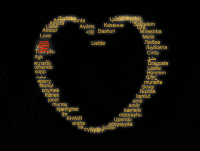

+++
title = '文字組成的心形'
date = 2018-08-17T17:41:28+08:00
image = '/test-hugo-deploy/img/thumbs/109.png'
summary = '#109'
+++



## 效果预览

点击链接可以在 Codepen 预览。

[https://codepen.io/comehope/pen/xJvERW](https://codepen.io/comehope/pen/xJvERW)

## 可交互视频

此视频是可以交互的，你可以随时暂停视频，编辑视频中的代码。

[https://scrimba.com/p/pEgDAM/cm94eu6](https://scrimba.com/p/pEgDAM/cm94eu6)

## 源代码下载

每日前端实战系列的全部源代码请从 github 下载：

[https://github.com/comehope/front-end-daily-challenges](https://github.com/comehope/front-end-daily-challenges)

## 代码解读

定义 dom，容器中包含 3 个子元素，每个子元素中有一个单词：
```html
<div class="love">
    <span>aaa</span>
    <span>bbb</span>
    <span>ccc</span>
</div>
```

居中显示：
```css
body {
    margin: 0;
    height: 100vh;
    display: flex;
    align-items: center;
    justify-content: center;
    background-color: black;
}
```

定义容器尺寸：
```css
.love {
    width: 450px;
    height: 450px;
}
```

设置文本样式：
```css
.love {
    position: relative;
}

.love span {
    position: absolute;
    left: 0;
    color: goldenrod;
    font-size: 20px;
    font-family: sans-serif;
    text-shadow: 0 0 1em white;
}
```

定义文本左右往复移动的动画：
```css
.love span {
    animation: x-move 10s ease-in-out infinite alternate;
}

@keyframes x-move {
    to {
        left: 450px;
    }
}
```

定义子元素的下标变量，设置动画延时，使各单词依次入场：
```css
.love {
    --particles: 3;
}

.love span {
    animation-delay: calc(20s / var(--particles) * var(--n) * -1);
}

.love span:nth-child(1) {
    --n: 1;
}

.love span:nth-child(2) {
    --n: 2;
}

.love span:nth-child(3) {
    --n: 3;
}
```

增加文本沿心形运动的动画效果：
```css
.love span {
    animation: 
        x-move 10s ease-in-out infinite alternate,
        y-move 20s linear infinite;
}

@keyframes y-move {
    0% { transform: translateY(180px); }
    10% { transform: translateY(45px); }
    15% { transform: translateY(5px); }
    18% { transform: translateY(0); }
    20% { transform: translateY(5px); }
    22% { transform: translateY(35px); }
    24% { transform: translateY(65px); }
    25% { transform: translateY(110px); }
    26% { transform: translateY(65px); }
    28% { transform: translateY(35px); }
    30% { transform: translateY(5px); }
    32% { transform: translateY(0); }
    35% { transform: translateY(5px); }
    40% { transform: translateY(45px); }
    50% { transform: translateY(180px); }
    71% { transform: translateY(430px); }
    72.5% { transform: translateY(440px); }
    75% { transform: translateY(450px); }
    77.5% { transform: translateY(440px); }
    79% { transform: translateY(430px); }
    100% { transform: translateY(180px); }
}
```

接下来用 d3 批量处理 dom 元素和 css 变量。
引入 d3 库：
```html
<script src="https://d3js.org/d3.v5.min.js"></script>
```

声明一个数组，包含若干单词：
```javascript
const words = ['aaa', 'bbb', 'ccc'];
```

用 d3 创建 dom 元素：
```javascript
d3.select('.love')
    .selectAll('span')
    .data(words)
    .enter()
    .append('span')
    .text((d) => d);
```

用 d3 为 css 变量赋值：
```javascript
d3.select('.love')
    .style('--particles', words.length)
    .selectAll('span')
    .data(words)
    .enter()
    .append('span')
    .style('--n', (d, i) => i + 1)
    .text((d) => d);
```

删除 html 文件中相关的 dom 元素和 css 文件中相关的 css 变量。

把数组元素改为“爱”在各种语言的单词：
```javascript
const words = [
    '愛', 'Love', 'Amour', 'Liebe', 'Amore',
    'Amor', 'Любовь', 'الحب', 'प्यार', 'Cinta',
    'Αγάπη', '사랑', 'Liefde', 'Dashuri', 'Каханне',
    'Ljubav', 'Láska', 'Armastus', 'Mahal', 'אהבה', 
    'Szerelem', 'Grá', 'Mīlestība', 'Meilė', 'Любов', 
    'Љубовта', 'Cinta', 'عشق', 'Dragoste', 'Láska', 
    'Renmen', 'ፍቅር', 'munaña', 'Sevgi', 'Љубав', 
    'karout', 'amà', 'amôr', 'kærleiki', 'mborayhu', 
    'Upendo', 'sòòyayyàà', 'ljubav', 'Սեր', 'сүю', 
    'сүйүү', 'tia', 'aroha', 'KHAIR', 'प्रेम', 
    'kjærlighet', 'munay', 'jecel', 'Kärlek', 'soymek', 
    'Mahal', 'ярату', 'محبت', 'sopp', 'uthando', 
    'ความรัก', 'Aşk', 'Tình yêu', 'ליבע'];
```

最后，为第 1 个单词设置特殊的文字样式：
```css
.love span:first-child {
    color: orangered;
    font-size: 3em;
    text-shadow: 
        0 0 0.1em black,
        0 0 1em white;
    z-index: 1;
}
```

大功告成！
