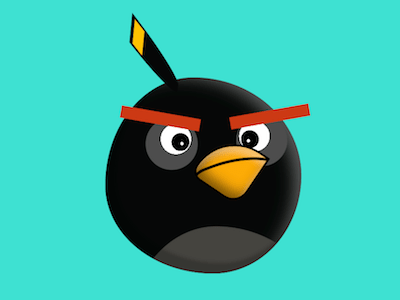

+++
title = '愤怒小鸟的黑炮'
date = 2018-08-18T17:41:48+08:00
image = '/test-hugo-deploy/img/thumbs/110.png'
summary = '#110'
+++



## 效果预览

点击链接可以在 Codepen 预览。

[https://codepen.io/comehope/pen/vaoQqa](https://codepen.io/comehope/pen/vaoQqa)

## 可交互视频

此视频是可以交互的，你可以随时暂停视频，编辑视频中的代码。

[https://scrimba.com/p/pEgDAM/cag9wfw](https://scrimba.com/p/pEgDAM/cag9wfw)

## 源代码下载

每日前端实战系列的全部源代码请从 github 下载：

[https://github.com/comehope/front-end-daily-challenges](https://github.com/comehope/front-end-daily-challenges)

## 代码解读

定义 dom，容器中包含的元素分别代表 
```html
<div class="black-bomb">
    <span class="head"></span>
    <span class="eyes"></span>
    <span class="eyebrows"></span>
    <span class="mouth"></span>
    <span class="hair"></span>
</div>
```

居中显示：
```css
body {
    margin: 0;
    height: 100vh;
    display: flex;
    align-items: center;
    justify-content: center;
    background-color: turquoise;
}
```

定义容器尺寸和伪元素的共同属性：
```css
.black-bomb {
    width: 13em;
    height: 13em;
    font-size: 16px;
}

.black-bomb *::before,
.black-bomb *::after {
    content: '';
    position: absolute;
}
```

画出头部轮廓：
```css
.black-bomb {
    position: relative;
}

.head {
    position: absolute;
    width: inherit;
    height: inherit;
    background-color: #0f1110;
    border-radius: 45% 55% 45% 55% / 55% 50% 50% 45%;
}
```

用伪元素画出眼睛的轮廓：
```css
.eyes::before,
.eyes::after {
    width: 3.4em;
    height: 3.4em;
    background-color: #4e4e4e;
    border-radius: 50%;
}

.eyes::before {
    top: 2.7em;
    left: 21%;
}

.eyes::after {
    top: 2.5em;
    right: 7%;
}
```

用径向渐变画出眼球和瞳孔：
```css
.eyes::before,
.eyes::after {
    background-image: 
        radial-gradient(
            circle at var(--left3) 1.7em,
            white 0.1em,
            transparent 0.1em
        ),
        radial-gradient(
            circle at var(--left2) 1.6em,
            black 0.6em,
            transparent 0.6em
        ),
        radial-gradient(
            circle at var(--left1) 1.4em,
            white 1em,
            transparent 1em
        );
}

.eyes::before {
    --left1: 2em;
    --left2: 2.3em;
    --left3: 2.4em;
}

.eyes::after {
    --left1: 1.2em;
    --left2: 0.9em;
    --left3: 0.8em;
}
```

用伪元素画出眉毛：
```css
.eyebrows::before,
.eyebrows::after {
    width: 5.3em;
    height: 0.8em;
    background: #cb3c1a;
}

.eyebrows::before {
    top: 2.3em;
    left: 1em;
    transform: rotate(10deg);
}

.eyebrows::after {
    top: 2.2em;
    right: -0.6em;
    transform: rotate(-10deg);
}
```

画出嘴的轮廓：
```css
.mouth {
    position: absolute;
    width: 3.6em;
    height: 3.6em;
    background-color: #fca90d;
    top: 4em;
    left: 6.4em;
    border-radius: 80% 0 30% 20%;
    transform: rotate(34deg);
    border: 0.1em solid black;
}
```

用伪元素画出上下颌的分界线：
```css
.mouth::before {
    width: 2.6em;
    height: 5.7em;
    border: 0.2em solid;
    border-radius: 80% 0 0 16%;
    transform: rotate(35deg);
    top: -1.1em;
    left: 1.4em;
    border-color: transparent transparent transparent black;
}
```

画出胸前的羽毛：
```css
.head {
    overflow: hidden;
}

.head::before {
    width: inherit;
    height: inherit;
    background-color: #474642;
    border-radius: inherit;
    top: 76%;
    left: 12%;
}
```

画出冠羽：
```css
.hair {
    position: absolute;
    width: 1.4em;
    height: 5em;
    background-color: #0f1110;
    top: -3.8em;
    left: 20%;
    border-radius: 0 0 40% 40% / 0 0 100% 100%;
}

.hair::before {
    width: 80%;
    height: 1em;
    background-color: #ffc000;
    top: 0.3em;
    left: 10%;
}
```

调整冠羽的形状：
```css
.hair {
    transform: rotate(-28deg) skewX(10deg) skewY(-50deg);
}
```

接下来画阴影，增强立体感。

为头部增加阴影：
```css
.head {
    box-shadow: inset -1em 0.5em 1.5em -0.5em rgba(255, 255, 255, 0.3);
}

.head::after {
    width: inherit;
    height: inherit;
    border-radius: inherit;
    box-shadow: inset 0.5em -0.5em 0.3em 0.2em rgba(0, 0, 0, 0.2);
}
```

为嘴增加阴影：
```css
.mouth {
    box-shadow: 
        inset 0 0.5em 0.5em rgba(255, 255, 255, 0.3),
        inset 0.2em -0.5em 1.2em rgba(0, 0, 0, 0.5);
}
```

大功告成！
