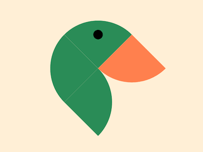

+++
title = '艺术鸭子'
date = 2018-08-19T17:42:01+08:00
image = '/test-hugo-deploy/img/thumbs/111.png'
summary = '#111'
+++



## 效果预览

点击链接可以在 Codepen 预览。

[https://codepen.io/comehope/pen/aaoveW](https://codepen.io/comehope/pen/aaoveW)

## 可交互视频

此视频是可以交互的，你可以随时暂停视频，编辑视频中的代码。

[https://scrimba.com/p/pEgDAM/c3q28tB](https://scrimba.com/p/pEgDAM/c3q28tB)

## 源代码下载

每日前端实战系列的全部源代码请从 github 下载：

[https://github.com/comehope/front-end-daily-challenges](https://github.com/comehope/front-end-daily-challenges)

## 代码解读

定义 dom，容器中包含 4 个元素：
```css
<figure class="duck">
    <span></span>
    <span></span>
    <span></span>
    <span></span>
</figure>
```

居中显示：
```css
body {
    margin: 0;
    height: 100vh;
    display: flex;
    align-items: center;
    justify-content: center;
    background-color: papayawhip;
  }
```

定义容器尺寸：
```css
.duck {
    width: 10em;
    height: 10em;
}
```

用 grid 把 4 个方块按 2*2 布局：
```css
.duck {
    display: grid;
    grid-template-columns: repeat(2, 1fr);
}

.duck span {
    background-color: seagreen;
}
```

把容器旋转 45 度：
```css
.duck {
    transform: rotate(-45deg);
}
```

设置每个正方形的圆角，组合成一只鸭子的抽象形状：
```css
.duck span:nth-child(1) {
    border-top-left-radius: 100%;
}

.duck span:nth-child(2) {
    border-top-right-radius: 100%;
}

.duck span:nth-child(3) {
    border-bottom-right-radius: 100%;
}

.duck span:nth-child(4) {
    border-bottom-left-radius: 100%;
}
```

为最后一个方块设置有差异的颜色，使它看起来像鸭子嘴：
```css
.duck span:nth-child(4) {
    background-color: coral;
}
```

在第 2 个方块用径向渐变画出一个圆点，代表鸭子的眼睛：
```css
.duck span:nth-child(2) {
    background-image: radial-gradient(black 0.5em, transparent 0.5em);
}
```

大功告成！
