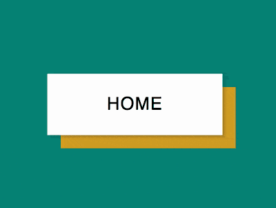

+++
title = '背景切换按钮特效'
date = 2018-08-20T17:42:18+08:00
image = '/test-hugo-deploy/img/thumbs/112.png'
summary = '#112'
+++



## 效果预览

点击链接可以在 Codepen 预览。

[https://codepen.io/comehope/pen/mGbpqv](https://codepen.io/comehope/pen/mGbpqv)

## 可交互视频

此视频是可以交互的，你可以随时暂停视频，编辑视频中的代码。

[https://scrimba.com/p/pEgDAM/cMwkJhG](https://scrimba.com/p/pEgDAM/cMwkJhG)

## 源代码下载

每日前端实战系列的全部源代码请从 github 下载：

[https://github.com/comehope/front-end-daily-challenges](https://github.com/comehope/front-end-daily-challenges)

## 代码解读

定义 dom，导航中包含一个无序列表，列表中有一个列表项：
```html
<nav>
    <ul>
        <li>home</li>
    </ul>
</nav>
```

居中显示：
```css
body {
    margin: 0;
    height: 100vh;
    display: flex;
    align-items: center;
    justify-content: center;
    background-color: teal;
}
```

隐藏列表项前端的引导符号：
```css
nav ul {
    padding: 0;
    list-style-type: none;
}
```

定义按钮容器尺寸：
```css
:root {
    font-size: 10px;
}

nav li {
    width: 20rem;
    height: 7rem;
}
```

设置文字样式：
```css
nav li {
    font-size: 20px;
    text-align: center;
    line-height: 7rem;
    font-family: sans-serif;
    text-transform: uppercase;
    letter-spacing: 1px;
}
```

用伪元素制作 2 个背景色块：
```css
nav li {
    position: relative;
}

nav li::before,
nav li::after {
    content: '';
    position: absolute;
    width: inherit;
    height: inherit;
    top: 0;
    left: 0;
}

nav li::before {
    background-color: white;
    z-index: -1;
}

nav li::after {
    background-color: goldenrod;
    z-index: -2;
}
```

让后面的背景块向右下偏移，并且让前面的背景块投放阴影，增加立体效果：
```css
nav li::before {
    box-shadow: 0.2rem 0.2rem 0.5rem rgba(0, 0, 0, 0.2);
}

nav li::after {
    transform: translate(1.5rem, 1.5rem);
}
```

接下来增加悬停效果。

设置缓动时间，主元素和伪元素都将有缓动效果：
```css
nav li {
    transition: 0.3s;
}

nav li::before,
nav li::after {
    transition: 0.3s;
}
```

当悬停时，2 个背景色块的颜色互换：
```css
nav li:hover::before {
    background-color: goldenrod;
}

nav li:hover::after {
    background-color: white;
}
```

同时，后面的背景色块的向左上方移动，按钮整体则向右下方移动：
```css
nav li:hover {
    transform: translate(1.5rem, 1.5rem);
}

nav li:hover::after {
    transform: translate(-1.5rem, -1.5rem);
}
```

同时，再让文本在悬停时变色：
```css
nav li:hover {
    color: white;
}
```

再增加几个按钮：
```html
<nav>
    <ul>
        <li>home</li>
        <li>products</li>
        <li>services</li>
        <li>contact</li>
    </ul>
</nav>
```

最后，增加按钮之间的间距：
```css
nav li {
    margin: 3rem;
}
```

大功告成！
