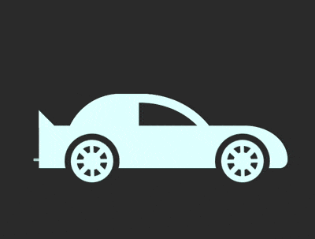

+++
title = '赛车 loader'
date = 2018-08-21T17:42:32+08:00
image = '/test-hugo-deploy/img/thumbs/113.png'
summary = '#113'
+++



## 效果预览

点击链接可以在 Codepen 预览。

[https://codepen.io/comehope/pen/mGdXGJ](https://codepen.io/comehope/pen/mGdXGJ)

## 可交互视频

此视频是可以交互的，你可以随时暂停视频，编辑视频中的代码。

[https://scrimba.com/p/pEgDAM/c3qL7Sz](https://scrimba.com/p/pEgDAM/c3qL7Sz)

## 源代码下载

每日前端实战系列的全部源代码请从 github 下载：

[https://github.com/comehope/front-end-daily-challenges](https://github.com/comehope/front-end-daily-challenges)

## 代码解读

定义 dom，容器中包含 1 个 `.car` 元素，它的 2 个子元素分别代表车身和车轮：
```html
<figure class="loader">
    <div class="car">
        <span class="body"></span>
        <span class="wheels"></span>
    </div>
</figure>
```

居中显示：
```css
body {
    margin: 0;
    height: 100vh;
    display: flex;
    align-items: center;
    justify-content: center;
    background-color: #333;
}
```

定义容器尺寸和车的颜色：
```css
.loader {
    width: 11.7em;
    height: 4.2em;
    color: lightcyan;
    position: relative;
}
```

画出底盘：
```css
.car {
    position: absolute;
    width: inherit;
    height: 2em;
    background-color: currentColor;
    top: 1.5em;
    border-radius: 0 5em 1em 0 / 0 4em 1em 0;
}
```

画出尾冀：
```css
.car::before {
    content: '';
    position: absolute;
    width: 0;
    height: 0;
    border: 0.6em solid transparent;
    border-left-width: 0;
    border-right-color: currentColor;
    transform-origin: left;
    transform: rotate(-45deg);
    top: -0.5em;
}
```

（这时看起来有点儿像飞机，哈哈~~）

画出车身：
```css
.body {
    position: absolute;
    width: 7.5em;
    height: 3.5em;
    box-sizing: border-box;
    border: 0.4em solid;
    border-radius: 3em 4.5em 0 0 / 3em 4em 0 0;
    top: -1.5em;
    left: 1.2em;
}
```

用伪元素画出车窗：
```css
.body::before {
    content: '';
    position: absolute;
    width: 3.5em;
    height: inherit;
    background-color: currentColor;
    border-top-left-radius: inherit;
    left: -0.4em;
    top: -0.4em;
}
```

画出车轮的轮廓：
```css
.wheels::before,
.wheels::after {
    content: '';
    position: absolute;
    box-sizing: border-box;
    width: 2.6em;
    height: 2.6em;
    background-color: #333;
    border-radius: 50%;
    bottom: -1em;
}
```

画出轮毂：
```css
.wheels::before,
.wheels::after {
    border: 0.3em solid #333;
    background-image: 
        linear-gradient(
            135deg,
            transparent 45%,
            currentColor 46%, currentColor 54%,
            transparent 55%
        ),
        linear-gradient(
            90deg,
            transparent 45%,
            currentColor 46%, currentColor 54%,
            transparent 55%
        ),
        linear-gradient(
            45deg,
            transparent 45%,
            currentColor 46%, currentColor 54%,
            transparent 55%
        ),
        linear-gradient(
            0deg,
            transparent 45%,
            currentColor 46%, currentColor 54%,
            transparent 55%
        ),
        radial-gradient(
            currentColor 29%,
            transparent 30%, transparent 50%,
            currentColor 51%
        );
}
```

把车轮定位到左右两侧：
```css
.wheels::before {
    left: 1.2em;
}

.wheels::after {
    right: 0.8em;
}
```

接下来制作动画效果。

增加表示风影的 dom 元素 `.strikes`，它包含 5 个子元素：
```html
<figure class="loader">
    <div class="car">
        <span class="body"></span>
        <span class="wheels"></span>
    </div>
    <div class="strikes">
        <span></span>
        <span></span>
        <span></span>
        <span></span>
        <span></span>
    </div>
</figure>
```

画出 5 段短细线：
```css
.strikes {
    position: absolute;
    width: 1em;
    height: inherit;
    border: 1px dashed white;
    display: flex;
    flex-direction: column;
    justify-content: space-between;
}

.strikes span {
    height: 0.1em;
    background-color: lightcyan;
}
```

增加风影飘逝的动画效果，定义 css 变量，设置动画延时：
```css
.strikes span {
    animation: drift 0.2s linear infinite;
    animation-delay: calc((var(--n) - 1) * 0.05s);
}

@keyframes drift {
    from {
        transform: translate(3.5em);
    }

    to {
        transform: translate(-8em);
        filter: opacity(0);
    }
}

.strikes span:nth-child(1) {
    --n: 1;
}

.strikes span:nth-child(2) {
    --n: 2;
}

.strikes span:nth-child(3) {
    --n: 3;
}

.strikes span:nth-child(4) {
    --n: 4;
}

.strikes span:nth-child(5) {
    --n: 5;
}
```

增加轮子转动动画效果：
```css
.wheels::before,
.wheels::after {
    animation: rotating 0.5s linear infinite;
}

@keyframes rotating {
    to {
        transform: rotate(1turn);
    }
}
```

增加车身颠簸的动画效果：
```css
.car {
    animation: run 0.25s linear infinite;
}

@keyframes run {
    0% {
        transform: translate(0.2em, 0.1em) rotate(0deg);
    }

    20% {
        transform: translate(0.1em, 0.2em) rotate(1deg);
    }

    40% {
        transform: translate(0.1em, -0.1em) rotate(-1deg);
    }

    60% {
        transform: translate(-0.1em, 0.2em) rotate(0deg);
    }

    80% {
        transform: translate(-0.1em, 0.1em) rotate(1deg);
    }

    100% {
        transform: translate(0.2em, 0.1em) rotate(-1deg);
    }
}
```

大功告成！
