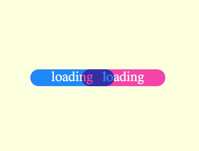

+++
title = '混色 loader'
date = 2018-08-22T17:42:50+08:00
image = '/test-hugo-deploy/img/thumbs/114.png'
summary = '#114'
+++



## 效果预览

点击链接可以在 Codepen 预览。

[https://codepen.io/comehope/pen/MqYroW](https://codepen.io/comehope/pen/MqYroW)

## 可交互视频

此视频是可以交互的，你可以随时暂停视频，编辑视频中的代码。

[https://scrimba.com/p/pEgDAM/c2qZyUV](https://scrimba.com/p/pEgDAM/c2qZyUV)

## 源代码下载

每日前端实战系列的全部源代码请从 github 下载：

[https://github.com/comehope/front-end-daily-challenges](https://github.com/comehope/front-end-daily-challenges)

## 代码解读

定义 dom，只有 1 个元素：
```css
<div class="loader"></div>
```

居中显示：
```css
body {
    margin: 0;
    height: 100vh;
    display: flex;
    align-items: center;
    justify-content: center;
    background-color: lightyellow;
}
```

定义容器尺寸：
```css
.loader {
    width: 30em;
    height: 3em;
    font-size: 10px;
}
```

用伪元素画出2个圆角矩形，各占容器的一半宽，放置在容器的左右两端，分别上色：
```css
.loader {
    position: relative;
}

.loader::before,
.loader::after {
    content: '';
    position: absolute;
    width: 50%;
    height: inherit;
    border-radius: 1em;
}

.loader::before {
    left: 0;
    background-color: dodgerblue;
}

.loader::after {
    right: 0;
    background-color: hotpink;
}
```

为圆角矩形增加 'loading' 文本：
```css
.loader::before,
.loader::after {
    content: 'loading';
    font-size: 2.5em;
    color: white;
    text-align: center;
    line-height: 1em;
}
```

增加动画效果：
```css
.loader::before,
.loader::after {
    animation: 5s move ease-in-out infinite;
}

@keyframes move {
    50% {
        transform: translateX(100%);
    }
}
```

为两个圆角矩形分别设置运动方向变量，使它们相对移动：
```css
.loader::before {
    --direction: 1;
}

.loader::after {
    --direction: -1;
}

@keyframes move {
    50% {
        transform: translateX(calc(100% * var(--direction)));
    }
}
```

最后，设置混色模式，使两个矩形相交的部分不是覆盖而是使颜色重叠：
```css
.loader::before,
.loader::after {
    mix-blend-mode: multiply;
}
```

大功告成！
