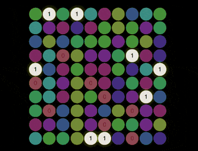

+++
title = 'pi 彩灯信息图'
date = 2018-08-23T17:43:05+08:00
image = '/fe/img/thumbs/115.png'
summary = '#115'
+++



## 效果预览

点击链接可以在 Codepen 预览。

[https://codepen.io/comehope/pen/XPbeKp](https://codepen.io/comehope/pen/XPbeKp)

## 可交互视频

此视频是可以交互的，你可以随时暂停视频，编辑视频中的代码。

[https://scrimba.com/p/pEgDAM/c79DRc4](https://scrimba.com/p/pEgDAM/c79DRc4)

## 源代码下载

每日前端实战系列的全部源代码请从 github 下载：

[https://github.com/comehope/front-end-daily-challenges](https://github.com/comehope/front-end-daily-challenges)

## 代码解读

定义 dom，容器中包含 9 个元素，代表 9 个数字：
```html
<div class="pi">
    <span>3</span>
    <span>1</span>
    <span>4</span>
    <span>1</span>
    <span>5</span>
    <span>9</span>
    <span>2</span>
    <span>6</span>
    <span>5</span>
</div>
```

居中显示：
```css
body {
    margin: 0;
    height: 100vh;
    display: flex;
    align-items: center;
    justify-content: center;
    background-color: black;
}
```

定义容器尺寸：
```css
.pi {
    width: 30em;
    height: 30em;
    font-size: 12px;
}
```

把 9 个数字布局成 3 * 3 的网格：
```css
.pi {
    display: grid;
    grid-template-columns: repeat(3, 1fr);
    grid-gap: 0.2em;
}

.pi span {
    color: white;
    font-size: 3em;
    background-color: hsl(0, 40%, 40%);
    font-family: sans-serif;
    border-radius: 50%;
    display: flex;
    align-items: center;
    justify-content: center;
    user-select: none;
}
```

在 dom 中定义 css 变量，变量值等于该元素代表的数字：
```html
<div class="pi">
    <span style="--d: 3">3</span>
    <span style="--d: 1">1</span>
    <span style="--d: 4">4</span>
    <span style="--d: 1">1</span>
    <span style="--d: 5">5</span>
    <span style="--d: 9">9</span>
    <span style="--d: 2">2</span>
    <span style="--d: 6">6</span>
    <span style="--d: 5">5</span>
</div>
```

为不同的数字设置不同的背景色：
```css
.pi span {
    --c: hsl(calc(var(--d) * 36), 40%, 40%);
    background-color: var(--c);
}
```

使数字的颜色与背景相同，在鼠标悬停时，高度当前的数字：
```css
.pi span {
    color: var(--c);
    transition: 0.3s;
}

.pi span:hover {
    background-color: white;
    color: black;
    box-shadow: 0 0 1em yellow;
}
```

至此，完成了视觉效果设计，接下来用 d3 批量处理 dom 元素和 css 变量。
引入 d3 库：
```html
<script src="https://d3js.org/d3.v5.min.js"></script>
```

用 d3 创建代表数字的 dom 元素，并设置 css 变量：
```javascript
const PI = '314159265';

d3.select('.pi')
    .selectAll('span')
    .data(PI)
    .enter()
    .append('span')
    .style('--d', (d) => d)
    .text((d) => d);
```

把 `PI` 改为100位：
```javascript
const PI = '3141592653589793238462643383279502884197169399375105820974944592307816406286208998628034825342117067';
```

同时把网格改为 10 * 10 的布局：
```css
.pi {
    grid-template-columns: repeat(10, 1fr);
}

.pi span {
    font-size: 1.3em;
}
```

接下来制作循环点亮的效果。

为各数字元素增加 css 类，数字 0 的类名是 `d0`，数字 1 的类名是 `d2`，以此类推：
```javascript
d3.select('.pi')
    .selectAll('span')
    .data(PI)
    .enter()
    .append('span')
    .attr('class', (d) => `d${d}`)
    .style('--d', (d) => d)
    .text((d) => d);
```

定义循环变量 `number`，它从 1 开始逐渐递增：
```javascript
let number = 1;
```

定义一个函数，用于点亮特定数字的一组元素：
```css
function show() {
    d3.selectAll(`.pi span.d${number % 10}`)
        .classed('show', true);
    d3.selectAll(`.pi span.d${(number-1) % 10}`)
        .classed('show', false);
    number++;
}
```

最后，设置一个间隔时间，不断重复调用上面这个函数，让各组数字依次点亮：
```javascript
setInterval(show, 500);
```

大功告成！
