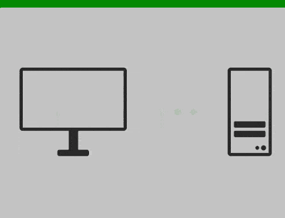

+++
title = '在线检测器'
date = 2018-08-24T17:43:21+08:00
image = '/fe/img/thumbs/116.png'
summary = '#116'
+++



## 效果预览

点击链接可以在 Codepen 预览。

[https://codepen.io/comehope/pen/oPjWvw](https://codepen.io/comehope/pen/oPjWvw)

## 可交互视频

此视频是可以交互的，你可以随时暂停视频，编辑视频中的代码。

[https://scrimba.com/p/pEgDAM/ceNm8CW](https://scrimba.com/p/pEgDAM/ceNm8CW)

## 源代码下载

每日前端实战系列的全部源代码请从 github 下载：

[https://github.com/comehope/front-end-daily-challenges](https://github.com/comehope/front-end-daily-challenges)

## 代码解读

navigator.onLine 方法用于检测在线状态，再配合相应的事件触发，就可开发一个在线检测工具了。整个过程分成两部分，先画出视觉效果，再检测在线/离线状态。

定义 dom，容器中包含客户端、信号和服务器：
```html
<div class="detector">
    <div class="client"></div>
    <div class="signal"></div>
    <div class="server"></div>
</div>
```

居中显示：
```css
body {
    margin: 0;
    height: 100vh;
    display: flex;
    align-items: center;
    justify-content: center;
}
```

在顶部增加一个横条，用于显示当前状态是在线还是离线，目前用绿色表示在线：
```css
:root {
    --status-color: green;
}

body {
    background: linear-gradient(var(--status-color) 5vh, #ccc 5vh);
}
```

定义容器尺寸：
```css
.detector {
    width: 40em;
    height: 14em;
    font-size: 10px;
}
```

定义子元素（客户端、信号、服务器）的整体布局和主色：
```css
.detector {
    display: flex;
    justify-content: space-between;
    align-items: center;
    color: #333;
}
```

设置子元素（客户端、信号、服务器）和它们的伪元素的共有属性：
```css
.detector > * {
    position: relative;
    box-sizing: border-box;
}

.detector > *::before,
.detector > *::after {
    content: '';
    position: absolute;
    box-sizing: border-box;
}
```

画出客户端的显示器：
```css
.client {
    display: flex;
    flex-direction: column;
    align-items: center;
}
```

用伪元素画出显示器的底座：
```css
.client {
    display: flex;
    flex-direction: column;
    align-items: center;
    margin-top: -4em;
}

.client::before {
    width: 1.5em;
    height: 3em;
    background-color: currentColor;
    top: 9.5em;
}

.client::after {
    width: 5em;
    height: 1em;
    background-color: currentColor;
    border-radius: 0.3em;
    top: 12.5em;
}
```

画出服务器的机箱：
```css
.server {
    width: 7em;
    height: 14em;
    border: 0.5em solid;
    border-radius: 0.5em;
}
```

用伪元素画出硬盘，留意此处阴影的用法，用阴影画出了第二块硬盘：
```css
.server::before {
    width: 5em;
    height: 1em;
    background-color: currentColor;
    border-radius: 0.2em;
    top: 8em;
    left: 0.5em;
    box-shadow: 0 1.5em 0;
}
```

用伪元素画出按钮，和上面阴影同样的用法，这次用阴影画出了第二个按钮：
```css
.server::after {
    width: 0.6em;
    height: 0.6em;
    background-color: currentColor;
    border-radius: 50%;
    right: 1.5em;
    bottom: 0.5em;
    box-shadow: 1em 0 0 0.1em;
}
```

画出信号，注意配色用的是代表在线/离线的颜色，目前是绿色：
```css
.signal,
.signal::before,
.signal::after {
    width: 1em;
    height: 1em;
    background-color: var(--status-color);
    border-radius: 50%;
}

.signal::before {
    right: 2.5em;
}

.signal::after {
    left: 2.5em;
}
```

给信号增加动画效果：
```css
.signal,
.signal::before,
.signal::after {
    animation: blink 0.6s infinite;
}

@keyframes blink {
    50% {
        filter: opacity(0.1);
    }
}
```

为第 2 个信号和第 3 个信号设置动画延时，延时的值用变量定义：
```css
:root {
    --second-signal-delay: 0.2s;
    --third-signal-delay: 0.4s;
}

.signal::before {
    animation-delay: var(--second-signal-delay);
}

.signal::after {
    animation-delay: var(--third-signal-delay);
}
```

至此，视觉效果已经完成，目前是在线状态的效果，在 `:root` 中一共定义了 3 个变量，顶部横条和信号是绿色，信号灯依次闪烁表示正在传输数据：
```css
:root {
    --status-color: green;
    --second-signal-delay: 0.2s;
    --third-signal-delay: 0.4s;
}
```

通过修改这 3 个变量的值，可以得到离线状态的视觉效果，顶部横条和信号变为红色，信号灯一起闪烁表示线路不通：
```css
:root {
    --status-color: orangered;
    --second-signal-delay: 0s;
    --third-signal-delay: 0s;
}
```

接下来通过检测在线/离线状态，动态应用这 2 种效果：

定义在线状态主题：
```javascript
const ONLINE_THEME = {
    statusColor: 'green',
    secondSignalDelay: '0.2s',
    thirdSignalDelay: '0.4s'
}
```

类似地，定义离线状态主题：
```javascript
const OFFLINE_THEME = {
    statusColor: 'orangered',
    secondSignalDelay: '0s',
    thirdSignalDelay: '0s'
}
```

创建一个函数，用于根据在线/离线状态显示不同的主题：
```javascript
function detectOnlineStatus() {
    let theme = navigator.onLine ? ONLINE_THEME : OFFLINE_THEME
    let root = document.documentElement
    root.style.setProperty('--status-color', theme.statusColor)
    root.style.setProperty('--second-signal-delay', theme.secondSignalDelay)
    root.style.setProperty('--third-signal-delay', theme.thirdSignalDelay)
}

detectOnlineStatus()
```

现在，关掉 wifi 连接，然后刷新页面，页面会采用红色主题；再打开 wifi 连接，然后刷新页面，页面会采用绿色主题。

接下来把检测函数与系统事件绑定，当连接断开或重新连接时，能自动设置主题，不用手动刷新页面了：
```javascript
window.addEventListener('online', detectOnlineStatus)
window.addEventListener('offline', detectOnlineStatus)
```

大功告成！
