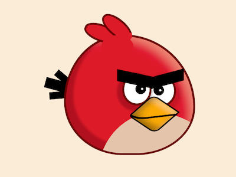

+++
title = '愤怒小鸟的红火'
date = 2018-08-25T17:43:36+08:00
image = '/fe/img/thumbs/117.png'
summary = '#117'
+++



## 效果预览

点击链接可以在 Codepen 预览。

[https://codepen.io/comehope/pen/pOgEdO](https://codepen.io/comehope/pen/pOgEdO)

## 可交互视频

此视频是可以交互的，你可以随时暂停视频，编辑视频中的代码。

[https://scrimba.com/p/pEgDAM/c86q9S3](https://scrimba.com/p/pEgDAM/c86q9S3)

## 源代码下载

每日前端实战系列的全部源代码请从 github 下载：

[https://github.com/comehope/front-end-daily-challenges](https://github.com/comehope/front-end-daily-challenges)

## 代码解读

定义 dom，容器中包含 6 个元素，分别代表头、眼睛、眉毛、嘴、冠羽、尾巴：
```html
<div class="red">
    <span class="head"></span>
    <span class="eyes"></span>
    <span class="eyebrows"></span>
    <span class="mouth"></span>
    <span class="hair"></span>
    <span class="tail"></span>
</div>
```

居中显示：
```css
body {
    margin: 0;
    height: 100vh;
    display: flex;
    align-items: center;
    justify-content: center;
    background-color: antiquewhite;
}
```

设置子元素的共有属性：
```css
.red * {
    position: absolute;
}

.red *::before,
.red *::after {
    content: '';
    position: absolute;
}
```

定义容器尺寸：
```css
.red {
    width: 12em;
    height: 11em;
    font-size: 16px;
    position: relative;
}
```

画出头部轮廓，把描边参数定义为变量，是因为后面还会用到：
```css
.red {
    --border: 0.2em solid #6a0306;
}

.head {
    width: inherit;
    height: inherit;
    background-color: #dc002d;
    border-radius: 45% 55% 45% 45% / 55% 60% 40% 45%;
    border: var(--border);
}
```

用伪元素画出眼睛的轮廓：
```css
.eyes::before,
.eyes::after {
    width: 2.4em;
    height: 2.6em;
    background: white;
    border-radius: 50%;
    border: var(--border);
}

.eyes::before {
    top: 3.7em;
    left: 5.5em;
    z-index: 1;
}

.eyes::after {
    top: 3.8em;
    left: 7.8em;
}
```

用径向渐变画出眼珠和瞳孔：
```css
.eyes::before,
.eyes::after {
    background: 
        radial-gradient(
            circle at calc(var(--eyeball-left) + 6%) 48%,
            white 0.1em,
            transparent 0.1em
        ),
        radial-gradient(
            circle at var(--eyeball-left) 48%,
            black 0.5em,
            transparent 0.5em
        ),
        white;
}

.eyes::before {
    --eyeball-left: 65%;
}

.eyes::after {
    --eyeball-left: 41%;
}
```

用伪元素画出眉毛：
```css
.eyebrows::before,
.eyebrows::after {
    height: 1.1em;
    background-color: black;
    top: 3.6em;
    z-index: 2;
}

.eyebrows::before {
    left: 5em;
    transform: skewY(12deg);
    width: 3.4em;
}

.eyebrows::after {
    left: 8.2em;
    transform: skewY(-15deg);
    width: 3.1em;
}
```

画出嘴的轮廓：
```css
.mouth {
    width: 2.8em;
    height: 2.8em;
    background-color: #fca90d;
    top: 6em;
    left: 7em;
    z-index: 3;
    border-radius: 20% 0 20% 10%;
    transform: rotate(34deg) skewX(-15deg);
    border: 0.1em solid black;
}
```

用伪元素画出上下颌的分界线：
```css
.mouth::before {
    width: 3.4em;
    height: 4em;
    border: 0.2em solid;
    top: -1.6em;
    left: -1.8em;
    border-radius: 0 0 40% 0;
    transform: rotate(42deg);
    border-color: transparent black transparent transparent;
}
```

画出冠羽的左侧：
```css
.hair {
    width: 1.2em;
    height: 3em;
    background-color: #dc002d;
    border-radius: 50%;
    border: var(--border);
    top: -1.8em;
    left: 2.8em;
    transform: rotate(-70deg);
    border-bottom-color: transparent;
}
```

用伪元素画出冠羽的右侧：
```css
.hair::before {
    width: inherit;
    height: inherit;
    background-color: inherit;
    border-radius: inherit;
    border: inherit;
    top: 1em;
    left: 0.8em;
    transform: rotate(20deg);
}
```

用伪元素把冠羽多余的搭边线遮盖住：
```css
.hair::after {
    width: 3em;
    height: 2em;
    background-color: #dc002d;
    border-radius: 50%;
    top: 2.3em;
    left: -1.5em;
    transform: rotate(70deg);
}
```

画出尾巴中最长的一根羽毛：
```css
.tail {
    width: 3em;
    height: 1em;
    background-color: black;
    top: 40%;
    left: -1.8em;
    z-index: -1;
    transform: rotate(15deg);
}
```

用伪元素画出尾巴中较短的两根羽毛：
```css
.tail::before,
.tail::after {
    width: inherit;
    height: 70%;
    background-color: black;
    left: 0.6em;
}

.tail::before {
    transform: rotate(25deg);
    top: -0.4em;
}

.tail::after {
    transform: rotate(-20deg);
    top: 0.8em;
}
```

用伪元素画出胸前的羽毛：
```css
.head {
    overflow: hidden;
}

.head::before {
    width: inherit;
    height: inherit;
    background-color: #e3c4ab;
    border-radius: inherit;
    top: 65%;
    left: 25%;
}
```
接下来画阴影，增强立体感。

为头部增加阴影：
```css
.head {
    box-shadow: 
      inset 0.5em -0.5em 0.3em 0.2em rgba(0, 0, 0, 0.2),
      inset -1em 0.8em 1.5em -0.5em rgba(237, 178, 144, 0.7);
}
```

为眼睛增加阴影：
```css
.eyes::before {
    box-shadow: -0.2em 0.2em 0.2em 0.3em rgba(0, 0, 0, 0.2);
}

.eyes::after {
    box-shadow: 0.2em 0.2em 0.4em 0.3em rgba(0, 0, 0, 0.1);
}
```

为嘴增加阴影：
```css
.mouth {
    box-shadow: 
      inset 0.2em -0.4em 1em rgba(0, 0, 0, 0.4),
      inset 0 0.5em 0.5em rgba(255, 255, 255, 0.3);
}
```

大功告成！
