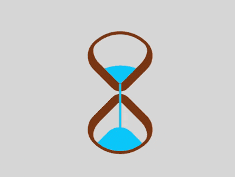

+++
title = '沙漏'
date = 2018-08-26T17:43:51+08:00
image = '/fe/img/thumbs/118.png'
summary = '#118'
+++



## 效果预览

点击链接可以在 Codepen 预览。

[https://codepen.io/comehope/pen/VGegxr](https://codepen.io/comehope/pen/VGegxr)

## 可交互视频

此视频是可以交互的，你可以随时暂停视频，编辑视频中的代码。

[https://scrimba.com/p/pEgDAM/cVRr9cp](https://scrimba.com/p/pEgDAM/cVRr9cp)

## 源代码下载

每日前端实战系列的全部源代码请从 github 下载：

[https://github.com/comehope/front-end-daily-challenges](https://github.com/comehope/front-end-daily-challenges)

## 代码解读

定义 dom，容器中包含 2 个元素，分别代表沙漏的上半部和下半部：
```html
<div class="loader">
    <span class="top"></span>
    <span class="bottom"></span>
</div>
```

居中显示：
```css
body {
    margin: 0;
    height: 100vh;
    display: flex;
    align-items: center;
    justify-content: center;
    background-color: gainsboro;
}
```

定义容器尺寸，并设置子元素整体布局：
```css
.loader {
    width: 4.3em;
    height: 9.8em;
    font-size: 10px;
    position: relative;
    display: flex;
    flex-direction: column;
    align-items: center;
    justify-content: space-between;
}
```

画出 2 个正方形：
```css
.top,
.bottom {
    width: 3.5em;
    height: 3.5em;
    border-style: solid;
    border-color: saddlebrown;
}
```

通过边框、圆角和旋转，把 2 个正方形变成沙漏形状：
```css
.top,
.bottom {
    border-width: 0.2em 0.2em 0.6em 0.6em;
    border-radius: 50% 100% 50% 30%;
}

.top {
    transform: rotate(-45deg);
}

.bottom {
    transform: rotate(135deg);
}
```

用伪元素画出沙子，上部的沙子的顶部是大圆弧，下部的沙子的顶部是小圆弧：
```css
.top::before,
.bottom::before {
    content: '';
    position: absolute;
    width: inherit;
    height: inherit;
    background-color: deepskyblue;
}

.top::before {
    border-radius: 0 100% 0 0;
}

.bottom::before {
    border-radius: 0 0 0 35%;
}
```

定义沙子的动画属性：
```css
.top::before,
.bottom::before {
    animation: 2s linear infinite;
}
```

增加沙子从沙漏的上半部落下的动画效果：
```css
.top::before {
    animation-name: drop-sand;
}

@keyframes drop-sand {
    to {
        transform: translate(-2.5em, 2.5em);
    }
}
```

增加沙子的沙漏在下半部堆积的动画效果：
```css
.bottom::before {
    transform: translate(2.5em, -2.5em);
    animation-name: fill-sand;
}

@keyframes fill-sand {
    to {
        transform: translate(0, 0);
    }
}
```

隐藏沙漏上半部和下半部容器外的部分，此时上面 2 个动画的叠加效果是沙子从上半部漏下，慢慢在下半部堆积：
```css
.top,
.bottom {
    overflow: hidden;
}
```

用外层容器的伪元素制作一个窄长条，模拟流动的沙子：
```css
.loader::after {
    content: '';
    position: absolute;
    width: 0.2em;
    height: 4.8em;
    background-color: deepskyblue;
    top: 1em;
}
```

增加沙子流动的动画效果：
```css
.loader::after {
    animation: flow 2s linear infinite;
}

@keyframes flow {
    10%, 100% {
        transform: translateY(3.2em);
    }
}
```

最后，增加沙漏的翻转动画：
```css
.loader {
    animation: rotating 2s linear infinite;
}

@keyframes rotating {
    0%, 90% {
        transform: rotate(0);
    }
    
    100% {
        transform: rotate(0.5turn);
    }
}
```

大功告成！
