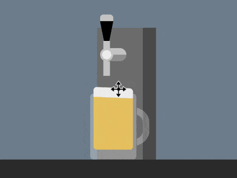

+++
title = '接扎啤'
date = 2018-08-27T17:44:05+08:00
image = '/test-hugo-deploy/img/thumbs/119.png'
summary = '#119'
+++



## 效果预览

点击链接可以在 Codepen 预览。

[https://codepen.io/comehope/pen/rZeOQp](https://codepen.io/comehope/pen/rZeOQp)

## 可交互视频

此视频是可以交互的，你可以随时暂停视频，编辑视频中的代码。

第 1 部分：
[https://scrimba.com/p/pEgDAM/c86mdUZ](https://scrimba.com/p/pEgDAM/c86mdUZ)

第 2 部分：
[https://scrimba.com/p/pEgDAM/cmVNbTW](https://scrimba.com/p/pEgDAM/cmVNbTW)

## 源代码下载

每日前端实战系列的全部源代码请从 github 下载：

[https://github.com/comehope/front-end-daily-challenges](https://github.com/comehope/front-end-daily-challenges)

## 代码解读

定义 dom，容器中包含一个表示酒桶的 `.keg` 元素和表示啤酒杯的 `.glass` 元素。酒桶有 2 个子元素，`.handle` 表示把手，`.pipe` 表示出水管，酒杯有 1 个表示啤酒的子元素 `.beer`：
```html
<div class="container">
    <div class="keg">
        <span class="handle"></span>
        <span class="pipe"></span>
    </div>
    <div class="glass">
        <span class="beer"></span>
    </div>
</div>
```

居中显示：
```css
body {
    margin: 0;
    height: 100vh;
    display: flex;
    justify-content: center;
    background: linear-gradient(
        lightslategray 300px,
        #333 300px
    );
}
```

定义容器尺寸和伪元素的共有属性：
```css
.container {
    width: 700px;
    height: 300px;
    position: relative;
}

.container *::before,
.container *::after {
    content: '';
    position: absolute;
}
```

画出酒桶：
```css
.keg {
    position: absolute;
    width: 90px;
    height: 200px;
    background: linear-gradient(
        to right,
        #777 70px,
        #555 70px
    );
    bottom: 0;
    left: 310px;
}
```

画出出水管和它的支架：
```css
.keg .pipe {
    position: absolute;
    width: 10px;
    height: 40px;
    background-color: #ccc;
    top: 33px;
    left: 10px;
}

.keg .pipe::before {
    width: 40px;
    height: 20px;
    background: 
        radial-gradient(
            circle at 10px 10px,
            #eee 7px,
            #ccc 7px, #ccc 10px,
            transparent 10px
        ),
        linear-gradient(
            #ccc 50%,
            #999 50%
        );
    border-radius: 10px;
    top: -2px;
    left: -5px;
}
```

画出把手：
```css
.keg .handle {
    position: absolute;
    border-style: solid;
    border-width: 50px 10px 0 10px;
    border-color: black transparent transparent transparent;
    top: -10px;
    left: 5px;
}

.keg .handle::before {
    width: 20px;
    height: 10px;
    background-color: #ccc;
    top: -60px;
    left: -10px;
    border-radius: 5px 5px 0 0;
}

.keg .handle::after {
    width: 10px;
    height: 20px;
    background-color: #ccc;
    top: -20px;
    left: -5px;
}
```

画出酒杯：
```css
.glass {
    position: absolute;
    width: 70px;
    height: 100px;
    color: rgba(255, 255, 255, 0.3);
    background-color: currentColor;
    bottom: 0;
    left: 300px;
    border-radius: 5px;
}

.glass::before {
    width: 50px;
    height: 40px;
    border: 10px solid;
    top: 20px;
    right: -20px;
    border-radius: 0 40% 40% 0;
    clip-path: inset(0 0 0 72%);
}
```

画出杯中的啤酒和泡沫：
```css
.beer {
    position: absolute;
    width: 60px;
    height: 80px;
    background-color: rgba(255, 206, 84, 0.8);
    bottom: 15px;
    left: 5px;
    border-radius: 0 0 5px 5px;
    border-top: solid rgba(255, 206, 84, 0.8);
}

.beer::before {
    width: inherit;
    height: 15px;
    background-color: #eee;
    top: -15px;
    border-radius: 5px 5px 0 0;
}
```

接下来制作动画。

增加酒杯把手被压下的动画效果：
```css
.keg .handle {
    transform-origin: center 50px;
    animation: handle 5s infinite;
}

@keyframes handle {
    10%, 60% {
        transform: rotate(0deg);
    }

    20%, 50% {
        transform: rotate(-90deg);
    }
}
```

增加啤酒被斟满的动画效果：
```css
.beer {
    animation: fillup 5s infinite;
}

@keyframes fillup {
    0%, 20% {
        height: 0px;
        border-width: 0px;
    }

    40% {
        height: 40px;
    }

    80%, 100% {
        height: 80px;
        border-width: 5px;
    }
}
```

增加啤酒泡沫泛起的动画效果：
```css
.beer::before {
    animation: 
        wave 0.5s infinite alternate,
        fillup-foam 5s linear infinite;
}

@keyframes fillup-foam {
    0%, 20% {
        top: 0;
        height: 0;
    }

    60%, 100% {
        top: -15px;
        height: 15px;
    }
}

@keyframes wave {
    from {
        transform: skewY(-3deg);
    }

    to {
        transform: skewY(3deg);
    }
}
```

增加啤酒从出水口流出的效果：
```css
.keg .pipe::after {
    width: 10px;
    background-color: rgba(255, 206, 84, 0.5);
    animation: flow 5s infinite;
}

@keyframes flow {
    0%, 15% {
        top: 40px;
        height: 0;
    }

    20% {
        height: 115px;
    }

    40% {
        height: 75px;
    }

    55% {
        top: 40px;
        height: 50px;
    }

    60%, 100% {
        top: 80px;
        height: 0;
    }
}
```

最后，增加酒杯滑动的效果：
```css
.glass {
    animation: slide 5s ease infinite;
}

@keyframes slide {
    0% {
        left: 0;
        filter: opacity(0);
    }

    20%, 80% {
        left: 300px;
        filter: opacity(1);
    }

    100% {
        left: 600px;
        filter: opacity(0);
    }
}
```

大功告成！
