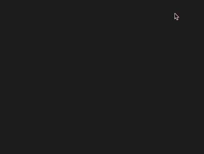

+++
title = '小鱼游动'
date = 2018-08-29T17:44:45+08:00
image = '/test-hugo-deploy/img/thumbs/121.png'
summary = '#121'
+++



## 效果预览

点击链接可以在 Codepen 预览。

[https://codepen.io/comehope/pen/bxwpER](https://codepen.io/comehope/pen/bxwpER)

## 可交互视频

此视频是可以交互的，你可以随时暂停视频，编辑视频中的代码。

[https://scrimba.com/p/pEgDAM/cWJmLh6](https://scrimba.com/p/pEgDAM/cWJmLh6)

## 源代码下载

每日前端实战系列的全部源代码请从 github 下载：

[https://github.com/comehope/front-end-daily-challenges](https://github.com/comehope/front-end-daily-challenges)

## 代码解读

定义 dom，容器中包含的子元素分别代表鱼的身体、眼睛、背鳍和尾巴：
```html
<div class="fish">
    <span class="body"></span>
    <span class="eye"></span>
    <span class="fin"></span>
    <span class="tail"></span>
</div>
```

设置页面样式为全屏且没有滚动条：
```css
body {
    margin: 0;
    width: 100vw;
    height: 100vh;
    background-color: #222;
    overflow: hidden;
}
```

定义鱼的容器尺寸，`--r` 是一个基本尺寸单位，后续所有尺寸都是基于它计算的：
```css
.fish {
    position: absolute;
    --r: 15vw;
    width: calc(var(--r) + var(--r) / 3);
    height: calc(var(--r) * 2);
    left: 50%;
    top: 100px;
}
```

画出鱼的身体，同时把鱼的颜色声明到父类中，因为下面还会用到这个颜色：
```css
.fish {
    color: hsl(0, 50%, 50%);
}

.fish .body {
    position: absolute;
    border: var(--r) solid transparent;
    border-right-color: currentColor;
    border-left-style: none;
}
```

画出鱼的眼睛：
```css
.fish .eye {
    position: absolute;
    --r1: calc(var(--r) / 4);
    width: var(--r1);
    height: var(--r1);
    background-color: #111;
    border-radius: 50%;
    top: 35%;
    left: 30%;
}
```

画出鱼的背鳍：
```css
.fish .fin {
    position: absolute;
    --r2: calc(var(--r) / 2);
    border-bottom: var(--r2) solid;
    border-left: var(--r2) solid transparent;
    filter: brightness(2.5);
    left: calc(var(--r) - var(--r2));
}
```

画出鱼的尾巴：
```css
.fish .tail {
    position: absolute;
    --r3: calc(var(--r) / 3);
    border: var(--r3) solid transparent;
    border-right-color: currentColor;
    border-left-style: none;
    right: 0;
    top: calc(var(--r) - var(--r3));
}
```

增加让鱼游动的动画效果，不是循环执行，而是只执行一次：
```css
.fish {
    right: calc(var(--r) * -1);
    animation: run 3s linear forwards;
}

@keyframes run {
    to {
        right: 100%;
    }
}
```

再增加鱼游动时摇摆的动画效果：
```css
.fish {
    animation: 
        run 3s linear forwards,
        shake 0.3s linear infinite;
}

@keyframes shake {
    50% {
        transform: rotateY(-30deg);
    }

    100% {
        transform: rotateY(30deg);
    }
}
```

接下来设置一些变量，以便创建不同样子的鱼：

鱼的大小的变量 `--size`，数值越大尺寸越大：
```css
.fish {
    --size: 5;
    --r: calc(var(--size) * 1vw);
}
```

鱼的颜色变量 `--color`，表示色相环的角度：
```css
.fish {
    --color: 0;
    color: hsl(var(--color), 50%, 50%);
}
```

鱼从右侧游到左侧的时长，时长越短游得越快：
```css
.fish {
    --duration: 3;
    animation: 
        run calc(var(--duration) * 1s) linear forwards,
        shake 0.3s linear infinite;
}
```

鱼出现的高度，数据越大越靠近页面下部：
```css
.fish {
    --top: 100;
    top: calc(var(--top) * 1px);
}
```

接下来用 d3 来批量处理 dom 元素和 css 变量。
引入 d3 库：
```html
<script src="https://d3js.org/d3.v5.min.js"></script>
```

删除掉 html 中的 `.fish` 元素和 css 文件中的变量声明代码。创建一个函数，用于生成一条鱼。css 变量的值均为随机生成，`--size` 的取值范围是 5 ~ 8，`--color` 的取值范围是 -60 ~ 15，`--duration` 的取值范围是 3 ~ 6，`--top` 的取值范围是 100 ~ 300：
```javascript
function buildFish() {
    let fish = d3.select('body')
        .append('div')
        .attr('class', 'fish')
        .style('--size', d3.randomUniform(5, 8)())
        .style('--color', d3.randomUniform(-60, 15)())
        .style('--duration', d3.randomUniform(3, 6)())
        .style('--top', d3.randomUniform(100, 300)());
    
    fish.append('span').attr('class', 'body');
    fish.append('span').attr('class', 'eye');
    fish.append('span').attr('class', 'fin');
    fish.append('span').attr('class', 'tail');
}
```

绑定鼠标单击事件，当按下鼠标时就生成一条鱼：
```javascript
function buildFish(e) {
    //略....
    .style('--top', e.clientY);
}

window.addEventListener('click', buildFish);
```

并且让鱼的嘴部和点击的位置在一条水平线上：
```css
.fish {
    top: calc(var(--top) * 1px - var(--r));
}
```

最后，在页面载入时自动生成 3 条鱼，以免页面载入后一片空白：
```javascript
function buildFish(e) {
    //略....
    .style('--top', e ? e.clientY : d3.randomUniform(100, 300)());
}

d3.range(3).forEach(buildFish);
```

大功告成！
