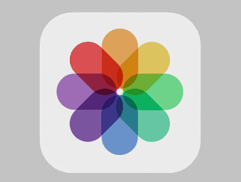

+++
title = '苹果相册图标'
date = 2018-08-30T17:45:01+08:00
image = '/test-hugo-deploy/img/thumbs/122.png'
summary = '#122'
+++



## 效果预览

点击链接可以在 Codepen 预览。

[https://codepen.io/comehope/pen/zJKwbO](https://codepen.io/comehope/pen/zJKwbO)

## 可交互视频

此视频是可以交互的，你可以随时暂停视频，编辑视频中的代码。

[https://scrimba.com/p/pEgDAM/cDBZNUW](https://scrimba.com/p/pEgDAM/cDBZNUW)

## 源代码下载

每日前端实战系列的全部源代码请从 github 下载：

[https://github.com/comehope/front-end-daily-challenges](https://github.com/comehope/front-end-daily-challenges)

## 代码解读

定义 dom，容器中包含 8 个元素，每个元素代表一个矩形色块：
```html
<div class="icon">
    <span></span>
    <span></span>
    <span></span>
    <span></span>
    <span></span>
    <span></span>
    <span></span>
    <span></span>
</div>
```

居中显示：
```css
body {
    margin: 0;
    height: 100vh;
    display: flex;
    align-items: center;
    justify-content: center;
    background-color: #ccc;
}
```

定义容器尺寸：
```css
.icon {
    width: 10em;
    height: 10em;
    font-size: 30px;
    background-color: #eee;
    border-radius: 20%;
}
```

绘制出矩形的轮廓（边框为辅助线，最终会被删除），并放置在容器的中上方：
```css
.icon {
    position: relative;
    display: flex;
    justify-content: center;
    box-sizing: border-box;
    padding: 1em;
}

.icon span {
    position: absolute;
    width: 22.5%;
    height: 37.5%;
    border: 1px dashed black;
    border-radius: 50% / 30%;
}
```

为矩形设置下标变量 `--n`：
```css
.icon span:nth-child(1) {
    --n: 1;
}

.icon span:nth-child(2) {
    --n: 2;
}

.icon span:nth-child(3) {
    --n: 3;
}

.icon span:nth-child(4) {
    --n: 4;
}

.icon span:nth-child(5) {
    --n: 5;
}

.icon span:nth-child(6) {
    --n: 6;
}

.icon span:nth-child(7) {
    --n: 7;
}

.icon span:nth-child(8) {
    --n: 8;
}
```

让 8 个矩形依次旋转固定的角度，围合成一个圆形：
```css
.icon span {
    transform-origin: center 105%;
    transform: rotate(calc((var(--n) - 1) * 45deg));
}
```

为矩形设置颜色变量 `--c`：
```css
.icon span:nth-child(1) {
    --c: rgba(243, 156, 18, 0.7);
}

.icon span:nth-child(2) {
    --c: rgba(241, 196, 15, 0.7);
}

.icon span:nth-child(3) {
    --c: rgba(46, 204, 113, 0.7);
}

.icon span:nth-child(4) {
    --c: rgba(27, 188, 155, 0.7);
}

.icon span:nth-child(5) {
    --c: rgba(65, 131, 215, 0.7);
}

.icon span:nth-child(6) {
    --c: rgba(102, 51, 153, 0.7);
}

.icon span:nth-child(7) {
    --c: rgba(155, 89, 182, 0.7);
}

.icon span:nth-child(8) {
    --c: rgba(242, 38, 19, 0.7);
}
```

为 8 个矩形上色，并删除掉起辅助线作用的边框：
```css
.icon span {
    /* border: 1px dashed black; */
    background-color: var(--c);
}
```

设置混色模式，使重叠颜色能叠加在一起：
```css
.icon span {
    mix-blend-mode: multiply;
}
```

增加鼠标悬停效果，当悬停时运行矩形色块展开的动画：
```css
.icon:hover span {
    animation: rotating 2s ease-in-out forwards;
}

@keyframes rotating {
    from {
        transform: rotate(0deg);
    }

    to {
        transform: rotate(calc((var(--n) - 1) * 45deg));
    }
}
```

注意，在动画过程中第 1 个矩形并没有转动，因为它是从 0 度转到 0 度，为了让它转动，要把它的结束角度设置为 360 度，通过修改它的下标变量来实现：
```css
.icon span:nth-child(1) {
    --n: 9;
}
```

大功告成！
