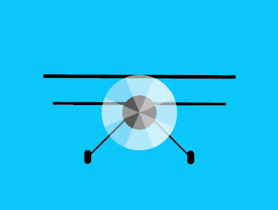

+++
title = '双冀飞机'
date = 2018-08-31T17:45:18+08:00
image = '/test-hugo-deploy/img/thumbs/123.png'
summary = '#123'
+++



## 效果预览

点击链接可以在 Codepen 预览。

[https://codepen.io/comehope/pen/yxVYRL](https://codepen.io/comehope/pen/yxVYRL)

## 可交互视频

此视频是可以交互的，你可以随时暂停视频，编辑视频中的代码。

[https://scrimba.com/p/pEgDAM/cmVLRc9](https://scrimba.com/p/pEgDAM/cmVLRc9)

## 源代码下载

每日前端实战系列的全部源代码请从 github 下载：

[https://github.com/comehope/front-end-daily-challenges](https://github.com/comehope/front-end-daily-challenges)

## 代码解读

定义 dom，容器中包含 3 个子元素，分别表示机冀、螺旋桨和轮子，机冀有 4 片叶片，轮子左右各一只：
```html
<div class="plane">
    <div class="wings"></div>
    <div class="fans">
        <span></span>
        <span></span>
        <span></span>
        <span></span>
    </div>
    <div class="wheels">
        <span class="left"></span>
        <span class="right"></span>
    </div>
</div>
```

定义容器尺寸：
```css
.plane {
    width: 28em;
    height: 13em;
    font-size: 10px;
}
```

定义子元素整体布局和共有属性：
```css
.plane {
    display: flex;
    justify-content: center;
    position: relative;
}

.plane > * {
    position: absolute;
}

.plane > *::before,
.plane > *::after {
    content: '';
    position: absolute;
}
```

定义基本色：
```css
.plane {
    color: black;
}
```

画出双冀：
```css
.wings {
    width: inherit;
    display: flex;
    justify-content: center;
}

.wings::before {
    width: inherit;
    height: 0.5em;
    background-color: currentColor;
}

.wings::after {
    top: 4em;
    width: 90%;
    height: 0.4em;
    background-color: currentColor;
}
```

画出螺旋桨的中心：
```css
.fans {
    width: 11em;
    height: 11em;
    outline: 1px dashed;
    background: radial-gradient(
        black 2.5em,
        transparent 2.5em
    );
}
```

定义叶片的形状为半圆形：
```css
.fans span {
    width: inherit;
    height: inherit;
}

.fans span::before {
    width: inherit;
    height: 50%;
    background-color: rgba(255, 255, 255, 0.4);
    border-radius: 50% 50% 0 0 / 100% 100% 0 0;
}
```

分别旋转叶片的角度，使 4 个页片均匀分布在一个圆内：
```css
.fans span::before {
    transform-origin: bottom;
    transform: rotate(calc((var(--n) - 1) * 90deg));
}

.fans span:nth-child(1) {
    --n: 1;
}

.fans span:nth-child(2) {
    --n: 2;
}

.fans span:nth-child(3) {
    --n: 3;
}

.fans span:nth-child(4) {
    --n: 4;
}
```

画出 2 个轮子：
```css
.wheels {
    width: 16em;
    height: 2em;
    outline: 1px dashed;
    bottom: 0;
    display: flex;
    justify-content: space-between;
}

.wheels span {
    position: static;
    width: 1em;
    height: inherit;
    background-color: currentColor;
    border-radius: 0.5em;
}
```

画出轮子的 2 个支架：
```css
.wheels span {
    display: flex;
    justify-content: center;
}

.wheels span::before {
    width: 0.2em;
    height: 8em;
    background-color: currentColor;
    transform-origin: bottom;
    bottom: 1em;
    z-index: -1;
}

.wheels .left::before {
    transform: rotate(45deg);
}

.wheels .right::before {
    transform: rotate(-45deg);
}
```

接下来制作动画效果。

增加螺旋桨旋转的动画效果：
```css
.fans span {
    animation: fans-rotating 0.8s linear infinite;
    animation-delay: calc(var(--n) * 0.1s);
}

@keyframes fans-rotating {
    to {
        transform: rotate(-1turn);
    }
}
```

增加飞机飞行的动画效果：
```css
.plane {
    animation: fly 5s infinite;
}

@keyframes fly {
    10%, 50%, 100% {
        top: 0;
    }
    
    25% {
        top: 1em;
    }
    
    75% {
        top: -1em;
    }
}
```

再增加飞机旋转的动画效果：
```css
.plane {
    animation: 
        plane-rotating 10s infinite,
        fly 5s infinite;
}

@keyframes plane-rotating {
    10%, 30%, 50% {
        transform: rotate(0deg);
    }
    
    20% {
        transform: rotate(-4deg);
    }
    
    80% {
        transform: rotate(8deg);
    }
    
    100% {
        transform: rotate(-1turn);
    }
}
```

大功告成！
