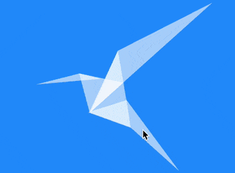

+++
title = '纸鹤'
date = 2018-09-01T17:45:31+08:00
image = '/test-hugo-deploy/img/thumbs/124.png'
summary = '#124'
+++



## 效果预览

点击链接可以在 Codepen 预览。

[https://codepen.io/comehope/pen/xagoYb](https://codepen.io/comehope/pen/xagoYb)

## 可交互视频

此视频是可以交互的，你可以随时暂停视频，编辑视频中的代码。

[https://scrimba.com/p/pEgDAM/cPw8eSg](https://scrimba.com/p/pEgDAM/cPw8eSg)

## 源代码下载

每日前端实战系列的全部源代码请从 github 下载：

[https://github.com/comehope/front-end-daily-challenges](https://github.com/comehope/front-end-daily-challenges)

## 代码解读

定义 dom，容器中包含 6 个元素，分别代表头、颈、身体侧面、翅、尾、胸：
```html
<div class="cranes">
    <span class="head"></span>
    <span class="neck"></span>
    <span class="side"></span>
    <span class="wing"></span>
    <span class="tail"></span>
    <span class="belly"></span>
</div>
```

居中显示：
```css
body {
    margin: 0;
    height: 100vh;
    display: flex;
    align-items: center;
    justify-content: center;
    background-color: dodgerblue;
}
```

定义容器尺寸：
```css
.cranes {
    width: 52em;
    height: 50em;
    font-size: 7px;
}
```

设置纸鹤的颜色灾白色：
```css
.cranes {
    color: white;
}
```

画出头部：
```css
.cranes {
    position: relative;
}

.head {
    border-left: 13em solid transparent;
    border-right: 6em solid transparent;
    border-bottom: 2em solid;
    position: absolute;
    left: 0;
    top: 21;
    transform: rotate(-5deg);
}
```

把以上创建三角形的代码抽象成一个模板，然后数据都改为变量，类似于调用函数的样子：
```css
.cranes span {
    border-left: calc(var(--left) * 1em) solid transparent;
    border-right: calc(var(--right) * 1em) solid transparent;
    border-bottom: calc(var(--bottom) * 1em) solid;
    position: absolute;
    transform: rotate(calc(var(--rotation) * 1deg));
    left: calc(var(--x) * 1em);
    top: calc(var(--y) * 1em);
}

.head {
    --left: 13;
    --right: 6;
    --bottom: 2;    
    --x: 0;
    --y: 21;
    --rotation: -5;
}
```

设置透明度，以便元素叠加的位置有折纸效果：
```css
.cranes span {
    filter: opacity(0.6);
}
```

接下来就是逐个调用生成三角形的函数，逐个创建其他三角形：

颈：
```css
.neck {
    --left: 6;
    --right: 6;
    --bottom: 12;
    --x: 14;
    --y: 19;
    --rotation: 75;
}
```

身体侧面：
```css
.side {
    --left: 1.5;
    --right: 11.5;
    --bottom: 20;
    --x: 18.8;
    --y: 15.1;
    --rotation: 20;
}
```

翅：
```css
.wing {
    --left: 18.7;
    --right: 30;
    --bottom: 8;
    --x: 6.7;
    --y: 9.2;
    --rotation: -41.9;
}
```

尾：
```css
.tail {
    --left: 18.6;
    --right: 7.7;
    --bottom: 3.9;
    --x: 19.6;
    --y: 38.1;
    --rotation: -126.5;
}
```

胸：
```css
.belly {
    --left: 6.2;
    --right: 1.8;
    --bottom: 11.5;
    --x: 17.5;
    --y: 27.8;
    --rotation: -99;
}
```

至此，纸鹤画完。
最后，增加一点交互效果，当鼠标悬停时，由等腰直角三角形变形成鹤：
```css
.cranes:hover span {
    animation: appear 1s ease-in;
}

@keyframes appear {
    from {
        border-left: 3em solid transparent;
        border-right: 3em solid transparent;
        border-bottom: 3em solid;
        position: absolute;
        transform: rotate(0deg);
        left: calc((52em - 3em) / 2);
        top: calc((50em - 3em) / 2);
    }
}
```

大功告成！
