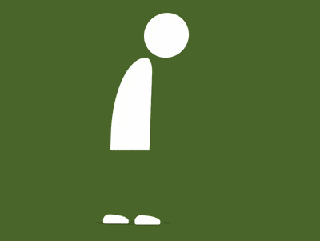

+++
title = '失落的人'
date = 2018-09-03T17:45:46+08:00
image = '/fe/img/thumbs/125.png'
summary = '#125'
+++



## 效果预览

点击链接可以在 Codepen 预览。

[https://codepen.io/comehope/pen/MqpOdR/](https://codepen.io/comehope/pen/MqpOdR/)

## 可交互视频

此视频是可以交互的，你可以随时暂停视频，编辑视频中的代码。

[https://scrimba.com/p/pEgDAM/czZnbsr](https://scrimba.com/p/pEgDAM/czZnbsr)

## 源代码下载

每日前端实战系列的全部源代码请从 github 下载：

[https://github.com/comehope/front-end-daily-challenges](https://github.com/comehope/front-end-daily-challenges)

## 代码解读

定义 dom，容器中包含 3 个元素，分别代表头、身体和脚：
```html
<div class="man">
    <span class="head"></span>
    <span class="body"></span>
    <span class="feet"></span>
</div>
```

居中显示：
```css
body {
    margin: 0;
    height: 100vh;
    display: flex;
    align-items: center;
    justify-content: center;
    background: radial-gradient(lightgray 20%, whitesmoke);
}
```

定义容器尺寸：
```css
.man {
    width: 12em;
    height: 33em;
    font-size: 10px;
    position: relative;
}
```

定义主色：
```css
.man {
    color: white;
}
```

画出头部：
```css
.head {
    position: absolute;
    width: 7em;
    height: 7em;
    background-color: currentColor;
    border-radius: 50%;
    right: 0;
}
```

画出身体：
```css
.body {
    position: absolute;
    width: 6.2em;
    height: 14.4em;
    background-color: currentColor;
    top: 7em;
    border-radius: 100% 20% 0 0;
}
```

画出脚，现在只能看到一只脚，是因为两只脚重叠在一起，一会儿动起来时就能看到两只脚了：
```css
.feet::before,
.feet::after {
    content: '';
    position: absolute;
    width: 4em;
    height: 1.4em;
    background-color: white;
    bottom: 0;
    left: -1.6em;
    border-radius: 1em 80% 0.4em 0.4em;
}
```

用伪元素画出阴影：
```css
.man::before {
    content: '';
    position: absolute;
    width: 12em;
    height: 0.8em;
    background-color: rgba(0, 0, 0, 0.1);
    bottom: -0.2em;
    left: -3em;
    border-radius: 50%;
}
```

接下来增加动画效果。

增加行走的动画效果，并使两只脚的动画时间交错：
```css
.feet::before,
.feet::after {
    animation: feet-animation 2s ease-in-out infinite;
}

.feet::after {
    animation-delay: 1s;
}

@keyframes feet-animation {
    20% {
        transform: translateX(3.4em) translateY(-1.6em) rotate(4deg);
    }

    30% {
        transform: translateX(4.6em) translateY(-1em) rotate(0deg);
    }

    40% {
        transform: translateX(5.6em) translateY(-0.6em) rotate(4deg);
    }

    44% {
        transform: translateX(5.6em) translateY(0) rotate(0deg);
    }
}
```

增加头和身体起伏的动画效果：
```css
.head,
.body {
    animation: body-animation 4s ease-in-out infinite;
}

@keyframes body-animation {
    0%, 100% {
        transform: translateY(0) skewX(-2deg);
    }

    25%, 75% {
        transform: translateY(0.5em) skewX(0deg);
    }

    50% {
        transform: translateY(0) skewX(0deg);
    }
}
```

增加阴影面积随身体运动而变化的动画效果：
```css
.man::before {
    animation: shadow-animate 4s ease-in-out infinite;
}

@keyframes shadow-animate {
    0%, 50%, 100% {
        transform: scale(1);
    }

    25%, 75% {
        transform: scale(1.15);
    }
}
```

大功告成！
