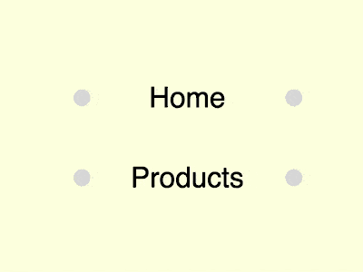

+++
title = '小球变矩形背景按钮特效'
date = 2018-09-04T17:46:02+08:00
image = '/test-hugo-deploy/img/thumbs/126.png'
summary = '#126'
+++



## 效果预览

点击链接可以在 Codepen 预览。

[https://codepen.io/comehope/pen/yxbEzJ](https://codepen.io/comehope/pen/yxbEzJ)

## 可交互视频

此视频是可以交互的，你可以随时暂停视频，编辑视频中的代码。

[https://scrimba.com/p/pEgDAM/cGanPU6](https://scrimba.com/p/pEgDAM/cGanPU6)

## 源代码下载

每日前端实战系列的全部源代码请从 github 下载：

[https://github.com/comehope/front-end-daily-challenges](https://github.com/comehope/front-end-daily-challenges)

## 代码解读

定义 dom，导航中包含一个无序列表，列表中有一个列表项：
```html
<nav>
    <ul>
        <li>home</li>
    </ul>
</nav>
```

居中显示：
```css
body {
    margin: 0;
    height: 100vh;
    display: flex;
    align-items: center;
    justify-content: center;
    background-color: lightyellow;
}
```

隐藏列表项前端的引导符号：
```css
nav ul {
    padding: 0;
    list-style-type: none;
}
```

设置容器尺寸：
```css
nav li {
    width: 8em;
    height: 2em;
    font-size: 25px;
}
```

设置文字样式：
```css
nav li {
    font-size: 25px;
    text-align: center;
    line-height: 2em;
    font-family: sans-serif;
    text-transform: capitalize;
}
```

添加伪元素，伪元素是 2 个小球：
```css
nav li {
    position: relative;
}

nav li::before,
nav li::after {
    content: '';
    position: absolute;
    width: 0.6em;
    height: 0.6em;
    background-color: gainsboro;
    border-radius: 50%;
}
```

把小球定位在左右两端：
```css
nav li::before {
    top: calc(50% - 0.6em / 2);
    left: 0;
}

nav li::after {
    bottom: calc(50% - 0.6em / 2);
    right: 0;
}
```

接下来设置按钮悬停效果。

当鼠标悬停在按钮上时，让小球变为与容器大小相等的矩形：
```css
nav li:hover::before,
nav li:hover::after {
    width: 100%;
    height: 100%;
    border-radius: 0;
}
```

第其中一个矩形稍向右下角错位，并且加深它的颜色，形成阴影效果：
```css
nav li:hover::before {
    z-index: -1;
    top: 0;
}

nav li:hover::after {
    z-index: -2;
    bottom: -0.4em;
    right: -0.4em;
    filter: brightness(0.8);
}
```

设置悬停的颜色，伪元素的矩形背景变为蓝色，文字变为白色：
```css
nav li:hover {
    color: white;
}

nav li:hover::before,
nav li:hover::after {
    background-color: dodgerblue;
}
```

设置缓动时间，其中伪元素的缓动时间函数用拟人的动画效果：
```css
nav li {
    transition: 0.5s;
}

nav li::before,
nav li::after {
    transition: 0.5s cubic-bezier(0.5, -0.5, 0.25, 1.5);
}
```

再增加几个按钮：
```html
<nav>
    <ul>
        <li>home</li>
        <li>products</li>
        <li>services</li>
        <li>contact</li>
    </ul>
</nav>
```

最后，增加按钮之间的间距：
```css
nav li {
    margin: 0.8em;
}
```

大功告成！
