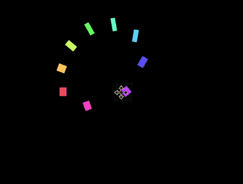

+++
title = '圆环错觉'
date = 2018-09-05T17:46:24+08:00
image = '/fe/img/thumbs/127.png'
summary = '#127'
+++



## 效果预览

点击链接可以在 Codepen 预览。

[https://codepen.io/comehope/pen/oPWJNj/](https://codepen.io/comehope/pen/oPWJNj/)

## 可交互视频

此视频是可以交互的，你可以随时暂停视频，编辑视频中的代码。

[https://scrimba.com/p/pEgDAM/cbvPWHM](https://scrimba.com/p/pEgDAM/cbvPWHM)

## 源代码下载

每日前端实战系列的全部源代码请从 github 下载：

[https://github.com/comehope/front-end-daily-challenges](https://github.com/comehope/front-end-daily-challenges)

## 代码解读

定义 dom，容器中包含 10 个 `<div>` 子元素，每个 `<div>` 子元素内还有一个 `<span>` 子元素：
```html
<figure class="container">
    <div><span></span></div>
    <div><span></span></div>
    <div><span></span></div>
    <div><span></span></div>
    <div><span></span></div>
    <div><span></span></div>
    <div><span></span></div>
    <div><span></span></div>
    <div><span></span></div>
    <div><span></span></div>
</figure>
```

定义容器尺寸：
```css
.container {
    width: 17em;
    height: 17em;
    font-size: 16px;
}
```

定义子元素的尺寸，和容器相同：
```css
.container {
    position: relative;
}

.container div {
    position: absolute;
    width: inherit;
    height: inherit;
}
```

在子元素的正中画一个黄色的小方块：
```css
.container div {
    display: flex;
    align-items: center;
    justify-content: center;
}

.container span {
    position: absolute;
    width: 1em;
    height: 1em;
    background-color: yellow;
}
```

增加让小方块左右移动的动画效果，动画时长还会在后面用到，所以定义成变量：
```css
.container span {
    --duration: 2s;
    animation: move var(--duration) infinite;
}

@keyframes move {
    0%, 100% {
        left: calc(10% - 0.5em);
    }

    50% {
        left: calc(90% - 0.5em);
    }
}
```

用[贝赛尔曲线](http://cubic-bezier.com/#.6,-0.3,.7,0)调整动画的时间函数，使小方块看起来就像在左右两侧跳来跳去：
```css
.container span {
    animation: move var(--duration) cubic-bezier(0.6, -0.3, 0.7, 0) infinite;
}
```

增加小方块变形的动画，使它看起来有下蹲起跳的拟人效果：
```css
.container span {
    animation: 
        move var(--duration) cubic-bezier(0.6, -0.3, 0.7, 0) infinite,
        morph var(--duration) ease-in-out infinite;
}

@keyframes morph {
    0%, 50%, 100% {
        transform: scale(0.75, 1);
    }

    25%, 75% {
        transform: scale(1.5, 0.5);
    }
}
```

至此，完成了 1 个方块的动画。接下来设置多个方块的动画效果。

为子元素定义 CSS 下标变量：
```css
.container div:nth-child(1) { --n: 1; }
.container div:nth-child(2) { --n: 2; }
.container div:nth-child(3) { --n: 3; }
.container div:nth-child(4) { --n: 4; }
.container div:nth-child(5) { --n: 5; }
.container div:nth-child(6) { --n: 6; }
.container div:nth-child(7) { --n: 7; }
.container div:nth-child(8) { --n: 8; }
.container div:nth-child(9) { --n: 9; }
```

旋转子元素，使小方块分布均匀地在容器的四周，围合成一个圆形：
```css
.container div {
    transform: rotate(calc(var(--n) * 40deg));
}
```

设置动画延时，现在看起来就像是一群小方块贴着一个圆的内边线在旋转了（但实际上没有任何元素在做旋转运动，大脑感觉到的旋转是一种错觉）：
```css
.container span {
    animation-delay: calc(var(--duration) / 9 * var(--n) * -1);
}
```

最后，为小方块上色：
```css
.container span {
    background-color: hsl(calc(var(--n) * 80deg), 100%, 70%);
}
```

大功告成！
