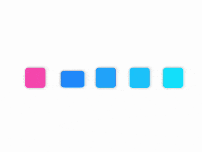

+++
title = '女神来了'
date = 2018-09-06T17:46:40+08:00
image = '/fe/img/thumbs/128.png'
summary = '#128'
+++



## 效果预览

点击链接可以在 Codepen 预览。

[https://codepen.io/comehope/pen/RYZbmE](https://codepen.io/comehope/pen/RYZbmE)

## 可交互视频

此视频是可以交互的，你可以随时暂停视频，编辑视频中的代码。

[https://scrimba.com/p/pEgDAM/c7MPZtg](https://scrimba.com/p/pEgDAM/c7MPZtg)

## 源代码下载

每日前端实战系列的全部源代码请从 github 下载：

[https://github.com/comehope/front-end-daily-challenges](https://github.com/comehope/front-end-daily-challenges)

## 代码解读

定义 dom，容器中包含 2 个子元素，分别代表 1 个女生和一群男生（4个），每个 `span` 元素代表 1 个人（1 个方块）：
```html
<figure class="container">
    <span class="girl"></span>
    <div class="boys">
        <span></span>
        <span></span>
        <span></span>
        <span></span>
    </div>
</figure>
```

居中显示：
```css
body {
    margin: 0;
    height: 100vh;
    display: flex;
    align-items: center;
    justify-content: center;
}
```

定义容器尺寸和它的子元素布局：
```css
.container {
    width: 8em;
    height: 1em;
    font-size: 35px;
    display: flex;
    justify-content: space-between;
}
```

画出 5 个方块，用边框作为辅助线帮助定位：
```css
.container span {
    width: 1em;
    height: 1em;
    border: 1px dashed black; /* 辅助线 */
}

.boys {
    width: 6em;
    display: flex;
    justify-content: space-between;
}
```

用伪元素设置元素的样式，使它们变得柔和一些，为男生和男生填上不同的颜色，同时删掉上一步的辅助线：
```css
.container span::before {    
    content: '';
    position: absolute;
    width: inherit;
    height: inherit;
    border-radius: 15%;
    box-shadow: 0 0 0.2em rgba(0, 0, 0, 0.3);
}

.girl::before {
    background-color: hotpink;
}

.boys span::before {
    background-color: dodgerblue;
}
```

使 4 个男生色块的颜色逐渐变淡，增加一点层次感：
```css
.boys span:nth-child(1)::before {
    filter: brightness(1);
}

.boys span:nth-child(2)::before {
    filter: brightness(1.15);
}

.boys span:nth-child(3)::before {
    filter: brightness(1.3);
}

.boys span:nth-child(4)::before {
    filter: brightness(1.45);
}
```

接下来制作动画效果。

先增加女生移动的效果，同时颜色也做渐淡处理，后面其他动画的时间要保持一致，所以把动画时长设置为变量：
```css
.container span {
    width: 1em;
    height: 1em;
    --duration: 3s;
}

.girl {
    animation: slide var(--duration) ease-in-out infinite;
}

@keyframes slide {
    from {
        transform: translateX(0);
        filter: brightness(1);
    }

    to {
        transform: translatex(calc(8em - (1em * 1.25)));
        filter: brightness(1.45);
    }
}
```

然后增加第 1 个男生跳开的动画效果，注意从 15% 到 35% 旋转的原点是在元素的正上方：
```css
.boys span {
    animation: var(--duration) ease-in-out infinite;
}

.boys span:nth-child(1) {
    animation-name: jump-off-1;
}

@keyframes jump-off-1 {
    0%, 15% {
        transform: rotate(0deg);
    }

    35%, 100% {
        transform-origin: -50% center;
        transform: rotate(-180deg);
    }
}
```

参考第 1 个男生的动画效果，再增加另外 3 个男生跳开的动画效果，区别只是调整了关键帧的时间，依次后延 15% 的时间：
```css
.boys span:nth-child(2) {
    animation-name: jump-off-2;
}

.boys span:nth-child(3) {
    animation-name: jump-off-3;
}

.boys span:nth-child(4) {
    animation-name: jump-off-4;
}

@keyframes jump-off-2 {
    0%, 30% {
        transform: rotate(0deg);
    }

    50%, 100% {
        transform-origin: -50% center;
        transform: rotate(-180deg);
    }
}

@keyframes jump-off-3 {
    0%, 45% {
        transform: rotate(0deg);
    }

    65%, 100% {
        transform-origin: -50% center;
        transform: rotate(-180deg);
    }
}

@keyframes jump-off-4 {
    0%, 60% {
        transform: rotate(0deg);
    }

    80%, 100% {
        transform-origin: -50% center;
        transform: rotate(-180deg);
    }
}
```

为第 1 个男生增加拟人的动画效果，这个效果写在 `::before` 伪元素中，动画的过程是从正常到压扁、然后抻长、再压扁、最后恢复正常，注意从 25% 到 40% 的压扁变形，因为此时主元素已经翻个儿，所以 `transform-origin` 的原点和 从 5% 到 15% 的压扁变形的原点不一样：
```css
.boys span::before {
    animation: var(--duration) ease-in-out infinite;
}

.boys span:nth-child(1)::before {
    filter: brightness(1);
    animation-name: jump-down-1;
}

@keyframes jump-down-1 {
    5% {
        transform: scale(1, 1);
    }

    15% {
        transform-origin: center bottom;
        transform: scale(1.3, 0.7);
    }

    20%, 25% {
        transform-origin: center bottom;
        transform: scale(0.8, 1.4);
    }

    40% {
        transform-origin: center top;
        transform: scale(1.3, 0.7);
    }

    55%, 100% {
        transform: scale(1, 1);
    }
}
```

参考第 1 个男生 `::before` 伪元素的动画效果，再增加另外 3 个男生拟人的动画效果，区别只是调整了关键帧的时间，依次后延 15% 的时间：
```css
.boys span:nth-child(2)::before {
    animation-name: jump-down-2;
}

.boys span:nth-child(3)::before {
    animation-name: jump-down-3;
}

.boys span:nth-child(4)::before {
    animation-name: jump-down-4;
}

@keyframes jump-down-2 {
    20% {
        transform: scale(1, 1);
    }

    30% {
        transform-origin: center bottom;
        transform: scale(1.3, 0.7);
    }

    35%, 40% {
        transform-origin: center bottom;
        transform: scale(0.8, 1.4);
    }

    55% {
        transform-origin: center top;
        transform: scale(1.3, 0.7);
    }

    70%, 100% {
        transform: scale(1, 1);
    }
}

@keyframes jump-down-3 {
    35% {
        transform: scale(1, 1);
    }

    45% {
        transform-origin: center bottom;
        transform: scale(1.3, 0.7);
    }

    50%, 55% {
        transform-origin: center bottom;
        transform: scale(0.8, 1.4);
    }

    70% {
        transform-origin: center top;
        transform: scale(1.3, 0.7);
    }

    85%, 100% {
        transform: scale(1, 1);
    }
}

@keyframes jump-down-4 {
    50% {
        transform: scale(1, 1);
    }

    60% {
        transform-origin: center bottom;
        transform: scale(1.3, 0.7);
    }

    65%, 70% {
        transform-origin: center bottom;
        transform: scale(0.8, 1.4);
    }

    85% {
        transform-origin: center top;
        transform: scale(1.3, 0.7);
    }

    100%, 100% {
        transform: scale(1, 1);
    }
}
```

至此，女生从左侧移动到右侧的动画效果已经完成。
把所有动画属性都加上 `alternate` 参数，使所有动画都往复执行，就实现了从右侧再回到左侧的效果：
```css
.girl {
    animation: slide var(--duration) ease-in-out infinite alternate;
}

.boys span {
    animation: var(--duration) ease-in-out infinite alternate;
}

.boys span::before {
    animation: var(--duration) ease-in-out infinite alternate;
}
```

大功告成！
