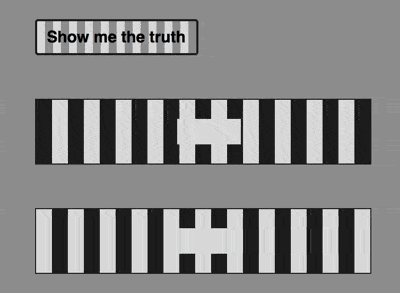

+++
title = '条纹错觉'
date = 2018-09-07T17:46:55+08:00
image = '/test-hugo-deploy/img/thumbs/129.png'
summary = '#129'
+++



## 效果预览

点击链接可以在 Codepen 预览。

[https://codepen.io/comehope/pen/qMPQPx](https://codepen.io/comehope/pen/qMPQPx)

## 可交互视频

此视频是可以交互的，你可以随时暂停视频，编辑视频中的代码。

[https://scrimba.com/p/pEgDAM/cMGa4TQ](https://scrimba.com/p/pEgDAM/cMGa4TQ)

## 源代码下载

每日前端实战系列的全部源代码请从 github 下载：

[https://github.com/comehope/front-end-daily-challenges](https://github.com/comehope/front-end-daily-challenges)

## 代码解读

定义 dom，容器中包含 2 个元素，分别代表 2 条轨道：
```html
<div class="container">
    <span class='track'></span>
    <span class='track'></span>
</div>
```

居中显示：
```css
body {
    margin: 0;
    height: 100vh;
    display: flex;
    align-items: center;
    justify-content: center;
    background-color: #999;
}
```

定义容器尺寸和子元素的布局方式：
```css
.container {
    font-size: 30px;
    width: calc(13em + 0.5em);
    height: 8em;
    display: flex;
    flex-direction: column;
    justify-content: space-between;
}
```

定义 2 个色值，一个亮的和一个暗的：
```css
.container {
    --dark: #222;
    --light: #ddd;
}
```

画出 2 条轨道的轮廓：
```css
.track {
    width: inherit;
    height: 2em;
    border: 1px solid var(--dark);
}
```

为 2 条轨道背景图案，图案是明暗相间的条纹，但 2 条轨道要错半个格：
```css
.track {
    background: linear-gradient(
        90deg,
        var(--dark) 50%,
        var(--light) 50%
    );
    background-size: 1em;
}

.track:nth-child(2) {
    background-position: 0.5em;
}
```

用伪元素画出 2 个矩形，让它们在轨道上往复运动：
```css
.track {
    position: relative;
    display: flex;
    align-items: center;
}

.track::before {
    content: '';
    position: absolute;
    width: 2em;
    height: 0.8em;
    background-color: var(--light);
}
```

让这 2 个矩形在轨道上往复移动：
```css
.track::before {
    animation: move 5s linear infinite alternate;
}

@keyframes move {
    from {
        left: 0;
    }
    
    to {
        left: calc(100% - 2em);
    }
}
```

此时，两个矩形看起来是一先一后地前进的，但实际上它们是在同一时刻开始并且以相同的速度在移动。接下来我们来揭秘真相。

在 dom 中增加一个子元素，作为按钮；
```html
<div class="container">
    <span class='track'></span>
    <span class='track'></span>
    <span class="toggle">Show me the truth</span>
</div>
```

设置按钮的样式：
```css
.toggle {
    order: -1;
    width: 10em;
    height: 2em;
    border: 2px solid var(--dark);
    border-radius: 0.2em;
    font-size: 0.5em;
    font-family: sans-serif;
    font-weight: bold;
    color: black;
    text-align: center;
    line-height: 2em;
    cursor: pointer;
    user-select: none;
}
```

为按钮设置与轨道风格类似的背景，以及鼠标悬停效果：
```css
.toggle {
    background-image: linear-gradient(to right, #ddd 50%, #999 50%);
    background-size: 1em;
    transition: 0.5s;
}

.toggle:hover {
    background-position: 5em;
}
```

增加一段点击按钮时触发的脚本，为轨道元素切换样式：
```javascript
let $toggle = document.getElementsByClassName('toggle')[0]
let $tracks = Array.from(document.getElementsByClassName('track'))

$toggle.addEventListener('click', function() {
    $tracks.forEach(track => track.classList.toggle('highlights'))
})
```

终于，谜底就在切换样式之后被揭晓了：
```css
.track::before {
    box-sizing: border-box;
    border: solid var(--dark);
    border-width: 0;
}

.track.highlights::before {
    background-color: white;
    border-width: 0.1em;
}
```

大功告成！
