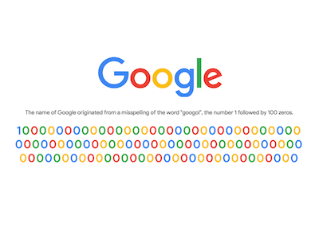

+++
title = 'Google googol 信息图'
date = 2018-09-08T17:47:11+08:00
image = '/test-hugo-deploy/img/thumbs/130.png'
summary = '#130'
+++



## 效果预览

点击链接可以在 Codepen 预览。

[https://codepen.io/comehope/pen/xaPZye](https://codepen.io/comehope/pen/xaPZye)

## 可交互视频

此视频是可以交互的，你可以随时暂停视频，编辑视频中的代码。

[https://scrimba.com/p/pEgDAM/cwkpGf9](https://scrimba.com/p/pEgDAM/cwkpGf9)

## 源代码下载

每日前端实战系列的全部源代码请从 github 下载：

[https://github.com/comehope/front-end-daily-challenges](https://github.com/comehope/front-end-daily-challenges)

## 代码解读

定义 dom，只有 1 个空元素，其中不包含任何文本：
```html
<div class="logo"></div>
```

引入字体文件，[Product Sans](https://en.wikipedia.org/wiki/Product_Sans) 是 Google 专门为品牌推广创建的无衬线字体：
```css
@import url("https://fonts.googleapis.com/css?family=Product+Sans");
```

居中显示：
```css
body {
    margin: 0;
    height: 100vh;
    display: flex;
    align-items: center;
    justify-content: center;
}
```

用伪元素制作 logo，注意 `content` 的内容不是 `"Google"`，而是 `"google_logo"`：
```css
.logo::before {
    content: 'google_logo';
    font-size: 10vw;
}

```

设置字体，采用刚才引入的在线字体，刚才页面上的 `"google_logo"` 文字被替换成了单色的 logo 图案：
```css
body {
    font-family: 'product sans';
}
```

定义颜色变量：
```css
:root {
    --blue: #4285f4;
    --red: #ea4335;
    --yellow: #fbbc05;
    --green: #34a853;
}
```

设置文字遮罩效果，为文字上色：
```css
.logo::before {
    background-image: linear-gradient(
        to right,
        var(--blue) 0%, var(--blue) 26.5%, 
        var(--red) 26.5%, var(--red) 43.5%, 
        var(--yellow) 43.5%, var(--yellow) 61.5%,
        var(--blue) 61.5%, var(--blue) 78.5%, 
        var(--green) 78.5%, var(--green) 84.5%, 
        var(--red) 84.5%, var(--red) 100%
    );
    -webkit-background-clip: text;
    -webkit-text-fill-color: transparent;
}
```

至此，Google logo 制作完成，接下来制作 googol 信息，说明 Google 的名字来源于含义是 1 后面跟 100 个零的大数的单词 googol。

在 dom 中添加一行说明文本和容纳数字的容器，容器中包含 5 个数字，在每个数字的内联样式中指定了颜色变量：
```html
<p class="desc">The name of Google originated from a misspelling of the word "googol", the number 1 followed by 100 zeros.</p> 
<div class="zeros">
    <span style="--c:var(--blue);">1</span>
    <span style="--c:var(--red);">0</span>
    <span style="--c:var(--yellow);">0</span>
    <span style="--c:var(--blue);">0</span>
    <span style="--c:var(--green);">0</span>
</div>
```

设置说明文本的样式：
```css
.desc {
    font-size: 1.5vw;
    font-weight: normal;
    color: dimgray;
    margin-top: 2em;
}
```

设置数字的样式：
```css
.zeros {
    font-size: 3vw;
    font-weight: bold;
    margin-top: 0.2em;
    text-align: center;
    width: 25.5em;
    word-wrap: break-word;
}
```

为数字上色：
```css
.zeros span {
    color: var(--c);
}
```

微调数字 `"1"` 的边距，让它不要和后面的 `"0"` 靠得太紧：
```css
.zeros span:nth-child(1) {
    margin-right: 0.2em;
}
```

至此，静态布局完成，接下来用 d3 批量处理数字。

引入 d3 库，并删除掉 dom 中 `.zeros` 的数字子元素：
```html
<script src="https://d3js.org/d3.v5.min.js"></script>
```

最终我们会在页面上显示 100 个 `0`，每个 `0` 的颜色都不同，并且为了美观，相邻数字的颜色也要不同。
所以，先定义一个获取颜色的函数，它可以从 Google logo 配色的 4 种颜色中取任意一个颜色，并且有一个表示被排除颜色的参数，当指定的此参数时，就从 4 个可选的颜色中去掉这个颜色，然后从剩下的 3 个颜色中随机取一个颜色：
```javascript
function getColor(excludedColor) {
    let colors = new Set(['blue', 'red', 'yellow', 'green'])
    colors.delete(excludedColor)
    return Array.from(colors)[Math.floor(d3.randomUniform(0, colors.size)())]
}
```

然后，定义 2 个常量，`ZEROS` 是存储 100 个 `0` 的数组，`ONE` 是存储数字 `1` 的对象，它有 2 个属性，`number` 表示它的数值是 1，`color` 表示它的颜色是蓝色：
```javascript
const ZEROS = d3.range(100).map(x=>0)
const ONE = {number: 1, color: 'blue'}
```

接下来，通过用 `reduce` 函数遍历 `ZEROS` 数组，返回一个新的数组 `numbers`，它有 101 个元素（1 以及跟随它的 100 个 0），每个元素都是 1 个包含 `number` 和 `color` 属性的对象：
```javascript
let numbers = ZEROS.reduce(function (numberObjects, d) {
    numberObjects.push({
        number: d,
        color: getColor(numberObjects[numberObjects.length - 1].color)
    })
    return numberObjects
}, [ONE])
```

然后，以 `numbers` 为数据源，用 d3 批量创建出 dom 元素，并且把颜色信息写在行内样式中：
```javascript
d3.select('.zeros')
    .selectAll('span')
    .data(numberObjects)
    .enter()
    .append('span')
    .style('--c', (d)=>`var(--${d.color})`)
    .text((d)=>d.number)
```

最后，微调一下内容的边距，使整个内容居中：
```css
.logo {
    margin-top: -10vh;
}
```

大功告成！
