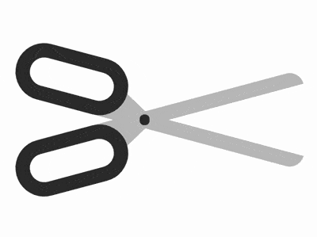

+++
title = '剪刀'
date = 2018-09-10T17:47:28+08:00
image = '/fe/img/thumbs/131.png'
summary = '#131'
+++



## 效果预览

点击链接可以在 Codepen 预览。

[https://codepen.io/comehope/pen/GXyGpZ](https://codepen.io/comehope/pen/GXyGpZ)

## 可交互视频

此视频是可以交互的，你可以随时暂停视频，编辑视频中的代码。

[https://scrimba.com/p/pEgDAM/cwkQWtz](https://scrimba.com/p/pEgDAM/cwkQWtz)

## 源代码下载

每日前端实战系列的全部源代码请从 github 下载：

[https://github.com/comehope/front-end-daily-challenges](https://github.com/comehope/front-end-daily-challenges)

## 代码解读

定义 dom，容器中包含 2 个 `.half` 元素，各表示剪刀的半边，它的子元素 `handle` 表示刀柄，`blade` 表示刀，最后的 `.joint` 表示连接左右两部分铆钉：
```html
<figure class="scissors">
    <div class="half">
        <span class="handle"></span>
        <span class="blade"></span>
    </div>
    <div class="half">
        <span class="blade"></span>
        <span class="handle"></span>
    </div>
    <div class="joint"></div>
</figure>
```

居中显示：
```css
body {
    margin: 0;
    height: 100vh;
    display: flex;
    align-items: center;
    justify-content: center;
}
```

定义容器尺寸，其中 `outline` 是辅助线：
```css
.scissors {
    width: 21em;
    height: 7em;
    outline: 1px dashed;
}
```

定义半边剪刀的尺寸，其中 `outline` 是辅助线：
```css
.scissors {
    position: relative;
}

.half {
    position: absolute;
    width: inherit;
    height: 4em;
    outline: 1px dashed red;
}
```

画出刀柄：
```css
.handle {
    position: absolute;
    box-sizing: border-box;
    width: 8em;
    height: inherit;
    border: 1em solid #333;
    border-radius: 2em;
}
```

画出刀，用圆角属性画出了顶部的刀尖：
```css
.blade {
    position: absolute;
    width: 15em;
    height: 1em;
    background-color: silver;
    top: 3em;
    left: 6em;
    border-radius: 0 0 1em 0;
    z-index: -1;
}
```

用伪元素在刀的底部画一个三角形，使刀与刀柄连接得更牢固：
```css
.blade::before {
    content: '';
    position: absolute;
    border-style: solid;
    border-width: 0 1.8em 1em 1.8em;
    border-color: transparent transparent silver transparent;
    top: -1em;
    left: 0.2em;
}
```

使半边刀倾斜：
```css
.half {
    transform-origin: 45% bottom;
    transform: rotate(15deg);
}
```

利用 `scale()` 函数画出剪刀的另一半：
```css
.half {
    transform-origin: 45% bottom;
    transform: rotate(calc(15deg * var(--direction))) scaleY(var(--direction));
}

.half:nth-child(1) {
    --direction: 1;
    top: 0;
}

.half:nth-child(2) {
    --direction: -1;
    top: -1em;
}
```

画出连接左右半边的铆钉：
```css
.joint {
    position: absolute;
    width: 0.7em;
    height: 0.7em;
    background-color: #333;
    border-radius: 50%;
    top: calc(50% - 0.7em / 2);
    left: 45%;
}
```

增加动画鼠标悬停时的动画效果：
```css
.scissors:hover .half {
    animation: cut 2s ease-out;
}

@keyframes cut {
    20%, 60% {
        transform: rotate(calc(30deg * var(--direction))) scaleY(var(--direction));
    }

    40%, 80% {
        transform: rotate(calc(5deg * var(--direction))) scaleY(var(--direction));
    }
}
```

最后，别忘了删掉辅助线。

大功告成！
